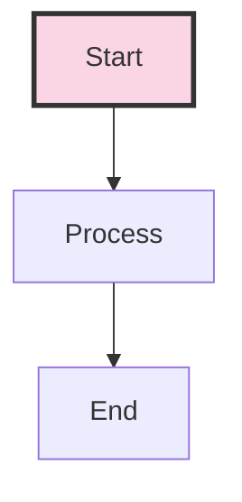

# ciprianrarau.com - Blog & Personal Website

## Overview

Personal website and blog for Ciprian Rarau (Chip). Built with Astro + Tailwind CSS.

## About Chip - Key Background

**Wisk.ai** - A foundational part of Chip's journey:
- Spent 8-9 years building and scaling Wisk.ai
- Grew the platform from zero to 1000+ clients
- Evolved deployment practices from quarterly releases to multiple daily deployments
- Learned production-first mindset through real constraints of serving paying customers
- This experience shapes all of Chip's current DevOps and infrastructure philosophy

**Current Focus:**
- Helping 10+ startups with infrastructure and DevOps
- Multi-cloud expertise (AWS, Azure, GCP)
- Launching OneOps.cloud for startup infrastructure
- AI-assisted development workflows

**Important:** Always spell it "Wisk.ai" (not "Wisc.ai").

## Key Reference Folders

These folders contain important implementations that should be referenced when writing about data warehouses, KPIs, analytics, or DevOps patterns:

### Data Warehouse & KPI Implementations

| Project | Path | Key Content |
|---------|------|-------------|
| **Eli Health** | `/home/chipdev/eli.health/` | Full data warehouse: BigQuery, Datastream CDC, Airbyte, GA4 sync |
| **Eli KPI Service** | `/home/chipdev/eli.health/eli-kpi/` | 89 SQL queries, KPI dashboards, AI insights |
| **Eli DevOps** | `/home/chipdev/eli.health/eli-devops/tf/` | Terraform for Datastream, GA4 sync, IAM |
| **Mentorly Meta** | `/home/chipdev/mentorly-meta/` | BigQuery GA4 streaming, PostgreSQL, HubSpot sync |
| **Mentorly Dashboard** | `/home/chipdev/mentorly-meta/mentorly-dash-meta/` | KPI queries, UTM tracking, marketing analytics |

### Data Sources & Patterns

**Eli Health Data Sources:**
- PostgreSQL → BigQuery (Google Cloud Datastream CDC)
- Shopify → BigQuery (Airbyte Cloud)
- GA4 → BigQuery (cross-region sync via Cloud Functions)
- Facebook Ads → BigQuery (Airbyte)
- Google Ads → BigQuery (Airbyte)
- Loopwork subscriptions → BigQuery (Airbyte)
- Klaviyo email → BigQuery (Airbyte)

**Mentorly Data Sources:**
- GA4 streaming export → BigQuery
- PostgreSQL operational data
- HubSpot CRM sync

### Key SQL Patterns

- **Cross-source JOINs**: Combine marketing, e-commerce, and product data
- **Attribution modeling**: First-touch, last-touch, multi-touch
- **Cohort analysis**: Monthly retention tracking
- **Funnel analysis**: Sankey diagrams from traffic to conversion
- **CAC/ROAS**: Customer acquisition cost and return on ad spend

## Blog Writing Approach

### Direct Writing vs Natural-Blog-Writer Agent

Choose the approach based on content type:

| Content Type | Approach | When to Use |
|--------------|----------|-------------|
| Code-heavy tutorials | Direct writing | Terraform configs, YAML, architecture with diagrams |
| Infrastructure deep-dives | Direct writing | IaC patterns, deployment pipelines, technical specs |
| How-I-Built-X posts | Direct writing | Step-by-step technical walkthroughs |
| Philosophical pieces | `natural-blog-writer` | Technology trends, industry reflections |
| Lessons learned | `natural-blog-writer` | Narrative-driven insights, experience sharing |
| Thought leadership | `natural-blog-writer` | Predictions, observations, career reflections |

**Rule of thumb:**
- **80% code/config, 20% narrative** → Direct writing
- **80% narrative, 20% technical examples** → `natural-blog-writer` agent

**Style requirements (both approaches):**
- **First person singular ("I", "my", "me")** - This is Chip's personal blog, not a team blog
  - Use "I built this integration..." not "We built this integration..."
  - Exception: "We" is acceptable when referring to humanity/society in general observations
  - Actions taken should always be "I", never "we"
- **NO company names** - Never mention client/company names in blog posts
  - Use generic terms: "a healthcare startup", "a SaaS company", "one of the startups I work with"
  - Exception: Wisk.ai can be mentioned (Chip's own company, public knowledge)
  - Exception: Well-known tools/platforms are fine (AWS, Azure, Stripe, Shopify, etc.)
  - This protects client confidentiality and keeps content universally applicable
  - **In code examples, replace:**
    - Company email domains → `company.com` (e.g., `dev@company.com`)
    - GCP project IDs → `my-project-dev`, `my-project-prod`
    - App names → `My App`, `My App Stage`, `My App Dev`
    - Service-specific names (like "HAE") → generic terms (`ML`, `Analytics`, etc.)
    - Bucket names → `my-project-bucket-name`
    - Any identifiable infrastructure names → generic equivalents
  - **In prose, replace:**
    - Specific team names → "the team", "developers", "engineers"
    - Product names → "the app", "the service", "the platform"
    - Internal service names → generic descriptions ("ML service", "analytics pipeline")
- Highly technical and experience-based
- Facts over opinions - everything should be what was done, what was possible
- No fluff or filler content
- Code examples should be complete and functional
- Mermaid diagrams where architecture visualization helps

**Using the natural-blog-writer agent:**
```
Use Task tool with subagent_type='natural-blog-writer'
Provide: topic, key points, transcript (if available), technical context
```

**Expected blog mix:** ~70% direct writing, ~30% natural-blog-writer

## Blog Post Creation Workflow

### 1. Create Blog Post

Create a new markdown file in `src/data/post/`:

```markdown
---
title: "Your Title Here"
author: Ciprian Rarau
publishDate: 2025-12-18
category: Technology
excerpt: "Brief description for previews and SEO"
tags:
  - tag1
  - tag2
  - tag3
metadata:
  featured: false
  showAuthor: true
  showDate: true
  showReadingTime: true
  showTags: true
transcript: |
  Optional: Original voice transcript or notes that inspired this post.
  This is stored in frontmatter but not displayed.
---

## Your Content Here

Write your blog content using standard markdown.
```

### 2. Add Mermaid Diagrams

Include mermaid diagrams inline in your markdown:

```markdown
## Architecture


```

**Important notes for mermaid:**
- **Optimize for vertical reading** - Diagrams should be tall, not wide. Use `flowchart TD` (top-down) instead of `flowchart LR` (left-right) when possible
- **Break wide diagrams into pieces** - If a diagram has more than 4-5 horizontal elements, split it into multiple smaller diagrams or restructure vertically
- **Mobile-friendly width** - Diagrams should render well on narrow screens; avoid long horizontal chains
- Use quotes around labels with special characters: `["email@domain.com"]`
- Avoid `@` symbols in unquoted labels
- Use `-->` for arrows, not unicode arrows

### 3. Process Mermaid Diagrams

Run the mermaid processing script:

```bash
# Standard processing (only new/changed diagrams)
npm run process-mermaid

# Force regenerate all diagrams
npm run process-mermaid -- --force
```

**What this does:**
- Extracts mermaid code blocks from all blog posts
- Generates PNG images using mermaid-cli
- Adds author footer to each diagram (from `scripts/mermaid-footer/`)
- Updates markdown to include image references
- Uses content-based hashing for caching

**Requirements:**
- `@mermaid-js/mermaid-cli` (npm install -g)
- `imagemagick` (for footer stitching)
- `libasound2` and other puppeteer dependencies

### 4. Commit and Push

```bash
# Add blog post and generated images
git add src/data/post/your-post.md
git add public/images/diagrams/

# Commit
git commit -m "Add blog post: Your Title Here"

# Push
git push origin main
```

## Directory Structure

```
ciprianrarau.com/
├── src/
│   └── data/
│       └── post/           # Blog posts (*.md)
├── public/
│   └── images/
│       └── diagrams/       # Generated mermaid PNGs
├── scripts/
│   ├── process-mermaid-diagrams.cjs
│   └── mermaid-footer/
│       └── ciprian-rarau.png   # Author footer
├── devops/
│   ├── README.md           # Vercel env vars documentation
│   └── .env.example        # Template for all env vars
├── blog-article-analysis.md    # Living document with article ideas
└── CLAUDE.md                   # This file
```

## Blog Tags (Recommended)

Use these tags consistently for machine readability:

- `spec-driven-development` - Specs as source of truth
- `infrastructure-as-code` - Terraform, IaC patterns
- `multi-cloud` - AWS, Azure, GCP expertise
- `ai-assisted-development` - AI workflow patterns
- `production-first` - Always production-ready mindset
- `devops-automation` - GitHub, Sentry, Workspace automation
- `ml-in-production` - Real AI/ML deployment
- `content-operations` - Help articles, marketing, docs
- `serverless` - Cloud Run, Container Apps
- `enterprise-compliance` - SOC 2, HIPAA

## Blog Article Analysis

The file `blog-article-analysis.md` is a living document containing:
- 28 article ideas organized by theme
- Source documentation references
- Prioritized writing order
- Tags and narrative threads

Update this document as you write articles and discover new topics.

## Commands Reference

```bash
# Development
npm run dev              # Start dev server
npm run build            # Build for production
npm run preview          # Preview production build

# Mermaid Processing
npm run process-mermaid           # Process new diagrams
npm run process-mermaid -- --force # Regenerate all

# Image Generation (Google Gemini / Nano Banana Pro)
./scripts/generate-image.sh "prompt" output.png
./scripts/generate-image.sh "A minimalist icon" public/images/icon.png
./scripts/generate-image.sh "Blog header" header.png --model gemini-2.0-flash-exp-image-generation

# Linting
npm run check            # Run all checks
npm run fix              # Fix linting issues
```

## Image Generation

The site uses Google's Gemini Image API (Nano Banana Pro) for generating images.

**Script location:** `scripts/generate-image.sh`

**Available models:**
- `gemini-3-pro-image-preview` - Best quality (default)
- `gemini-2.5-flash-image` - Higher quality
- `gemini-2.0-flash-exp-image-generation` - Fast iterations

**Examples:**
```bash
# Generate favicon/icon
./scripts/generate-image.sh "A minimalist CR monogram logo, blue to teal gradient" public/favicon.png

# Generate blog header
./scripts/generate-image.sh "DevOps pipeline visualization, modern flat design" public/images/blog/devops-header.png

# Fast iteration mode
./scripts/generate-image.sh "Quick test image" test.png --model gemini-2.0-flash-exp-image-generation
```

**Current favicon:** Generated with prompt "A minimalist, modern favicon icon for a tech blog. Simple geometric design featuring the letters 'CR' (Ciprian Rarau initials) in a clean, professional style. Use a gradient from deep blue to teal."

## Style Guide - Components Reference

**IMPORTANT:** Before creating any new page, visit `/style-guide` to see all available components visually. This ensures consistent styling across the site.

The site uses AstroWind components exclusively. All new pages must use these standard components - no custom HTML/CSS unless absolutely necessary.

### Layout Components

| Component | Usage | Example Pages |
|-----------|-------|---------------|
| `Hero` | Page headers with title, subtitle, CTA | index, about |
| `Content` | Image + text blocks (reversible) | projects/*, about |
| `Features` | Icon grid with descriptions | index, services |
| `Features2` | Larger icon cards | services |
| `Features3` | Compact feature list | projects/* |
| `Steps` | Numbered process steps | services |
| `Steps2` | Timeline with icons | about |
| `Timeline` | Vertical timeline | index (experience) |
| `FAQs` | Accordion Q&A | pricing |
| `Stats` | Number highlights | projects/* |
| `Pricing` | Pricing cards | pricing |
| `CallToAction` | CTA sections | all pages |

### Content Block Pattern (Image Left/Right)

```astro
<Content
  isReversed  <!-- Image on right, text on left -->
  items={[
    { title: 'Feature 1', description: '...' },
    { title: 'Feature 2', description: '...' },
  ]}
  image={{ src: '~/assets/images/...', alt: '...' }}
>
  <Fragment slot="content">
    <h3>Section Title</h3>
    <p>Description text...</p>
  </Fragment>
</Content>
```

### Color Palette

- **Primary:** Blue (#1565C0 to teal gradient)
- **Accent:** Teal (#0288D1)
- **Success:** Green (#388E3C)
- **Warning:** Amber (#F57C00)
- **Error:** Red (#C62828)
- **Dark mode:** Slate backgrounds

### Typography

- **Headings:** font-heading (Inter/system)
- **Body:** Default sans-serif
- **Code:** Monospace

### Icon System

Uses `tabler` icons via `astro-icon`:
```astro
import { Icon } from 'astro-icon/components';
<Icon name="tabler:code" class="w-6 h-6" />
```

Common icons: `tabler:code`, `tabler:building`, `tabler:user`, `tabler:rocket`, `tabler:chart-line`

### Project Page Template

All project pages follow this structure:
1. Hero with stats (role, company, impact)
2. Challenge section
3. Solution with features grid
4. Technical implementation
5. Results/Impact stats
6. Call to action

### Blog Post Template

- Frontmatter with title, excerpt, image, tags
- Mermaid diagrams for architecture
- Code blocks with syntax highlighting
- First person singular ("I built...", not "We built...")

### Favicon/Logo

Located at `src/assets/favicons/`:
- `favicon.ico` - Browser tab icon
- `apple-touch-icon.png` - iOS home screen
- `favicon.svg` - Vector version

Generated source: `public/favicon-generated.png`

## Deployment

The site deploys automatically to Vercel on push to main via GitHub Actions.

### Vercel Environment Variables

See `devops/README.md` for full documentation.

**Quick reference:**
```bash
# List current variables
vercel env ls

# Add new variable to all environments
for env in production preview development; do
  echo "value" | vercel env add VARIABLE_NAME $env
done

# Pull to local .env
vercel env pull .env.local
```

**Current variables:**
- `TURNSTILE_SITE_KEY` / `TURNSTILE_SECRET_KEY` - Cloudflare CAPTCHA
- `GMAIL_USER` / `GMAIL_APP_PASSWORD` / `RECIPIENT_EMAIL` - Contact form email

## Author Footer

The mermaid script automatically adds a footer to all diagrams. The footer is selected based on the `author` field in the blog post frontmatter:

- Author: `Ciprian Rarau` → Footer: `scripts/mermaid-footer/ciprian-rarau.png`

To add a new author footer:
1. Create a PNG file in `scripts/mermaid-footer/`
2. Name it `{firstname}-{lastname}.png` (lowercase, hyphenated)

## Mermaid Config Gotchas

**CRITICAL: Never put `width` or `height` inside the mermaid config JSON.**

These properties cause sequence diagram actor boxes to expand to fill the specified dimensions, creating huge empty boxes with tiny text. They should only be passed as CLI arguments (`--width 1200 --height 800`), not in the config JSON.

**Theme choice:** Use `theme: 'base'` for full customization. The `'default'` and `'neutral'` themes override custom themeVariables inconsistently.

**Debugging mermaid issues:**
```bash
# Test a single diagram directly before running the full script
npx mmdc -i /tmp/test.mmd -o /tmp/test.png -c /tmp/config.json --scale 2

# Then run full processing
npm run process-mermaid -- --force
```

This saves time vs regenerating all 28+ diagrams while debugging config issues.
