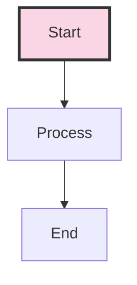

# ciprianrarau.com - Blog & Personal Website

## Overview

Personal website and blog for Ciprian Rarau (Chip). Built with Astro + Tailwind CSS.

## Blog Writing Approach

### Direct Writing vs Natural-Blog-Writer Agent

Choose the approach based on content type:

| Content Type | Approach | When to Use |
|--------------|----------|-------------|
| Code-heavy tutorials | Direct writing | Terraform configs, YAML, architecture with diagrams |
| Infrastructure deep-dives | Direct writing | IaC patterns, deployment pipelines, technical specs |
| How-I-Built-X posts | Direct writing | Step-by-step technical walkthroughs |
| Philosophical pieces | `natural-blog-writer` | Technology trends, industry reflections |
| Lessons learned | `natural-blog-writer` | Narrative-driven insights, experience sharing |
| Thought leadership | `natural-blog-writer` | Predictions, observations, career reflections |

**Rule of thumb:**
- **80% code/config, 20% narrative** → Direct writing
- **80% narrative, 20% technical examples** → `natural-blog-writer` agent

**Style requirements (both approaches):**
- **First person singular ("I", "my", "me")** - This is Chip's personal blog, not a team blog
  - Use "I built this integration..." not "We built this integration..."
  - Exception: "We" is acceptable when referring to humanity/society in general observations
  - Actions taken should always be "I", never "we"
- Highly technical and experience-based
- Facts over opinions - everything should be what was done, what was possible
- No fluff or filler content
- Code examples should be complete and functional
- Mermaid diagrams where architecture visualization helps

**Using the natural-blog-writer agent:**
```
Use Task tool with subagent_type='natural-blog-writer'
Provide: topic, key points, transcript (if available), technical context
```

**Expected blog mix:** ~70% direct writing, ~30% natural-blog-writer

## Blog Post Creation Workflow

### 1. Create Blog Post

Create a new markdown file in `src/data/post/`:

```markdown
---
title: "Your Title Here"
author: Ciprian Rarau
publishDate: 2025-12-18
category: Technology
excerpt: "Brief description for previews and SEO"
tags:
  - tag1
  - tag2
  - tag3
metadata:
  featured: false
  showAuthor: true
  showDate: true
  showReadingTime: true
  showTags: true
transcript: |
  Optional: Original voice transcript or notes that inspired this post.
  This is stored in frontmatter but not displayed.
---

## Your Content Here

Write your blog content using standard markdown.
```

### 2. Add Mermaid Diagrams

Include mermaid diagrams inline in your markdown:

```markdown
## Architecture


```

**Important notes for mermaid:**
- Use quotes around labels with special characters: `["email@domain.com"]`
- Avoid `@` symbols in unquoted labels
- Use `-->` for arrows, not unicode arrows

### 3. Process Mermaid Diagrams

Run the mermaid processing script:

```bash
# Standard processing (only new/changed diagrams)
npm run process-mermaid

# Force regenerate all diagrams
npm run process-mermaid -- --force
```

**What this does:**
- Extracts mermaid code blocks from all blog posts
- Generates PNG images using mermaid-cli
- Adds author footer to each diagram (from `scripts/mermaid-footer/`)
- Updates markdown to include image references
- Uses content-based hashing for caching

**Requirements:**
- `@mermaid-js/mermaid-cli` (npm install -g)
- `imagemagick` (for footer stitching)
- `libasound2` and other puppeteer dependencies

### 4. Commit and Push

```bash
# Add blog post and generated images
git add src/data/post/your-post.md
git add public/images/diagrams/

# Commit
git commit -m "Add blog post: Your Title Here"

# Push
git push origin main
```

## Directory Structure

```
ciprianrarau.com/
├── src/
│   └── data/
│       └── post/           # Blog posts (*.md)
├── public/
│   └── images/
│       └── diagrams/       # Generated mermaid PNGs
├── scripts/
│   ├── process-mermaid-diagrams.cjs
│   └── mermaid-footer/
│       └── ciprian-rarau.png   # Author footer
├── blog-article-analysis.md    # Living document with article ideas
└── CLAUDE.md                   # This file
```

## Blog Tags (Recommended)

Use these tags consistently for machine readability:

- `spec-driven-development` - Specs as source of truth
- `infrastructure-as-code` - Terraform, IaC patterns
- `multi-cloud` - AWS, Azure, GCP expertise
- `ai-assisted-development` - AI workflow patterns
- `production-first` - Always production-ready mindset
- `devops-automation` - GitHub, Sentry, Workspace automation
- `ml-in-production` - Real AI/ML deployment
- `content-operations` - Help articles, marketing, docs
- `serverless` - Cloud Run, Container Apps
- `enterprise-compliance` - SOC 2, HIPAA

## Blog Article Analysis

The file `blog-article-analysis.md` is a living document containing:
- 28 article ideas organized by theme
- Source documentation references
- Prioritized writing order
- Tags and narrative threads

Update this document as you write articles and discover new topics.

## Commands Reference

```bash
# Development
npm run dev              # Start dev server
npm run build            # Build for production
npm run preview          # Preview production build

# Mermaid Processing
npm run process-mermaid           # Process new diagrams
npm run process-mermaid -- --force # Regenerate all

# Linting
npm run check            # Run all checks
npm run fix              # Fix linting issues
```

## Deployment

The site deploys automatically to Vercel on push to main.

## Author Footer

The mermaid script automatically adds a footer to all diagrams. The footer is selected based on the `author` field in the blog post frontmatter:

- Author: `Ciprian Rarau` → Footer: `scripts/mermaid-footer/ciprian-rarau.png`

To add a new author footer:
1. Create a PNG file in `scripts/mermaid-footer/`
2. Name it `{firstname}-{lastname}.png` (lowercase, hyphenated)
