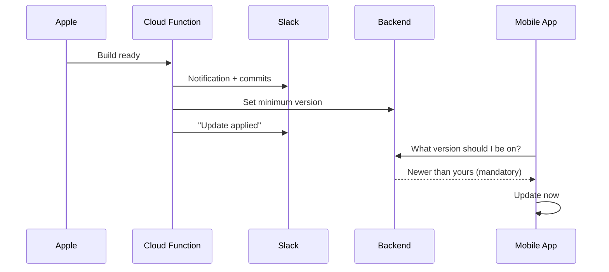
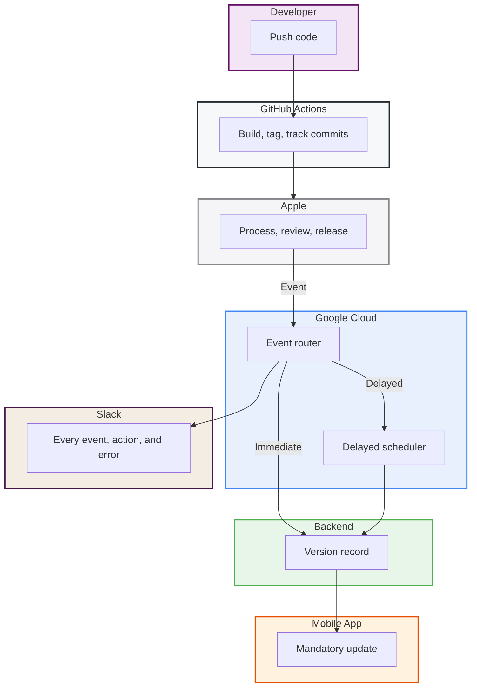

I think a lot about how companies actually work. Not the org chart version, but the real version: how information flows, where decisions get stuck, where a human is doing something a machine should be doing.

Most companies are a collection of systems that don't talk to each other. Someone pushes code. Someone else checks if the build finished. A third person posts in Slack. A fourth person does something in the database. Everyone is a messenger between machines. It's like running a relay race where the runners keep stopping to call each other on the phone.

What if the machines just talked to each other directly?

## The Vision

Here's what I wanted: a developer pushes code, and some time later, every user's phone updates itself. No human touches anything in between. No checking. No posting. No database commands. The company's release pipeline operates as a single organism.

Six services. One flow. Zero human steps.

## Building the Nervous System

The first question is always: how do the systems even know what happened? In the iOS world, Apple is the gatekeeper. You upload a build, and it disappears into a black box. Is it processing? Is it in review? Did it get approved? Released? The default experience is refreshing a web page and hoping.

But Apple sends webhooks. For everything. Build processing, TestFlight status, review decisions, crash reports, releases. They sign each one cryptographically, so you know it's really Apple talking.

I put a small Cloud Function in front of these webhooks. Its only job: listen, verify, and translate. Apple speaks in resource IDs and state changes. My function translates that into something humans care about, and posts it to Slack with the exact list of commits that shipped in each build.

Suddenly, the Slack channel becomes the release dashboard. Nobody needs to check App Store Connect. The information arrives.

## From Knowing to Acting

But knowing is only half the story. The more interesting question is: what should the system *do* with that knowledge?

Here's a problem that sounds small but is actually expensive: QA is testing on a build from three days ago. A developer fixed the bug yesterday. QA doesn't know a new build exists. They file the same bug again. Multiply this across a team, across weeks.

TestFlight doesn't force updates. It notifies, and people ignore notifications. So I connected the webhook to the backend. When a build finishes processing, the system doesn't just announce it. It tells the backend: "this is the new minimum version." The mobile app checks on every launch. If you're behind, you see a full-screen popup. No dismiss button. You update, or you don't use the app.

This sounds aggressive, and it is. But for internal dev and staging builds, currency matters more than convenience. Everyone tests the same code. Always.

## The Production Puzzle

Dev and staging were fully automated. But production has a constraint that internal builds don't: when Apple releases your app to the App Store, it takes time for the binary to propagate to every CDN node worldwide. If you tell users "you must update" and the update isn't available in their region yet, you've just locked them out of your app for no reason.

The answer is a delay. When Apple fires the "released to App Store" event, the system doesn't act immediately. It schedules a task that fires 30 minutes later. Enough time for Apple to distribute globally. The task queue handles the scheduling, the delay, and retries if something is temporarily down.

Same system, same function, different timing per environment. Dev and staging: instant. Production: 30 minutes.

## The Detail That Would Have Broken Everything

Here's something that's worth sharing because it's the kind of thing that separates systems that work from systems that almost work.

Apple's webhook for "your app is now live on the App Store" contains almost no information. It tells you that a state change happened and gives you a resource ID. That's it. No version number. No build number. Not even which app it is.

If I had built this from Apple's documentation and assumed the payload would contain what I needed, the system would have deployed, looked correct, passed every test, and silently done nothing in production. I only discovered this by pulling the actual webhook payload from production logs after a real release.

The system now takes that resource ID and asks Apple's API: "What version is this? What build? Which app?" Then it acts. This is a pattern I keep seeing: the real world is always messier than the documentation. You build for the real payload, not the expected one.

## The Full Organism

Here's what the system looks like when all the pieces are connected:

Every node does one thing. GitHub builds. Apple reviews. The function routes. The scheduler delays. The backend records. Slack observes. The app enforces.

No node is complex. But together, they create behavior that looks intelligent: code gets pushed, and days later, phones update themselves. Nobody coordinated anything. The system is the coordination.

## Visibility is Not Optional

There's a temptation, when you automate something, to make it invisible. "It just works." But invisible automation is automation you can't trust. The moment something breaks, you're blind.

Every action the system takes shows up in Slack. Not just Apple's events (build ready, in review, released), but the system's own actions: force update applied, 30-minute timer scheduled, backend confirmed, or if something fails, what failed and why.

Slack is the control plane. Not because it's the best monitoring tool, but because it's where I already live during a release. The information comes to me. I don't go looking for it.

## The Release

Here's what releasing looks like now:

1. I click "Release" in App Store Connect
2. Slack: your app is live
3. Slack: force update scheduled, 30 minutes
4. I close the browser
5. 30 minutes later, Slack: confirmed
6. Every user on an older version sees the update popup

That's it. The system handles the rest.

## The Bigger Idea

I keep coming back to this question: what is a company, really? It's a collection of systems. Some of them are people. Some of them are software. Some of them are third-party services you don't control (like Apple). The quality of a company isn't determined by how good each individual system is. It's determined by how well they talk to each other.

Most companies have excellent individual systems that don't communicate. The CRM doesn't know what the build system is doing. The build system doesn't know what the notification system is doing. Humans bridge the gaps, manually, every time.

What I'm building, release by release, automation by automation, is a company where the systems are the communication. Apple tells the Cloud Function. The Cloud Function tells Slack and the backend. The backend tells the mobile app. Each one reacts to the previous one, like a nervous system.

The AI tools I use (and they're deeply embedded in how I build all of this) are the orchestrators. They help me see the connections, design the flows, and build the glue between systems at a speed that would have been impossible even two years ago. But the AI isn't the point. The point is that every system in the company knows what every other system is doing, and acts accordingly.

No human messengers. No manual steps. No relay race with phone calls.

Just systems, talking to each other, getting things done.
