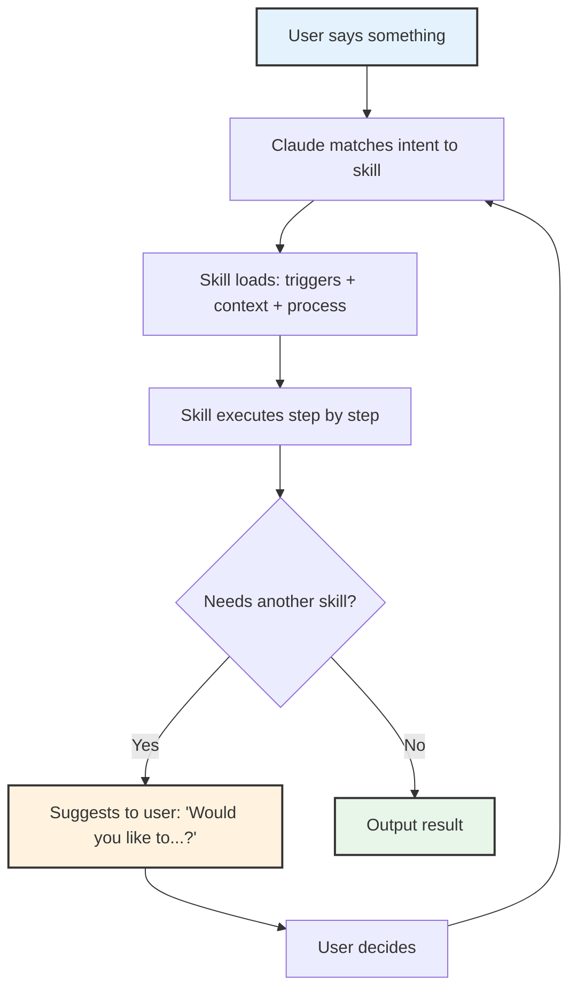

## The Skills Architecture

Brad Feld published a post called [Running a Company on Markdown Files](https://adventuresinclaude.ai/posts/2026-02-21-running-a-company-on-markdown-files/) that caught my attention. He built something called CompanyOS: a system of 12 markdown files that teach Claude Code how to run business operations. No application code. No web UI. No orchestration engine. Just structured markdown.

The 12 skills cover everything from drafting emails (`co-comms`) to managing support tickets (`co-support`) to running weekly EOS meetings (`co-l10-prep`). Each one connects to external systems through MCP servers: Linear, Gmail, Google Calendar, Help Scout, Notion, Sentry, Stripe, and Granola.

He also open-sourced [CEOS](https://github.com/bradfeld/ceos), a separate package of 17 skills that implements the Entrepreneurial Operating System through Claude Code. That repo is the one you can actually clone and study.

I spent time reading every blog post on [Adventures in Claude](https://adventuresinclaude.ai/), cloning the repos, and reading the actual skill files. What Brad built is genuinely impressive. He took Claude Code, which most people use as a coding assistant, and turned it into the operating system for an entire business. The level of thought that went into the skill template, the data ownership model, the guardrails, the measurement loop... this is production-grade systems thinking applied to AI configuration. It deserves serious study.

## How Skills Work

Every skill follows an 8-section template:

1. **YAML Frontmatter**: name, trigger description, file access declarations, tools used
2. **Heading + Summary**: one paragraph on what the skill does
3. **When to Use**: natural language trigger phrases ("set rocks for this quarter", "how are our rocks tracking?")
4. **Context**: repo detection, key files, data format specs
5. **Process**: step-by-step instructions organized by modes (Create, Track, Score)
6. **Output Format**: how to display results (tables, summaries, scorecards)
7. **Guardrails**: hard rules (show diff before writing, never auto-invoke other skills)
8. **Integration Notes**: cross-skill relationships and data ownership declarations

The interaction model between skills is the interesting part. Each skill owns exactly one data directory. Other skills can read from it but never write to it. This is microservices-style data isolation applied to markdown files.




Skills never call each other directly. When `co-launch` needs to send a message, it delegates to `co-comms` through natural language. The human stays in the loop at every transition. Brad calls this "mention, don't invoke."

## Why Brad Needs This

Brad runs 8 parallel Claude Code worktrees simultaneously. He processes 114 sessions per week. His auto-loaded context costs 19,600 tokens per session before he types anything. He has multiple team members who need different skill sets. His skills connect to 8 external APIs.

At that scale, a single configuration file would be unmanageable. The formalism solves real problems: data ownership prevents one workflow from corrupting another's state. The 8-section template makes skills reviewable and auditable. Trigger-based activation routes natural language to the right skill without the user memorizing commands. The measurement loop (hooks that log every skill invocation to a database) creates self-awareness about operational patterns.

## What I Have Instead

I manage infrastructure, DevOps, and product development across multiple companies simultaneously. Each company has its own [meta repository](/meta-repository-pattern) containing 10 to 20 sub-repositories: backend, web, mobile, DevOps, documentation, KPIs, and more. Each company has its own Docusaurus site serving as the [DNA of the business](/company-docs-dna-of-the-business). Each one deploys through Terraform across AWS, Azure, and GCP with full CI/CD pipelines.

This is not a simple setup. It is a sophisticated, multi-company, multi-cloud operation with different teams in each company.

But the AI configuration? That is simple on purpose.

I use layered `CLAUDE.md` files. One global file at `~/.claude/CLAUDE.md` that contains my personal workflow preferences: how to assign tasks to teammates (project management tool + chat notification), how to format messages for Slack, how to take screenshots, the database port registry, the commit workflow, the blog publishing pipeline. Then each company's meta repository has its own `CLAUDE.md` with company-specific context. And each sub-repository within that meta folder has its own `CLAUDE.md` with repo-specific instructions.

```
~/.claude/CLAUDE.md                    # Global: my workflow, my tools, my preferences
company-meta/CLAUDE.md                 # Company: architecture, teams, conventions
company-meta/company-backend/CLAUDE.md # Repo: stack, patterns, deployment
company-meta/company-devops/CLAUDE.md  # Repo: Terraform, CI/CD, infrastructure
```

When I say "send a message to the team about the deployment," Claude reads my global CLAUDE.md, finds the messaging section with the webhook configuration, and follows the steps. When I say "create a task for the frontend developer about the new API endpoint," Claude reads the same file, creates the work item in the project management tool, sends the notification. Two steps, one file, everything works.

I wrote about this layered approach in [The Meta Repository Pattern](/meta-repository-pattern). The CLAUDE.md hierarchy is a natural extension of it.

## The System Behind the Simplicity

To be clear about the scope: my workflow is not trivial. Across these companies, I manage:

- **Multi-cloud infrastructure** deployed through Terraform across [all three major cloud providers](/devops-across-clouds-production-first)
- **Docusaurus documentation sites** for each company, deployed as [first-class services](/company-docs-dna-of-the-business) with Google OAuth
- **Spec-driven development** where [specifications are the single source of truth](/specs-as-single-source-of-truth) that drives code, documentation, and marketing
- **Configuration as code** for everything: [Sentry alerts](/sentry-configuration-as-code), [Slack channel access](/slack-configuration-as-code), [Google Workspace users](/google-workspace-as-code)
- **Multiple teammates per company** with task assignment, code review, and async communication
- **Production deployments** [multiple times daily](/production-first-mindset-evolution) across all environments
- **KPI dashboards** and data warehouses built on [BigQuery with cross-source analytics](/the-first-thing-i-set-up-data-warehouse)
- **AI-assisted development** where [specs guide every implementation step](/ai-reads-my-specs)

The sophistication lives in the infrastructure, the processes, and the documentation. Not in the AI configuration layer. That is the key distinction.

## Why I Chose Not to Build Skills

I analyzed the skills architecture carefully. I mapped out what potential skills I could extract: task assignment for teammates, team messaging, blog publishing, deployment workflows, Slack formatting, screenshot tooling.

Then I asked myself what I would actually gain.

**Token savings?** My global CLAUDE.md is not 19,600 tokens. And the layered approach means Claude only loads the relevant company and repo context for the current session. The meta repository pattern already solves the context problem.

**Data isolation?** I don't have cross-skill data ownership problems. My workflows are procedural instructions, not data management systems. There is no state that one workflow could corrupt in another.

**Team coordination?** I coordinate with multiple teams, but through project management tools and chat, not through Claude Code skills. Each teammate works in their own environment. The CLAUDE.md tells Claude how I interact with them, not how they interact with each other.

**Composability?** I can already compose workflows naturally. "Create a task for the backend developer and message them about it" chains two sections of the same file. No skill delegation needed.

The real tradeoff is **agility vs. structure**. Right now, if I want to change how task assignment works across all companies, I update one section of my global CLAUDE.md. One file. One edit. Thirty seconds. Every future session across every company picks up the change.

With skills, that same change means: update the task assignment skill, check if the messaging skill references the old pattern in its integration notes, verify the trigger phrases still make sense, make sure the data ownership table is current.

I am trading flexibility for formalism. At my scale, flexibility wins.

## The Layered Context is the Architecture

Brad's skills system provides structured context for each operational domain. My layered CLAUDE.md files do the same thing, just organized differently:

**Brad's Approach** vs **My Approach**

- 12 skill files in one repo vs Layered CLAUDE.md across multiple meta repos
- Skills activate by intent matching vs Sections activate by natural language
- Data ownership per skill vs Context isolation per company/repo
- 8-section template per skill vs Company-level + repo-level context
- Trigger configs in JSON vs No explicit triggers needed

The meta repository pattern already gives me context isolation. When I open Claude Code in the healthcare company's meta folder, it loads that company's CLAUDE.md with its architecture, team structure, and conventions. When I switch to the B2B SaaS company, different CLAUDE.md, different context, different team. The isolation is physical (different folders) rather than logical (different skill files).

## The Trigger Point

The moment skills start making sense is not about the number of workflows or even the number of companies. It is about when the CLAUDE.md files can no longer hold their own weight. When I change one section and forget that three other sections reference the same pattern. When the global file is 2,000 lines and I am afraid to touch it. When teammates start using Claude Code directly and need different subsets of the same operational knowledge.

I am nowhere near that point.

And when I get there, the migration is trivial. The CLAUDE.md already contains the domain knowledge in natural language. Extracting a section into a skill file is restructuring, not rewriting. The 8-section template is just a frame around content that already exists.

## What I Took Away

The vocabulary matters more than the architecture. Understanding that Claude Code has distinct concepts for skills, commands, rules, and agents means that when I do hit a scaling problem, I will know which tool to reach for. Brad's system is a reference architecture for a problem I do not have yet.

The `.claude/commands/` pattern is the one piece I find immediately useful. If I have a workflow I run repeatedly with specific steps, a slash command is simpler than a full skill. One markdown file, direct invocation, no trigger matching, no integration notes, no data ownership table.

Brad built the right system for Brad's problem. I built the right system for mine. The difference is not about which approach is better. It is about which problem you are solving.

## Everyone Has Their Own Journey

This is what I find most fascinating about working with AI. There is no single correct way to configure it. Brad looked at his operational complexity and built a formalized skills system with templates, triggers, and data ownership rules. I looked at my operational complexity and chose to keep my configuration free-form, shaped to fit the way I think and work.

Both approaches work. Both are sophisticated. The sophistication just lives in different places.

What Brad did is amazing. He proved that you can run a company on markdown files. That Claude Code is not just a coding tool but a full operational layer. That skills can coordinate through natural language delegation without an orchestration engine. This is new territory and he mapped it thoroughly.

But I know exactly what I need right now, and I know when the time will come to move to a higher level of complexity. That decision is mine to make, based on the friction I actually feel, not the friction I might feel someday. Right now, the free-form approach lets me shape the AI configuration into something that fits uniquely my style, my workflow, my way of thinking across multiple companies and teams.

That is the power of AI in this era. It adapts to you, not the other way around. Every practitioner finds their own path. Some build formal skill systems. Some build layered CLAUDE.md hierarchies. Some do something entirely different. The tool is flexible enough to support all of it.

The important thing is not which pattern you follow. It is that you understand the options, study what others have built, and make a deliberate choice based on your actual needs. Not someone else's.

## The Decision Framework

For anyone evaluating this:

**Stay with CLAUDE.md when:**
- Your configuration fits in files you can read in 5 minutes
- Your context isolation comes from project structure (meta repos, folders)
- Your workflows are procedural instructions, not data management
- You value the ability to change anything in one edit
- Your team coordination happens through external tools, not through Claude

**Move to skills when:**
- Your auto-loaded context exceeds 15,000+ tokens
- Multiple people use Claude Code on the same repo and need different capabilities
- Your workflows manage state that could conflict across domains
- You need audit trails for which workflows ran and when
- You cannot hold the full configuration in your head anymore

The architecture is there when you need it. The blog posts and the [CEOS repo](https://github.com/bradfeld/ceos) document every detail. Study them. Understand the patterns. Then make your own choice based on the friction you actually feel today.

Your journey with AI is yours. Shape it to fit.
