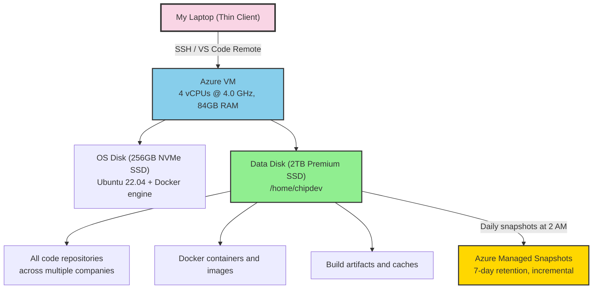
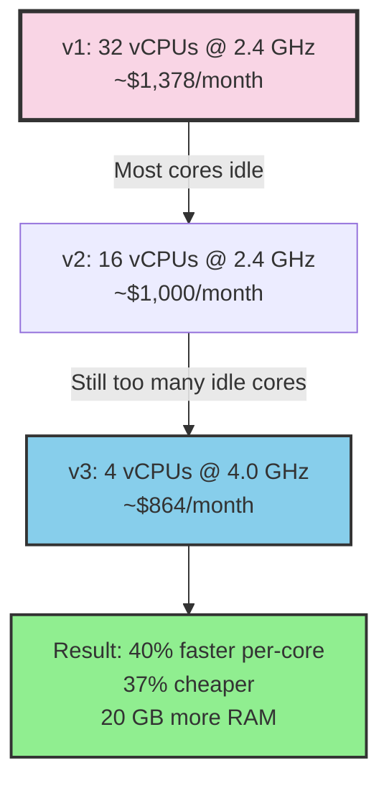
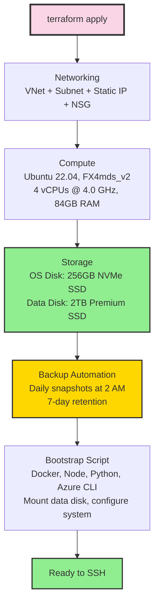

## The Moment I Stopped Developing Locally

There's a pattern I kept hitting. New laptop, spend a day configuring it. Install Node, Docker, Python, Terraform, Azure CLI, GitHub CLI, configure SSH keys, clone repositories, set up workspace files. Then repeat it all when a team member joins. Then repeat it again when something breaks.

I stopped doing this entirely. My entire development environment now runs on a cloud VM. My laptop is a thin client. It runs VS Code, and VS Code connects over SSH to an Azure VM where all the real work happens. That's it.

## The Setup

The machine is an Azure Ubuntu 22.04 VM running an FX-series processor at 4.0 GHz turbo with 84GB of RAM and a 2TB data disk. It runs 24/7. Every repository, every Docker container, every build process runs on this machine.




The key decision: two separate disks.

## Two Disks, One Principle

The OS disk handles Ubuntu and system packages. The data disk holds everything I care about: code, Docker data, project files. This separation is intentional and critical.

If the OS disk corrupts, I format it and reinstall. My code survives. If I want to upgrade Ubuntu versions, I swap the OS disk. My code survives. The data disk is the thing that matters, and it's the thing that gets backed up.

The storage layout on the current machine:

```
/dev/nvme0n1p1  →  /              (256 GB)  OS + installed software
/dev/nvme0n2p1  →  /home/chipdev  (2 TB)    All development files
/dev/nvme1n1    →  (unmounted)    (220 GB)  Local ephemeral NVMe
```

The 2TB data disk mounts directly as the home directory. Every repository, every Docker image, every node_modules folder lives there. Current usage sits around 913 GB, which is 46% of the disk. There's also a 220GB local ephemeral NVMe drive available for future optimization (moving node_modules or Docker layers to it for faster I/O).

Docker's data root also points to the data disk:

```json
{"data-root": "/data/docker"}
```

Every container, every image, every volume lives on the data disk. Nothing valuable touches the OS disk.

## The Backup That Runs While I Sleep

Every night at 2 AM UTC, an Azure Automation runbook takes an incremental snapshot of the data disk. Incremental means only the blocks that changed since the last snapshot get stored. This keeps costs low while providing full point-in-time recovery.

The entire backup system is defined in Terraform:

```hcl
# Azure Automation Account for running backup scripts
resource "azurerm_automation_account" "backup_automation" {
  name     = "dev-backup-automation"
  sku_name = "Basic"

  identity {
    type = "SystemAssigned"
  }
}

# Daily schedule at 2 AM UTC
resource "azurerm_automation_schedule" "daily_backup" {
  name      = "daily-disk-backup"
  frequency = "Day"
  interval  = 1
  timezone  = "UTC"
}
```

The runbook itself creates the snapshot with a date tag and cleans up anything older than 7 days:

```powershell
# Create incremental snapshot
$snapshotConfig = New-AzSnapshotConfig `
    -SourceUri "$($disk.Id)" `
    -Location "$($disk.Location)" `
    -CreateOption Copy `
    -Incremental

New-AzSnapshot `
    -ResourceGroupName $ResourceGroupName `
    -SnapshotName "$diskName-snapshot-$date" `
    -Snapshot $snapshotConfig

# Clean up snapshots older than 7 days
$cutoffDate = (Get-Date).AddDays(-7)
Get-AzSnapshot -ResourceGroupName $ResourceGroupName |
    Where-Object { $_.Tags.CreatedDate -lt $cutoffDate } |
    ForEach-Object { Remove-AzSnapshot -SnapshotName $_.Name -Force }
```

Seven days of snapshots. Automatic cleanup. Zero manual intervention. If something goes catastrophically wrong on a Tuesday, I restore from Monday's snapshot and lose at most one day of work (though git handles most of that anyway).

Recovery takes less than 15 minutes: deallocate the VM, detach the corrupted disk, create a new disk from the snapshot, attach it, start the VM. I've done it. It works.

## The Upgrade That Surprised Me: Fewer Cores, Faster Machine

I started with a Standard_D32s_v6 (32 vCPUs). Then moved to a D16s_v5 (16 vCPUs, 64GB RAM). Both were overkill in the wrong direction.

Here's what I learned: development workloads are mostly single-threaded. TypeScript compilation, Rails hot reload, Next.js dev server, webpack bundling. All of these hit one core hard and leave the rest idle. I had 16 cores sitting 85% idle while waiting on a single slow one.

So I went the other direction. I moved to the FX-series: 4 vCPUs at 4.0 GHz turbo, with 84GB of RAM and an NVMe disk controller.




The result: compilation is faster, hot reload is snappier, and the monthly bill dropped by 37%. Four fast cores beat sixteen slow ones for everything I do.

84GB of RAM means I never think about memory. I run PostgreSQL, Redis, Rails, Next.js, and Docker simultaneously. The machine doesn't flinch.

## Everything Is Terraform

The entire machine is defined in Terraform. The networking, the disks, the backup automation. One `terraform apply` and the infrastructure exists.




A first-boot script runs automatically when the VM is created. It installs everything: Docker, Node.js via nvm, GitHub CLI, Azure CLI, Python, build tools. It formats the data disk, creates the mount, tunes the kernel for Node.js development (increasing inotify watchers to 524288). By the time I SSH in for the first time, the machine is ready.

## The Cost

Running this in Canada Central on Azure:

- **VM (FX4mds_v2, 4 vCPU @ 4 GHz, 24/7):** ~$550/month
- **Data Disk (2TB Premium SSD):** ~$270/month
- **OS Disk (256GB Premium SSD):** ~$35/month
- **Backup snapshots (incremental):** ~$5/month
- **Static public IP:** ~$4/month
- **Total:** ~$864/month

The previous setup with a D32s_v6 cost ~$1,378/month. Switching to fewer, faster cores saved $514/month while making everything feel quicker.

That's real money. But consider what it replaces. A high-end developer laptop costs $3,000-$4,000 and depreciates. It breaks, it needs replacing, it needs configuring. The cloud VM is faster than any laptop for the workloads I run, it's reproducible through Terraform, and I can scale it up or down in minutes.

To reduce costs, I could stop the VM outside working hours. VS Code reconnects automatically when the machine restarts. For teams that work standard hours, this cuts the VM cost roughly in half.

## How I Actually Work

My daily workflow looks like this:

1. Open VS Code on my laptop
2. Connect to the remote machine via SSH (one click, it's saved)
3. Open the workspace file that contains all repositories
4. Start Claude Code at the meta folder level
5. Work across all repositories with full context

The connection is seamless. File editing, terminal access, extensions, debugging. Everything runs on the remote machine. My laptop's CPU sits idle. Its fan never spins.

I've worked from hotel Wi-Fi, coffee shop connections, even tethered to my phone. Because the VM has a static public IP and everything runs remotely, the only thing traveling over the network is keystrokes and screen updates. Build artifacts, Docker images, npm packages. All of that stays on the VM's fast SSD.

## Onboarding a New Developer in Minutes

This is where the pattern really pays off. When I bring someone onto a project, the process is:

1. They generate an SSH key
2. I add their public key to Terraform
3. `terraform apply` creates their machine
4. They connect via VS Code Remote SSH
5. They run `gh auth login` and clone the meta repo

That's it. No "install Docker on Windows" debugging. No "your Node version is different" conversations. No "it works on my machine" problems. Their VM is identical to mine because it's built from the same Terraform configuration.

## Security by Design

Password authentication is disabled. Only SSH keys work. The network security group opens port 22 for SSH and a range of development ports (3000-9000) for testing web servers. Nothing else is exposed.

All secrets live in Azure Key Vault, not on the machine. Terraform reads from Key Vault and sets GitHub Actions secrets. The VM itself holds no credentials beyond SSH keys and authenticated CLI sessions. Disks are encrypted at rest by Azure.

## The Pattern

```
Your Laptop                    Azure VM (Canada Central)
┌──────────────────┐          ┌──────────────────────────────┐
│                  │          │  OS Disk (256GB NVMe)        │
│  VS Code         │   SSH   │  └─ Ubuntu, Docker, tools    │
│  (thin client)   ├─────────┤                              │
│                  │          │  Data Disk (2TB SSD)         │
│  Nothing builds  │          │  └─ /home/chipdev/           │
│  Nothing runs    │          │     ├─ All repos (913GB)     │
│  Nothing stores  │          │     ├─ Docker data           │
│                  │          │     └─ Build caches          │
└──────────────────┘          │                              │
                              │  Backups: daily, 7 days      │
                              └──────────────────────────────┘
```

Local development served me well for 20 years. But when I started managing multiple companies, each with 10-20 repositories, running heavy Docker setups, and using AI tools that need massive context, the laptop stopped being enough.

The cloud VM is faster, reproducible, backed up, and accessible from anywhere. And when the next developer joins, their environment is one `terraform apply` away.

My laptop is a screen with a keyboard. The real machine is in the cloud.
