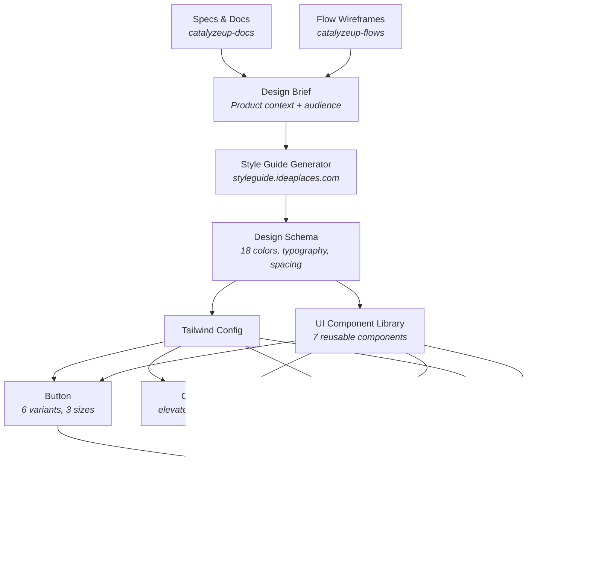

I was reviewing a PR where my developer had "integrated a style guide." The colors changed. The background was different. But the font was exactly the same system font as before, and every page still had its own inline button styles, its own card markup, its own badge colors. It looked different but it wasn't a design system. It was a palette swap.

So I decided to do it properly. In one session, I studied how my own [style guide generator](https://styleguide.ideaplaces.com) works under the hood, generated a complete design system following the exact same schema, built a reusable component library, and refactored 20 pages to use it.




## The Problem: Color Soup

[ImpactPulse](https://impactpulse.catalyzeupdev.com) is a survey platform for nonprofits. Before the refactor, the frontend was using default Tailwind colors with no consistency:

- Orange for auth buttons
- Indigo for survey actions
- Purple for organizations
- Blue for member management
- Green for success states

Every page had its own inline styles. Buttons were 15 lines of Tailwind classes copy-pasted everywhere. Want to change the primary button color? Find and replace across 20 files. That's not a design system. That's technical debt wearing a color palette.

## Step 1: Study Your Own Tools

I had already built [styleguide.ideaplaces.com](https://styleguide.ideaplaces.com), an AI-powered style guide generator. Instead of just using it as a black box, I studied its internals to understand what a "complete" design system actually contains.

The generator outputs a structured schema with:

- **18 color tokens**: primary (3 shades), secondary (3), accent, background (2), surface, foreground (2), border (2), and 4 semantic colors
- **Typography**: 3 font families (body, heading, mono), weights, line heights, and a 10-step type scale
- **Spacing**: base unit (4px or 8px) with a full scale
- **Shadows**: 4 levels (sm, md, lg, xl) with 5 style presets
- **Border radius, icon style, transitions**

This schema became my blueprint. If the generator thinks these are the minimum tokens a design system needs, that's what I'll build.

## Step 2: Write a Design Brief, Not Just "Make It Teal"

The biggest mistake developers make with design systems is starting with colors. You should start with *who uses this product and how should it make them feel*.

I wrote a comprehensive design brief for the AI prompt:

> ImpactPulse serves nonprofit organizations measuring their impact on vulnerable communities. The people taking surveys are often in transitional housing, recovery programs, or youth mentorship. The interface must feel safe, calm, and encouraging. Never clinical, bureaucratic, or intimidating.
>
> The brand sits at the intersection of "data-driven rigor" and "human warmth." Think: if a compassionate social worker and a data analyst designed an app together.

From this, the design direction became clear:

- **Primary: Deep Teal (#0D7377)** for trust, growth, and calm
- **Secondary: Sage Green (#5B8A72)** for nature and progress
- **Accent: Warm Coral (#E07A5F)** for human warmth and CTAs
- **Background: Warm Linen (#FAF8F5)** instead of cold white/gray
- **Fonts: Inter** (body, readable at all sizes) + **Plus Jakarta Sans** (headings, warm and distinctive)

The full [design brief and prompt](https://docs.catalyzeupdev.com/impact-pulse/technical/style-guide) is available in our documentation site, which itself is built on a [specs-as-single-source-of-truth](/specs-as-single-source-of-truth) approach.

## Step 3: Build 7 Components, Not 70

The component library has exactly 7 components. Not a massive UI framework. Just the building blocks that every page actually needs:

```typescript
// One import gives you everything
import { Button, Card, CardHeader, Badge, StatusBadge,
         Input, Textarea, Select, Alert, NavBar,
         PageLayout, PageHeader } from '../components/ui'
```

**Button** handles 6 variants (primary, secondary, accent, danger, outline, ghost), 3 sizes, loading state, and full-width mode. One component replaces 15 lines of Tailwind classes everywhere.

**Card** with padding options and an elevated variant replaces the `bg-white shadow rounded-lg p-6` pattern that was duplicated on every page.

**StatusBadge** auto-maps status strings to colors: PUBLISHED becomes green, DRAFT becomes amber, OWNER becomes teal. No more `statusColor()` helper functions scattered across files.

**PageLayout** wraps any page with the nav bar and consistent max-width container. **PageHeader** handles the title, subtitle, back button, and action buttons. Together they eliminate the 30 lines of boilerplate that started every single page.

## Step 4: Refactor Everything at Once

With the components built, I ran three parallel refactoring agents:

1. Auth pages (SignIn, SignUp, ForgotPassword, ResetPassword)
2. Dashboard and survey pages (Dashboard, Create, Edit, Share, Preview, Responses)
3. Organizations, Maslow, and remaining pages

20 files refactored simultaneously. Every inline button became `<Button>`. Every card div became `<Card>`. Every error message became `<Alert>`. The net result was *fewer lines of code* despite adding a new component library, because the duplication was that bad.

## Step 5: The Visual Style Guide Page

The final piece: a living style guide at `/style-guide` that shows every component, every color swatch, every typography level, every shadow and spacing value. When a developer wonders "what shade of teal should I use for this?", they open the style guide and see the answer.

This is not a Figma file that gets out of sync. It's a React page that uses the same components as the rest of the app. If you change the primary color in `tailwind.config.js`, the style guide updates automatically.

## What I Learned

**Study your tools deeply.** I built the style guide generator months ago. But I never actually studied the schema it produces until I needed to replicate it. Understanding *why* it generates 18 specific color tokens (and not 12 or 24) informed better decisions.

**Design briefs matter more than color pickers.** "Warm teal" means nothing without context. "The interface must feel safe for people in vulnerable situations" gives you real constraints to design against.

**7 components is enough.** You don't need a massive UI library. Button, Card, Badge, Input, Alert, Nav, PageLayout. That covers 95% of a CRUD application. Add more only when you actually need them.

**Refactor all at once, not incrementally.** If half your pages use the old patterns and half use the new components, you have two systems to maintain. Rip the band-aid off.

**In-memory databases make this workflow possible.** The entire development cycle (change code, hot reload, test, screenshot) happens in milliseconds because there's no disk I/O. The [in-memory MongoDB pattern](/specs-as-single-source-of-truth) that powers our test suite also powers this kind of rapid iteration.

## The Stack

- **Design tokens**: Generated following the [styleguide.ideaplaces.com](https://styleguide.ideaplaces.com) schema
- **Documentation**: Specs in [catalyzeup-docs](https://docs.catalyzeupdev.com), flows in [catalyzeup-flows](https://flows.catalyzeupdev.com)
- **Frontend**: React + TypeScript + Tailwind CSS
- **Component library**: 7 components in `src/components/ui/`
- **Backend**: FastAPI (Python) with in-memory MongoDB for development
- **Live style guide**: [/style-guide](https://impactpulse.catalyzeupdev.com/style-guide)

The entire approach, from studying the generator's internals to having 20 refactored pages, took one working session. That's the power of having structured specs, reusable tools, and a clear design brief.
