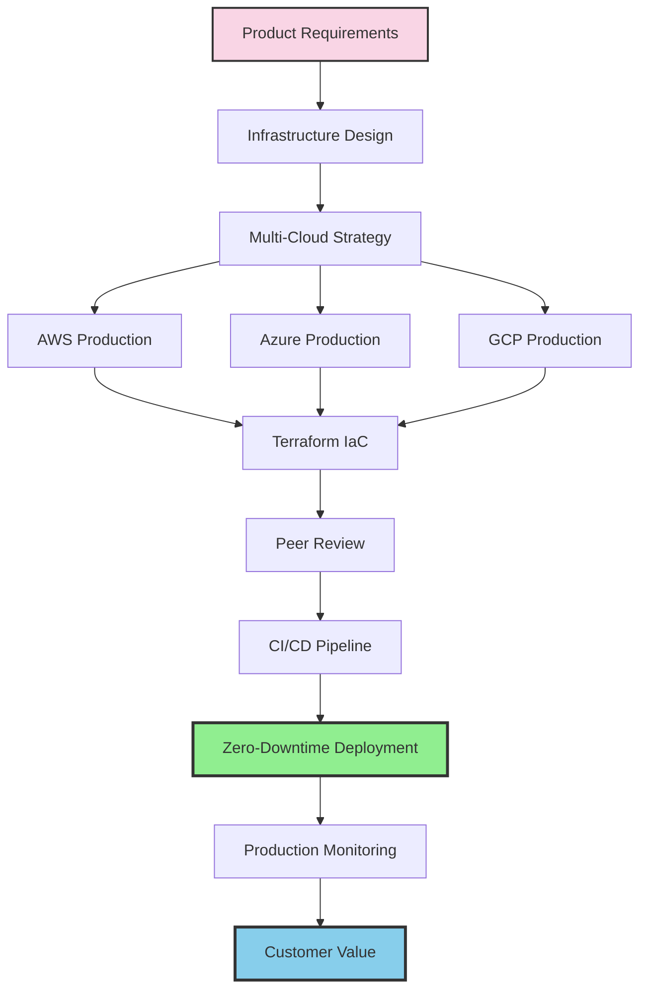

Working in production is one of the most challenging yet rewarding aspects of DevOps. When something breaks, it's immediately visible. Over the years, I've deployed production infrastructure across AWS, Azure, and Google Cloud for more than 10 startups, and now I'm launching OneOps.cloud to bring enterprise-grade DevOps to every early-stage company.

## The Evolution from Code to Infrastructure

My DevOps journey started 4-5 years ago, but this year alone has seen explosive growth. I've been helping more startups build their infrastructure, with AI dramatically accelerating my capabilities. Working across all three major cloud providers—Google Cloud, AWS, and Azure—I'm running production applications on each platform.

As a software engineer originally, I'm a product person at heart. But experience has taught me how critical infrastructure is. Now, when I join any company, I examine two things immediately: what customers want from the product, and whether the infrastructure can scale to handle them. Whether you have 10 customers or 10,000, you need certainty that your system will perform in any situation.

## Infrastructure as Code: The Foundation of Everything

Infrastructure as code has become a game changer in my professional practice. Being able to handle every aspect of an application—from databases to Kubernetes provisioning, services, VMs, Terraform configurations, logs, and alerts—the power is mesmerizing. When properly implemented, the leverage this brings to a business is immense.

But here's what I want to emphasize: the tension inherent in DevOps work. Migrations and deployments involving significant changes can lead to instability. Proper preparation is critical. Security, performance, availability, redundancy, disaster recovery—there are countless angles to consider, but all of them start with exceptional software engineering. Everything must be infrastructure as code, everything must be peer-reviewed, and everything must be clear in text and code.

## Production Reality: Where Theory Meets Practice

Working in production requires exceptional software engineering because any misstep can significantly backfire. Yet when done correctly, you can dramatically accelerate development. Over recent months, I've focused on using open technologies and keeping things as direct as possible, avoiding solutions that create unnecessary abstraction layers. AI allows me to test, deploy, validate, and run everything, greatly accelerating the development process.

With proper architectural guidance, AI becomes a powerful tool for shaping best-of-breed DevOps practices. I've been implementing blue-green deployments for zero-downtime releases. Many times I've performed deep migrations while significantly improving infrastructure while keeping the business running. It's not just greenfield projects—it's continuous improvement in production.

In every environment, I've built production-ready setups with comprehensive CI/CD pipelines including:
- Integration tests
- Unit tests
- End-to-end tests
- UI tests

When done properly, especially for B2B and B2C companies, this infrastructure gives them wings.

## The Comprehensive Infrastructure Stack

After working with 10+ startups on infrastructure, I've developed expertise the industry desperately needs. Beyond the major cloud providers, I work with Vercel, Railway, and Render. I deploy everything through Terraform with extensive bash scripting, create React Native builds, iOS builds, implement GitHub CI/CD, deploy GitHub Pages, and more. I host both B2B enterprise solutions and marketing websites—it's truly all-encompassing.

The production stack I've deployed includes:
- Multi-cloud infrastructure across AWS, Azure, and Google Cloud
- Kubernetes orchestration with auto-scaling
- Terraform for complete infrastructure as code
- Comprehensive CI/CD pipelines with full test coverage
- Blue-green deployments for zero downtime
- Security hardening and compliance frameworks
- Performance optimization and caching strategies
- High availability with redundancy across regions
- Disaster recovery with automated backups
- Monitoring, logging, and alerting systems
- Mobile app builds and deployments

## Managing the Tension of Production DevOps

The tension in DevOps work is real. Every deployment, especially migrations involving significant changes, carries risk. This is why everything starts with solid software engineering principles:

1. **Infrastructure as Code**: Every configuration, every deployment, every change is codified
2. **Peer Review**: Nothing goes to production without review
3. **Comprehensive Testing**: From unit to end-to-end, testing catches issues before customers do
4. **Security First**: Not an afterthought but built into every layer
5. **Performance Monitoring**: Real-time visibility into system health
6. **Availability Planning**: Redundancy and failover strategies
7. **Disaster Recovery**: When things go wrong, recovery is automated and tested

These aren't just best practices—they're survival requirements in production environments.

## Launching OneOps.cloud: Infrastructure for Every Startup

This extensive production experience has led me to launch OneOps.cloud, a service specifically tailored for startups and early businesses to establish their infrastructure correctly from day one. This represents my commitment to making enterprise-grade infrastructure accessible to companies that need it most but often can't access it.

The vision is simple: every startup deserves the same infrastructure excellence that large enterprises enjoy. With AI accelerating my capabilities and my experience across multiple cloud platforms and production deployments, I can make this happen.

## The Future of Infrastructure

We're no longer constrained by complexity. Today's challenge isn't technical limitations—it's bringing best practices to everyone who needs them. With modern tools, AI assistance, and proper architectural thinking, we can build robust, scalable infrastructure that grows with your business.

What excites me most is pushing code to production and seeing it handle real traffic, real customers, real problems. There's nothing quite like deploying infrastructure that seamlessly scales from your first customer to your millionth, knowing you've built something that works in any situation.

The infrastructure revolution is here. It's time every startup had access to it.