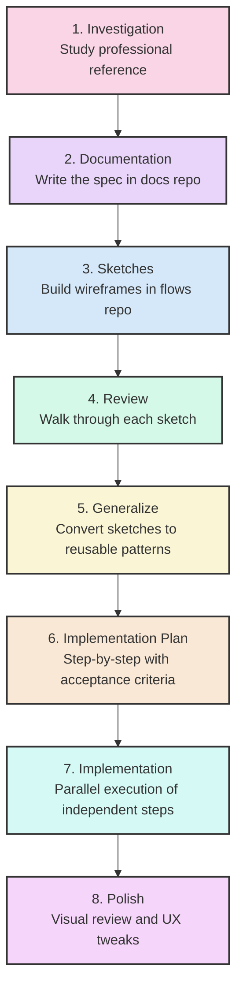

# How I Turned a Color Palette Generator Into a Professional Design System in One Session

I had a working product: the [IdeaPlaces Style Guide Generator](https://styleguide.ideaplaces.com). Users could chat with AI to generate color palettes, refine them through conversation, explore a version tree, and export to 7 formats (CSS, Tailwind, Swift, Android XML, and more). It had 463 tests, Stripe billing, and a split-pane chat interface.

The problem was simple: **the output looked like a developer tool, not a professional deliverable.** A flat list of 45+ UI components against a colored background. No typography scale. No spacing system. No device frames. No one was going to hand this to a stakeholder and say "here's our design system."

I needed to evolve it into something that generates professional style guide documents with platform-native previews. The kind of thing a designer would produce, but generated instantly from a conversation.

This is the process I followed. It took one focused session from investigation to merged PR.

## The Process: 8 Steps From Investigation to Production

Most developers would jump straight to step 7. That's why most feature work drifts, bloats, and ships late. The first 6 steps took less time than the implementation, but they made the implementation almost mechanical.

## Step 1: Investigation

I started with a professionally designed style guide built as an interactive web app. Not to copy it, but to understand what a complete visual guidelines document actually looks like.

The key patterns I extracted:

- **Alternating section backgrounds** (white and warm gray) create visual rhythm
- **Asymmetric grid layouts** (1:2 ratio) where text sits beside visual examples
- **Warm gray text hierarchy** with distinct weights for headings, body, and captions
- **Generous spacing** (80px+) between sections lets content breathe
- **The document uses its own design tokens** to style itself

This investigation revealed three concrete problems with my current output:

1. **Minimal tokens.** No typography scale, no spacing system, no font weights. Users export a Tailwind config and still have to define everything from scratch.
2. **Flat showcase.** No cover page, no color rationale, no typography specimens. Just a vertical list of components.
3. **No platform awareness.** iOS and Android "previews" looked like desktop websites.

Without this investigation, I would have guessed at what to build. With it, I had a reference for every design decision.

## Step 2: Documentation (The Spec)

I wrote a full specification in our docs repository. Not a feature request, not a Jira ticket. A proper technical spec with:

- **Problem statement** with specific examples of what users actually need
- **Expanded schema definition** showing every new field, its type, and default value
- **Architecture diagrams** for the preview panel, device frames, and style guide document
- **File-level plan** listing every file to create and modify
- **Backward compatibility analysis** proving existing palettes would still work

The spec lived in Docusaurus alongside all project documentation. It was versioned, reviewable, and permanent. When I came back to implement, I never had to remember why I made a decision. It was all written down.

## Step 3: Sketches (Wireframes in Code)

Instead of Figma, I built wireframes as code in a dedicated prototyping app. Low-fidelity sketches using a component library that strips away color and styling to focus on structure and flow.

I built three wireframe pages:

- **Chat v2 overview**: the full three-panel layout with tabs
- **Components detail**: what each platform's component showcase looks like
- **Screens detail**: every screen type (Landing, Auth, Dashboard, Settings) across all three platforms (Web, iOS, Android) side by side

The wireframes included actual CSS-only device frames (iPhone with Dynamic Island, Android with gesture bar), iOS-native patterns (grouped lists, toggles, SF Pro font), and Material Design 3 patterns (pill-shaped buttons, FAB, outlined text fields).

## Step 4: Review

I walked through every wireframe screen by screen. This caught issues that code review never would:

- The "Compare" mode for screens needed to hide the chat panel to fit three device frames
- iOS components needed to use system font overrides, not the palette's fonts
- The platform toggle and tab bar looked confusing on the same line (fixed later in polish)

## Step 5: Generalize

The wireframes used hardcoded colors (`#3730A3`, `#f2f2f7`). I converted every component to accept a palette prop and derive all styling from it. This meant:

- Device frames render the same structure regardless of palette
- Screen components use `palette.colors.primary` instead of a fixed indigo
- The style guide document literally styles itself with the design system it documents

## Step 6: Implementation Plan

This is where most of the leverage comes from. I wrote a step-by-step plan with:

- **Exact files** to create and modify per step
- **Acceptance criteria** for each step (what tests to run, what to verify)
- **Dependency graph** identifying which steps could run in parallel
- **The schema change comes first** because everything depends on it

The plan had 12 steps. Steps 1 through 5 were sequential (each depended on the previous). Steps 6 through 9 were independent (device frames, showcases, screens, and style guide document) and could be built in parallel. Steps 10 through 12 integrated everything and tested the result.

## Step 7: Implementation

With the plan in hand, implementation was fast. The key was parallelization.

I made the schema changes first (expanded `ColorPalette` with typography weights, line heights, type scale, spacing system, and icon style), updated all LLM components (schema, prompts, parser, mock), and verified 220 tests still passed.

Then I launched four parallel tracks simultaneously:

- **Track A**: CSS-only device frame components (IPhoneFrame, AndroidFrame)
- **Track B**: Platform showcase components (IOSShowcase, AndroidShowcase, ShowcaseRouter)
- **Track C**: Screen type components (Landing, Auth, Dashboard, Settings, each with Web/iOS/Android variants)
- **Track D**: Style guide document (7 sections: cover, colors, typography, spacing, components, usage)

While those four tracks ran, I built the PreviewPanel (tabbed container), the HTML export function, and updated the chat page to wire everything together.

The result: **18 new files, 18 modified files, 340 passing tests, zero TypeScript errors.** Seven focused commits, each touching a single concern.

## Step 8: Polish

The first visual test revealed a UX problem. The tab bar (Style Guide, Components, Screens) and the platform toggle (Web, iOS, Android) were on the same row with just a thin divider. It looked like one flat list of 6 buttons.

The fix was simple: move the platform toggle to its own row with a "Platform" label and a lighter background. Two rows instead of one. Immediately clear. This is the kind of thing you only catch by looking at the actual UI.

## What Changed

**Before:** A color palette with 18 colors, 3 font families, and a flat component list.

**After:** A complete design system with:

- Typography scale (10 sizes from 12px to 60px), font weights, line heights
- Spacing system (base unit + scale)
- Icon style preference
- Professional style guide document with cover, colors with rationale, typography specimens, spacing visualization, WCAG AA contrast checks
- Platform-native previews in CSS-only device frames (iPhone Dynamic Island, Android gesture bar)
- 4 screen types (Landing, Auth, Dashboard, Settings) rendered for Web, iOS, and Android
- Compare mode showing all 3 platforms side by side
- Self-contained HTML style guide export (8th format)

## The Principle

**Spec-driven development is not slower. It is faster.**

The investigation, documentation, wireframes, review, and planning took a fraction of the implementation time. But they eliminated every moment of "what should I build next?" during implementation. There was no drift, no scope creep, no backtracking.

When you write the spec first, implementation becomes parallel, mechanical, and testable. When you skip the spec, implementation becomes serial, exploratory, and fragile.

Every significant feature I build follows this process. Investigation, spec, sketch, review, plan, implement, polish. Eight steps. The first six are the ones that actually matter.
