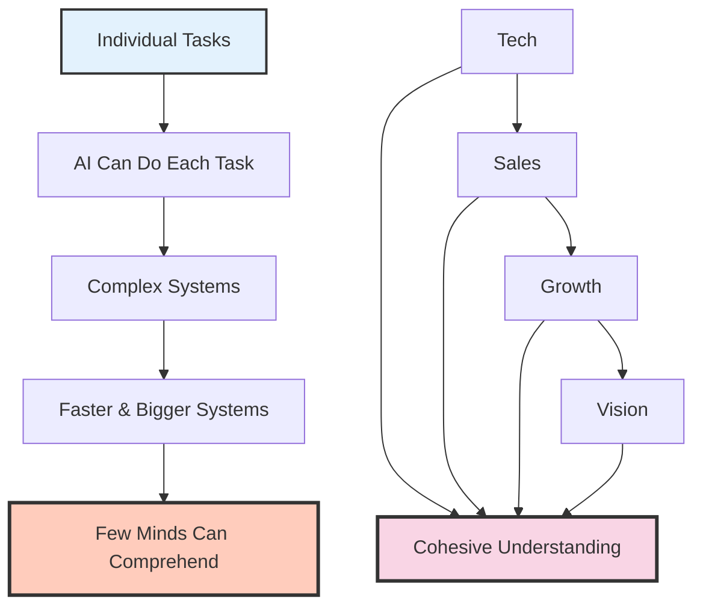

Last month I was sitting in front of three monitors, managing infrastructure across four companies simultaneously. One screen showed a Terraform plan rolling out across AWS and Azure. Another had a CI/CD pipeline deploying a healthcare startup's backend. The third was a conversation with an AI assistant helping me debug a data pipeline that stitched together Shopify transactions, Google Analytics sessions, and PostgreSQL records into a single warehouse.

I paused and realized something. I was not doing any of these tasks myself. Not really. I was thinking about what needed to happen, and then making it happen through a layer of intelligence that sat between my intentions and the machines. The AI was writing the Terraform modules. The AI was tracing the bug. The AI was suggesting the SQL joins. My job was to hold the entire picture in my head and decide what mattered next.

That moment clarified something I had been feeling for months. AI is not a tool I use. It is an extension of how I think. When I have an idea, I can make it real. Not in weeks. Not after hiring a specialist. Now. The gap between thought and execution has collapsed, and that changes everything about what it means to build things.

I have spent nearly a decade building and scaling a SaaS platform, growing it from zero to over a thousand clients. I have pushed code to production thousands of times. I know what it feels like to be deep in the details, to hold the shape of a system in my head while fixing a bug at three in the morning. What I am experiencing now is categorically different. The details still exist. But I no longer live inside them. I live above them, steering.

## The Principle

Here is what I have come to believe: every individual task in a modern business is simple. Writing a function, configuring a load balancer, drafting a sales email, analyzing a cohort of users. Individually, each one is straightforward. An AI can do any of them if you give it clear direction.

But the system these tasks form is not simple. It is complex beyond what most human minds can hold. And AI is the bridge between those two realities. It handles the simple pieces so that a person can focus on the complex whole.

## AI Handles Individual Tasks Brilliantly

I see this every day. I ask an AI to write a Cloud Function that syncs GA4 data across regions, and it produces working code in minutes. I describe the shape of a database migration, and it generates the SQL. I paste an error log, and it traces the root cause faster than I could by reading documentation.

These are not parlor tricks. This is real work that used to take hours. Infrastructure modules, data pipeline debugging, deployment configurations, monitoring alerts. Each task, taken alone, is something a competent engineer could do. The AI does it faster and often with fewer mistakes, because it does not get tired and it does not forget edge cases it has seen before.

The result is that my throughput has multiplied. Not by ten percent. By multiples. I can move across domains that used to require separate specialists. Infrastructure in the morning, data engineering after lunch, frontend fixes before dinner. The AI fills in the knowledge gaps between my areas of deep expertise, turning me from a specialist into something closer to a generalist with specialist depth everywhere.

## The Complexity Challenge

But here is where it gets interesting. The hard part is not the tasks. The hard part is guiding the system.

When I manage infrastructure for multiple startups, I am not just writing Terraform. I am making decisions that span technical architecture, cost optimization, security posture, team capability, product roadmap, and business strategy. Those decisions interact. A choice about database architecture affects deployment speed, which affects feature velocity, which affects growth, which affects runway.

No AI can hold that full picture yet. It can execute brilliantly within any single box on that diagram. But the lines between the boxes, the tensions, the tradeoffs, the judgment calls about what to prioritize when everything is on fire. That is still a human job. And it is getting harder, because the systems are getting bigger and faster every month.

Only a few minds can move fluidly between technical implementation, sales strategy, growth mechanics, and long term vision while keeping everything cohesive. That has always been true. What is new is that the stakes are higher. The systems move faster. The feedback loops are shorter. And the penalty for losing coherence is steeper.

## The Horizon Expansion

Before AI, most people lived deep in the details. A backend engineer spent years mastering PostgreSQL query optimization. A DevOps engineer became an expert in Kubernetes networking. A data analyst knew every quirk of their BI tool. Depth was the currency of professional value.

That currency is being devalued. Not because depth does not matter, but because AI provides depth on demand. I can go deep on any topic for as long as I need to, then pull back out to the strategic level. The new currency is breadth of comprehension. The ability to see the whole board.

This is a profound shift. I went from being someone who needed to master every detail of a deployment pipeline to someone who needs to understand how deployment speed connects to customer acquisition connects to unit economics connects to fundraising timeline. The details are handled. The thinking has moved up a level.

And this is where the opportunity lives. Ideas that used to require a team of specialists and months of execution can now be realized by one person with clear thinking and good AI tools. I can make any idea happen. That sentence would have sounded absurd five years ago. It does not sound absurd anymore.

## What Technology Wants

Kevin Kelly wrote about this in "What Technology Wants." His argument is that technology has its own trajectory, its own momentum, its own desires if you want to use that word. It moves toward greater complexity, greater interconnection, greater capability. Not because anyone planned it, but because that is the nature of the system.

I see this playing out in real time. The infrastructure I manage today would have been incomprehensible to me ten years ago. Not because any single piece is hard, but because the number of pieces and the speed at which they interact has grown exponentially. Cloud services, containerization, serverless functions, event driven architectures, machine learning pipelines, real time data streaming. Each one is individually learnable. Together, they form a system that no single human can fully map.

Society is moving into the technology. Not alongside it. Into it. Our businesses, our communication, our healthcare, our education, our entertainment. All of it runs on layers of software that grow more sophisticated every year. And that sophistication comes at a cost: fewer and fewer people can comprehend what is actually happening beneath the surface.

## The Tension

This is the uncomfortable truth. AI makes individuals more powerful than ever. I can build and manage systems that would have required a team of twenty a decade ago. But the systems themselves are growing more complex faster than human understanding can keep up.

We are in a race. On one side, AI amplifies what a single mind can do. On the other side, the technology those minds are building grows beyond any single mind's comprehension. Right now, AI is winning the race for me. I can still hold the picture. I can still see the connections. I can still make good judgment calls about what matters.

But I am not sure that lasts. The complexity is accelerating. Every month the systems get bigger, the interactions get more subtle, the failure modes get more surprising. AI helps me keep up. It does not guarantee I will.

## What This Means for the Next Decade

I do not think the future belongs to people who can do tasks well. AI has that covered. I think it belongs to people who can hold complex systems in their heads, see the connections that machines miss, and make judgment calls that require understanding not just the technology but the humans it serves.

The details are handled. The question is whether we can keep up with the thing we have built. Whether the human capacity for coherent understanding can scale alongside the systems we are creating. Whether the few minds that can see the whole picture will be enough to steer what comes next.

I do not have the answer. But I know this: the ability to think across domains, to hold contradictions, to see a system as more than the sum of its parts. That is the most valuable skill in the world right now. And it is getting more valuable every day.