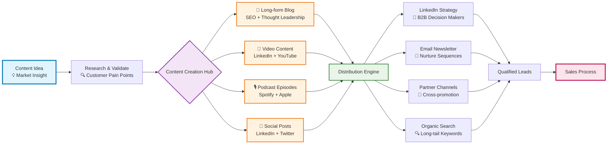
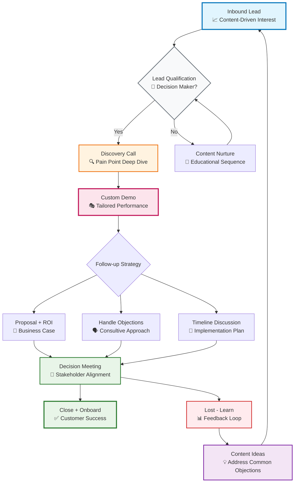

# From Stage to Sales: How I Built Mentorly's Content Creation Engine

When people hear I went from performing with international dance companies to leading a B2B SaaS company, they often ask how those worlds connect. The truth is, both require the same fundamental skill: **systematic preparation for peak performance**.

After 8 years building Mentorly from a startup idea to a platform trusted by organizations worldwide, I've learned that content creation and sales aren't art forms—they're systems. And like any great performance, success comes from disciplined practice behind the scenes.

## The Artist's Approach to B2B Content Strategy

Here's my complete content creation and distribution system—from initial concept to closed deals:

## The Sales Performance System

Converting content into customers requires the same systematic approach I learned in dance: every movement has a purpose, every sequence builds toward the finale.

## What I Learned from 10 Years on Stage

**Performance is preparation.** In dance, you don't just show up and improvise. Every movement is practiced, every transition is rehearsed, every performance builds on the last. The same applies to B2B sales and content creation.

### The Choreographer's Mindset

When I was touring with BJM Danse and Ballet BC, I learned that great choreographers don't just create beautiful moments—they create systems that consistently produce beautiful moments. That's exactly what I've built at Mentorly:

1. **Content Choreography**: Every piece of content serves multiple purposes across multiple channels
2. **Sales Choreography**: Every touchpoint in our sales process is designed to build trust and demonstrate value
3. **Feedback Choreography**: Every lost deal becomes content that addresses future objections

### From Development Liaison to CEO

My experience as a development liaison taught me something crucial about B2B relationships: **People don't buy from companies, they buy from humans they trust.**

When I was bridging donors and artists, I realized that successful partnerships weren't about perfect pitches—they were about understanding what each party truly needed and creating genuine value for both sides.

## The Tools That Power Our Content Engine

**Content Creation Stack:**
- **Loom** for quick video explanations and product demos
- **Canva** for visual content and LinkedIn carousels  
- **Riverside.fm** for podcast recording and interviews
- **Buffer** for social media scheduling and analytics
- **Notion** for content planning and editorial calendar

**Sales & Outreach Stack:**
- **HubSpot** for CRM and lead nurturing sequences
- **Calendly** for demo booking and scheduling
- **Zoom** for discovery calls and product demonstrations
- **Notion** for proposal templates and ROI calculations
- **Slack** for internal sales coordination

## The Montreal Advantage

Building Mentorly from Montreal has given us a unique perspective on global mentorship needs. The city's blend of North American business culture and European relationship-building has shaped how we approach both content and sales.

**Our content reflects this balance:**
- **North American directness**: Clear value propositions and measurable ROI
- **European relationship-focus**: Long-term trust building and genuine partnership

## Why Content-Led Sales Works for B2B

Here's what most B2B companies get wrong: they treat content and sales as separate functions. But when you've performed on stage, you understand that **the rehearsal and the performance are part of the same system**.

### The Performance Feedback Loop

Every piece of content I create feeds directly into our sales process:
- **Blog posts** become talking points in discovery calls
- **Podcast conversations** become case studies for proposals  
- **LinkedIn posts** become conversation starters with prospects
- **Lost deals** become topics for future content

### Building Trust at Scale

In dance, you build trust with your audience through consistent, authentic performance. In B2B sales, it's the same principle: **consistent, valuable content builds trust before the first sales conversation even happens**.

## The Numbers Behind the System

After 8 years of refining this approach, here's what our content-led sales engine delivers:

- **70% of our qualified leads** come from content-driven channels
- **Average sales cycle reduced by 40%** through educational content
- **3x higher close rate** on content-qualified leads vs. cold outreach
- **85% customer retention rate** because expectations are set through content

## What's Next: Scaling the Performance

Just like a dance company that grows from small venues to international stages, we're scaling our content and sales systems for global impact. The fundamentals remain the same: **systematic preparation, authentic performance, and continuous refinement based on audience feedback**.

The mentorship gap that inspired me to start this company is still massive. But with the right systems—content systems, sales systems, and relationship systems—we can make mentorship accessible and reliable for organizations worldwide.

**The stage may have changed, but the discipline remains the same: great performance requires great preparation.**

---

*Ashley Werhun is the CEO and Co-Founder of Mentorly, a cloud-based mentorship platform trusted by organizations worldwide. Prior to building Mentorly, Ashley spent 10+ years performing with internationally renowned dance companies including BJM Danse and Ballet BC. Connect with Ashley on [LinkedIn](https://linkedin.com/in/ashleywerhun) to learn more about systematic approaches to B2B growth.* 