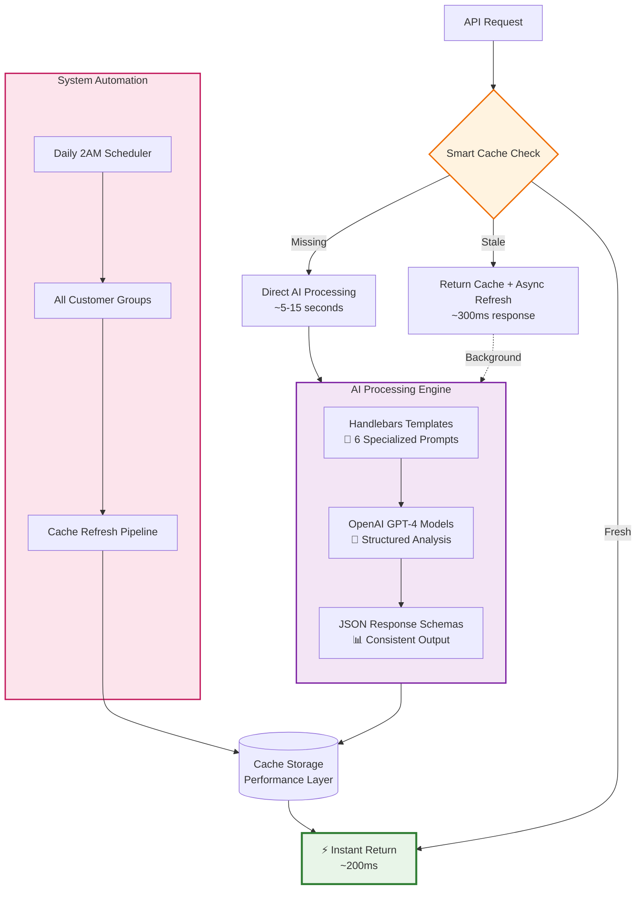
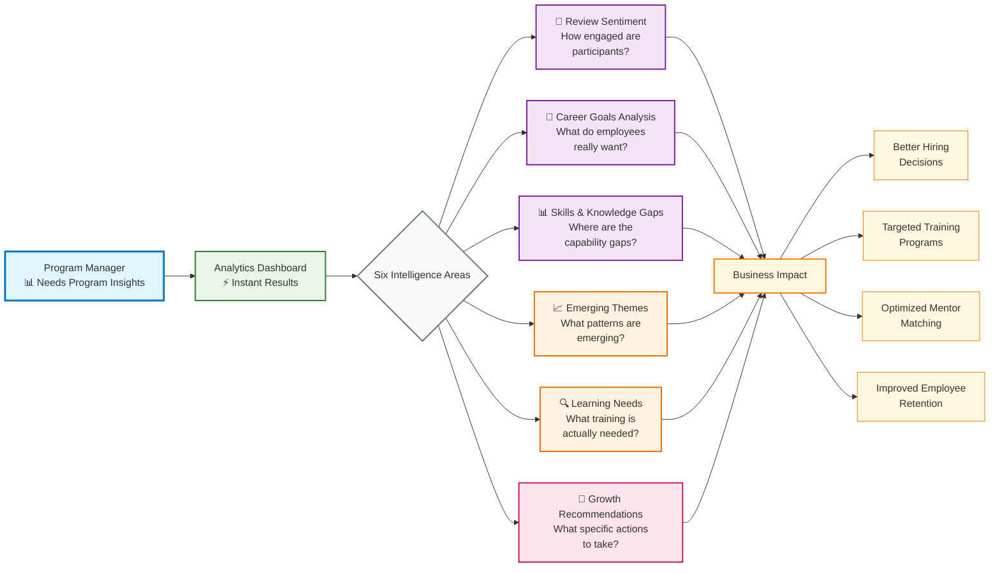

# Building the Mentorly Intelligence System: How LLMs Finally Made Sense of Human Potential

When we set out to build our intelligence system, we weren't trying to create another AI dashboard. We wanted to solve something that's frustrated HR leaders for decades: **How do you extract meaningful insights from hundreds of conversations about skills, growth, and career development?**

The breakthrough wasn't in the technology itself—it was in realizing that LLMs are uniquely suited to understand the messy, human complexity of professional development. For the first time, we can distill insights from hundreds of employees in a way that actually makes sense to the people who need to act on them.

## The Technical Architecture That Powers Human Understanding

First, let's look at the technical foundation that makes instant intelligence possible:

Now here's the intelligence flow - what program managers actually experience:

This horizontal structure groups our intelligence capabilities into two logical rows:

**Row 1 - Data Intelligence**: Raw analysis of conversations, reviews, and career goals  
**Row 2 - Program Intelligence**: Pattern recognition, learning needs assessment, and actionable recommendations

The six intelligence areas work together to transform unstructured human conversations into structured business insights that program managers can act on immediately.

## Why LLMs Changed Everything for Mentorship Analytics

Traditional analytics struggled with mentorship data because human conversations about professional development are inherently unstructured. People don't describe their skills in standardized categories. They don't articulate their career goals in predictable formats.

But LLMs excel at exactly this kind of complexity. They can extract meaning from statements like "I want to get better at strategic thinking" and map that to specific development paths. They can identify when someone mentions "leadership challenges" and connect it to relevant mentors who've faced similar situations.

**The real breakthrough: structured output from unstructured conversations.**

## The Daily Intelligence Cycle

Every night at 2 AM, our system processes each customer group through a carefully orchestrated pipeline using six specialized AI templates:

### Row 1 - Data Intelligence (Foundation Analysis)
1. **Review Sentiment Analysis**: Extracts themes from mentor-mentee feedback and satisfaction scores
2. **Career Goals Analysis**: Identifies patterns in short-term and long-term professional aspirations  
3. **Skills & Knowledge Gap Analysis**: Maps what mentors offer vs what mentees need

### Row 2 - Program Intelligence (Pattern Recognition & Recommendations)  
4. **Emerging Themes Analysis**: Discovers cross-cutting patterns across skills, goals, and industries
5. **Learning Needs Assessment**: Pinpoints specific training gaps and development opportunities
6. **Career Development Recommendations**: Generates prioritized, actionable upskilling initiatives

Each template uses specialized Handlebars prompts designed to extract structured JSON responses from unstructured human conversations. The results are cached for instant dashboard delivery while background processes ensure fresh insights are always available.

This isn't real-time processing for the sake of it—it's strategic pre-optimization that makes complex human insights feel instant.

## From Code to Production in Record Time

Here's what still amazes us: **We used LLMs not just to analyze the data, but to build the entire system**. The same technology that powers our intelligence extraction also accelerated our development process.

Every component is integration tested. Every feature follows best practices. The whole system went from concept to production faster than traditional development cycles for far simpler projects.

## Knowledge Gap Analysis: Where AI Finally Delivers Value

The most powerful feature we've built is knowledge gap analysis. For the first time, HR managers can see patterns across their entire organization:

- Which skills are most in demand but least available internally
- Where mentorship relationships are thriving versus struggling
- How different departments' development needs compare
- Which mentors are most effective for specific skill development

This isn't just data visualization—it's intelligence that directly drives program improvements.

## The Production Reality

Building production AI systems taught us that the technical challenges everyone worries about—model selection, fine-tuning, infrastructure scaling—are often the wrong problems to solve first.

The real challenges are:
- **Question Design**: What insights actually change decisions?
- **Output Structure**: How do you make AI insights actionable for non-technical users?
- **Integration**: How do you embed intelligence into existing workflows?
- **Trust**: How do you build confidence in AI-generated recommendations?

## What This Means for the Future

We're at an inflection point. **The technology to understand human potential at scale already exists.** The limitation isn't computational power or model sophistication—it's our imagination in applying these capabilities.

Every organization has conversations happening right now that contain valuable insights about employee development, skill gaps, and growth opportunities. Most of that intelligence is lost because we haven't built systems to capture and analyze it effectively.

The Mentorly Intelligence system proves that's no longer necessary. We can extract meaning from the human complexity of professional development and translate it into clear, actionable intelligence.

**The question isn't whether AI can understand human potential—it's whether we're asking the right questions to unlock it.**

---

*This is part of our ongoing exploration of how AI transforms human development. Next, we'll dive deeper into the specific frameworks we use for knowledge gap analysis and how we've made AI insights trustworthy for HR decision-making.* 