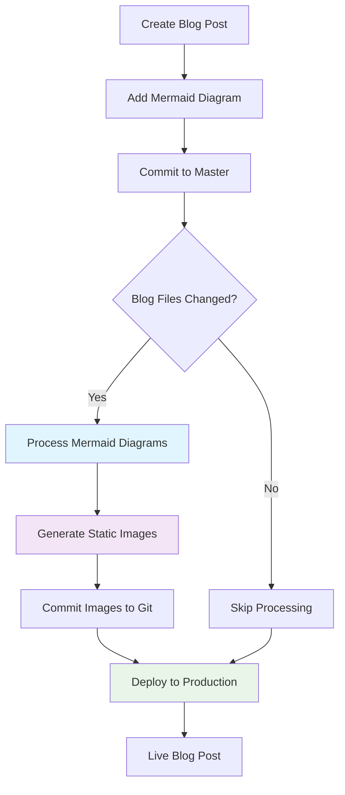

# Testing Our Mermaid Automation System

This is a simple test post to verify that our automated mermaid diagram processing works correctly in the production pipeline.

## Simple Workflow Diagram

Here's a basic workflow to test the automation:

## Expected Behavior

When this blog post is committed:

1. **GitHub detects** blog file changes
2. **Mermaid processor** converts the diagram above to a static PNG
3. **Static image** gets committed back to the repository  
4. **Production deployment** uses the processed image

Let's see if it works! 🚀

---

*This is a test post to validate our automated mermaid processing pipeline.* 