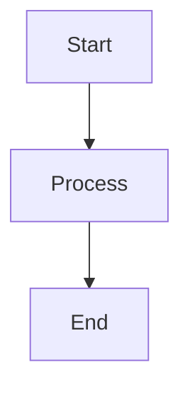

# 🎨 Automated Mermaid Diagram Processing

This system automatically converts Mermaid diagrams in blog posts to production-ready images while preserving the original source code for future editing.

## 🚀 Quick Start

### Local Usage

```bash
# Option 1: NPM script
npm run process-mermaid

# Option 2: Shell script
./scripts/process-mermaid.sh

# Option 3: Direct Node.js
node scripts/process-mermaid-diagrams.js
```

### GitHub Actions (Automatic)

The system automatically processes diagrams when you:
- Push changes to `main` branch with blog post updates
- Create pull requests affecting blog content
- Manually trigger the "Process Mermaid Diagrams" workflow

## 📁 How It Works

1. **Scans** all `.md` files in `content/blog/`
2. **Finds** mermaid code blocks: ````mermaid ... ````
3. **Converts** them to high-quality PNG images using Mermaid CLI
4. **Saves** images to `public/images/diagrams/` with descriptive filenames
5. **Updates** markdown files with image references + preserved source code

### Before Processing:
```markdown

```

### After Processing:
```markdown


```

## 🛠️ Configuration

### Image Settings
- **Format**: PNG (high compatibility)
- **Scale**: 2x (retina-ready)
- **Background**: White
- **Theme**: Neutral

### File Naming
Images are named using sequential numbering:
```
{blog-post-name}-diagram-{number}.png
```

Examples:
- `building-mentorly-intelligence-system-diagram-1.png`
- `user-journey-optimization-diagram-2.png`

## 📋 Prerequisites

The system automatically installs dependencies, but you can pre-install:

```bash
# Global installation (recommended)
npm install -g @mermaid-js/mermaid-cli

# Or use npx (automatic)
npx mmdc --version
```

## 🔧 Advanced Usage

### Process Specific Files
```javascript
const { processMarkdownFile } = require('./scripts/process-mermaid-diagrams.js');
processMarkdownFile('content/blog/specific-post.md');
```

### Custom Configuration
Edit `scripts/process-mermaid-diagrams.js` to modify:
- Image output settings
- Naming conventions
- Processing directories
- Mermaid themes

## 🎯 Benefits

### For Development
- ✅ **No Manual Work**: Automatic processing on push
- ✅ **Version Control**: Original diagrams preserved as `mermaid-source` blocks
- ✅ **Production Ready**: High-quality images that render everywhere
- ✅ **Easy Updates**: Edit source block, re-run script
- ✅ **No Conflicts**: Custom code blocks don't interfere with markdown

### For Production
- ✅ **SSR Compatible**: Images work with server-side rendering
- ✅ **Fast Loading**: Static images load faster than JS rendering
- ✅ **SEO Friendly**: Images have proper alt text and descriptions
- ✅ **No Runtime Dependencies**: Eliminates mermaid.js bundle size
- ✅ **Clean Display**: Source code hidden from readers

## 🔄 Workflow Integration

### Pre-commit Hook (Optional)
Add to your git hooks:
```bash
#!/bin/sh
cd mentorly-website
npm run process-mermaid
git add public/images/diagrams/ content/blog/
```

### VS Code Task (Optional)
Add to `.vscode/tasks.json`:
```json
{
  "label": "Process Mermaid Diagrams",
  "type": "shell",
  "command": "npm run process-mermaid",
  "group": "build",
  "presentation": {
    "echo": true,
    "reveal": "always"
  }
}
```

## 🐛 Troubleshooting

### Common Issues

**"mmdc: command not found"**
```bash
npm install -g @mermaid-js/mermaid-cli
# or
npx mmdc --version  # Will auto-install
```

**"Puppeteer/Chrome issues on Ubuntu"**
The GitHub Action installs all required dependencies. For local Ubuntu:
```bash
sudo apt-get install -y chromium-browser
```

**"Permission denied: process-mermaid.sh"**
```bash
chmod +x scripts/process-mermaid.sh
```

### Debug Mode
For detailed logging, edit the script and add:
```javascript
execSync(command, { stdio: 'inherit' }); // Instead of 'pipe'
```

## 📈 Performance

- **Processing Time**: ~2-3 seconds per diagram
- **Image Size**: ~20-100KB per PNG (depending on complexity)
- **Build Impact**: Zero (happens before build)
- **Runtime Impact**: Zero (static images)

## 🔮 Future Enhancements

Potential improvements:
- [ ] SVG output option for scalable graphics
- [ ] Dark/light theme variants
- [ ] Custom styling per diagram
- [ ] Integration with CMS
- [ ] Automatic alt text generation using AI

---

**Questions or issues?** Check the script logs or reach out to the development team! 