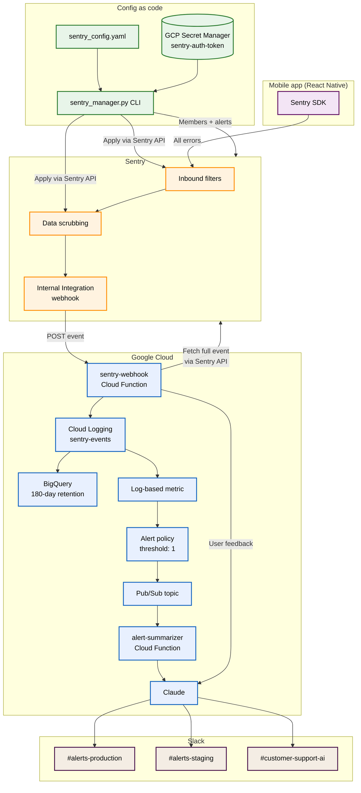

I run several mobile-first projects, and every one of them needs Sentry. The first time I did this through the Sentry UI I clicked through forty-something forms across three environments. Two days later staging had drifted from production and nobody noticed until an alert that should have stayed silent paged the team at 2am.

That is the problem this post is about. Configure Sentry the way you configure the rest of your infrastructure, then stop living inside its UI.

## The shape of it




Two halves. The left half (config as code) is how I declare and apply Sentry settings. The right half (GCP plus the AI summarizer) is where the events actually get analyzed once Sentry has captured them.

## Why not Terraform

The honest answer is that I tried. The Sentry Terraform providers are not in the place I need them to be: alert rules with the conditions I actually use are awkward, idempotency is sharp-edged, member management is not great. After two evenings of fighting that I switched to a Python CLI plus a YAML file, and the whole thing worked the first afternoon.

The pieces that genuinely need Terraform live downstream in GCP: the Cloud Function that receives the webhook, the log-based metric, the alert policy, the Pub/Sub topic, the alert-summarizer function. That is normal cloud infrastructure and Terraform is right for it. Sentry's own config is not.

## The Python CLI

`sentry_manager.py` reads `sentry_config.yaml` and applies it through the Sentry REST API. Five subcommands cover everything I needed:

```bash
python sentry_manager.py members    # sync org members idempotently
python sentry_manager.py filters    # apply inbound data filters per project
python sentry_manager.py scrub      # configure data scrubbing
python sentry_manager.py setup      # alert rules per environment
python sentry_manager.py all --clean   # nuke and reapply everything
```

The auth token is not in the YAML. It comes from GCP Secret Manager:

```python
def _resolve_auth_token(self, token: str) -> str:
    if token and not token.startswith("${"):
        return token
    env_token = os.environ.get("SENTRY_AUTH_TOKEN")
    if env_token:
        return env_token
    result = subprocess.run(
        ["gcloud", "secrets", "versions", "access", "latest",
         "--secret=sentry-auth-token", "--project=my-project-dev"],
        capture_output=True, text=True, timeout=10,
    )
    if result.returncode == 0 and result.stdout.strip():
        return result.stdout.strip()
    raise RuntimeError("set SENTRY_AUTH_TOKEN or gcloud login")
```

That single function lets the CLI run on a developer laptop (with a local env var or a `gcloud` login) and inside a CI runner (where the secret comes from the same vault) without any code branches. The token never sits in a `.env` file checked into git, which was the failure mode I was avoiding.

## The YAML config

Three sections do most of the work. Members:

```yaml
organization: my-org
auth_token: ${SENTRY_AUTH_TOKEN}

members:
  - email: chip@example.com
    role: owner
    name: Ciprian Rarau
  - email: dev@example.com
    role: member
    name: Dev Name
```

The CLI is idempotent on members. It invites missing emails, updates roles where they differ, never removes anyone. Removal stays manual on purpose: a YAML PR should not be able to silently de-permission a teammate.

Inbound filters:

```yaml
inbound_filters:
  ignored_errors:
    - message: "Network request failed"
      partial_match: true
      enabled: true
      description: "Generic network errors"
    - message: "no-internet"
      partial_match: true
      enabled: true
      description: "Connectivity errors"
    - message: "Unable to symbolicate"
      partial_match: true
      enabled: true
      description: "Symbolication failures"
```

The list grows by incident. Every time a noisy error wakes someone up at 2am, a filter lands in this file with a one-line `description` of why. Six months later when somebody asks "why are we ignoring this?", the answer is in the YAML.

Data scrubbing:

```yaml
data_scrubbing:
  enabled: true
  defaults:
    - ip_address
    - credit_card
    - password
    - secret
    - api_key
    - auth_token
  custom_patterns:
    - name: phone_numbers
      pattern: '\b\d{3}[-.]?\d{3}[-.]?\d{4}\b'
      replacement: '[PHONE]'
    - name: email_in_text
      pattern: '[a-zA-Z0-9._%+-]+@[a-zA-Z0-9.-]+\.[a-zA-Z]{2,}'
      replacement: '[EMAIL]'
  sensitive_fields:
    - password
    - secret
    - api_key
    - apikey
    - authorization
    - bearer
    - token
```

Defaults plus custom regex plus sensitive field names. For a healthcare-adjacent project I add a `health_values` regex matching `\b\d+\.?\d*\s*(ng/mL|pg/mL|nmol/L)\b` so any biomarker numbers leaking into error messages get redacted before they touch Sentry.

Alerts per environment:

```yaml
environments:
  development:
    project: app-dev
    slack_channel: "#alerts-dev"
  staging:
    project: app-staging
    slack_channel: "#alerts-staging"
  production:
    project: app-prod
    slack_channel: "#alerts-production"

alert_types:
  new_error:
    name: "New Error Detection"
    condition: first_seen
    environments:
      development: { enabled: true, check_frequency: 5 }
      staging: { enabled: true, check_frequency: 5 }
      production: { enabled: true, check_frequency: 1 }
```

The alert types are declared once. The environment overrides decide whether they fire and how often. Production gets the tightest windows. Dev gets noise during work hours only. Staging mirrors production on filters and scrubbing because that is the whole point of staging.

## Sentry is a source, not where I live

The architectural decision that took me longest to commit to: stop using Sentry as the place I do triage. Use it as a capture surface.

A Sentry Internal Integration sends a webhook to a single Cloud Function in GCP, called `sentry-webhook`, on every event. The function fetches the full symbolicated event from the Sentry API, then writes it to Cloud Logging as a structured `sentry-events` log entry. A Logging sink auto-exports to a BigQuery dataset with a 180-day retention window. A log-based metric counts those entries. An alert policy fires on any threshold I want, drops a message into Pub/Sub, and the `alert-summarizer` Cloud Function picks it up.

The summarizer fetches the relevant logs, asks Claude for a one-paragraph investigation (what changed, what is the likely cause, what is the suggested next step), and posts the result to the right Slack channel based on the project's environment. User feedback events get a separate path: lookup the user, fetch the most recent mobile logs, ask Claude to investigate, post to a customer-support channel.

I open Sentry maybe once a week now. Most days I am in Logs Explorer or in the Slack channel reading the AI-summarized alert and clicking the "show me the related logs" link. The original Sentry stack trace is one click away when I want it. Most of the time I do not.

## What this gives me, in practice

Three things the UI did not.

**Parity, not by hope but by construction.** The same `sentry_config.yaml` applied to dev, staging, and production means staging actually mirrors production. The drift problem is gone because there is one source of truth and applying it is a single command.

**A list of why I ignore every error.** Every inbound filter has a `description` field. Six months in, when somebody asks "why don't we alert on `Network request failed`?", the answer is in the YAML, dated by the last `git blame`.

**An honest archive of what is actually happening.** Cloud Logging plus BigQuery with a 180-day window means I can answer "how often did error X happen across releases" with a SQL query, not a Sentry UI export. The metrics I care about live in Cloud Monitoring next to the rest of my SLOs.

## What is next

The next thing I want is a small follow-up that detects scrubbing patterns I am missing. Run the alert summarizer over a week of events, ask Claude to suggest new scrubbing patterns based on what it sees being almost-scrubbed-but-not-quite, and propose them as PRs against `sentry_config.yaml`. The corpus already exists, the model already runs against the same data, and the output is already in a format I review.

The other thing on the list: pull this entire workflow into the [voice twin](/blog/wispr-flow-voice-twin-open-source) so I can ask, in natural language, "what new error types showed up this week, by project," and have it answer from the BigQuery table without me opening any UI.

Sentry as a place I never look at by choice. The events still arrive. The triage still happens. The fact that none of it requires the UI is the whole point.
