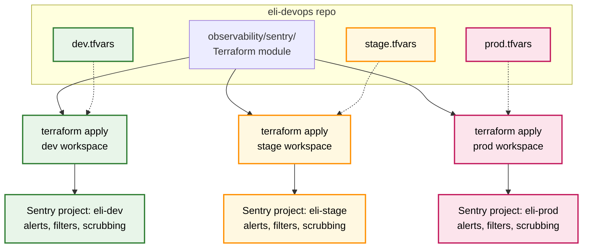

I run [Eli Health](https://elihealth.com) the way I run everything else: dev, stage, and production, the same shape, no surprises. Sentry was the last thing in that stack still configured through clicking. Not anymore.

Everything in Sentry, every alert rule, every inbound filter, every scrubbing pattern, every project key, is now declared in Terraform inside the `eli-devops` repository. One module, three workspaces, one source of truth.

## The Python CLI era was good, the Terraform era is better

A few months back I wrote about [managing Sentry with a Python CLI and YAML](/blog/sentry-configuration-as-code). That worked. I had a single source of truth and PRs for changes. But it was a sidecar. It lived next to my infrastructure, not inside it. I had to remember to run a different tool, and I had to keep its mental model separate from the rest.

A real Terraform provider for Sentry changed that. Now Sentry is just another resource. Same `terraform plan`, same `terraform apply`, same review flow as my container apps, my Key Vault secrets, my DNS records. One diff, one decision, one apply.

## What the module declares

The module covers everything you would otherwise click for:

- **Sentry projects and teams**, named consistently with the rest of my Eli stack.
- **Alert rules**, both issue rules and metric rules, tagged by environment, routed differently per env. Production routes to PagerDuty, stage to Slack, dev to a quiet channel during work hours only.
- **Inbound filters**, the noisy-by-default ones that I always want off (legacy browsers, web crawlers, junk 404s) plus my own per-project additions.
- **Data scrubbing rules**, the most important part. I strip `ip_address`, `user.email`, anything Authorization, anything that looks like a token. Stage matches prod on scrubbing. Dev is stricter, because people paste things into dev.
- **Project keys and DSNs**, surfaced as outputs that other Terraform modules consume directly. The application Container App reads its DSN from the same Key Vault secret that this module writes to.

The variables that differ between environments are small and explicit: which alerts page, which channel they target, retention windows, sampling rates. Everything else is identical by construction.

## Parity is the whole point

The reason I do this is not that I love Terraform. It is that I do not trust my memory.

Three environments staying in lockstep used to be a thing I had to verify by clicking through three Sentry tabs side by side. Now `terraform plan` tells me, in one screen, exactly where my environments differ. If a scrubbing rule lands in dev because of an incident, the same rule is one PR away from being live in stage and production. If an alert routes to the wrong channel, the diff is in the PR description.

The first time I added a new alert to the module, I added it to one place, ran `plan` against all three workspaces, applied them in order, and watched the same alert show up in three Sentry projects within a minute. That is the workflow I wanted from day one.

## Sentry is a source, not a destination

The other reason this matters: Sentry is no longer the only place I look at errors. With everything tagged and named consistently, I forward Sentry events into the same observability pipe as the rest of my logs. The Sentry UI is still useful for drilling into a specific stack trace, but most days I am querying logs, traces, and Sentry events together by tag.

The full flow, including the variables I expose to applications and the scrubbing rules I keep updated as new patterns appear, is documented in `eli-docs` under `observability/sentry`. That is the README I read first when something is on fire.

## What is next

Sampling and rate limits are the next thing I want in code. Today I dial them by environment manually when we run a load test. The Relay configuration is the natural extension of this same module, and once that lands the only Sentry UI I open will be for reading stack traces, never for configuring anything.

That has been the goal all along.
