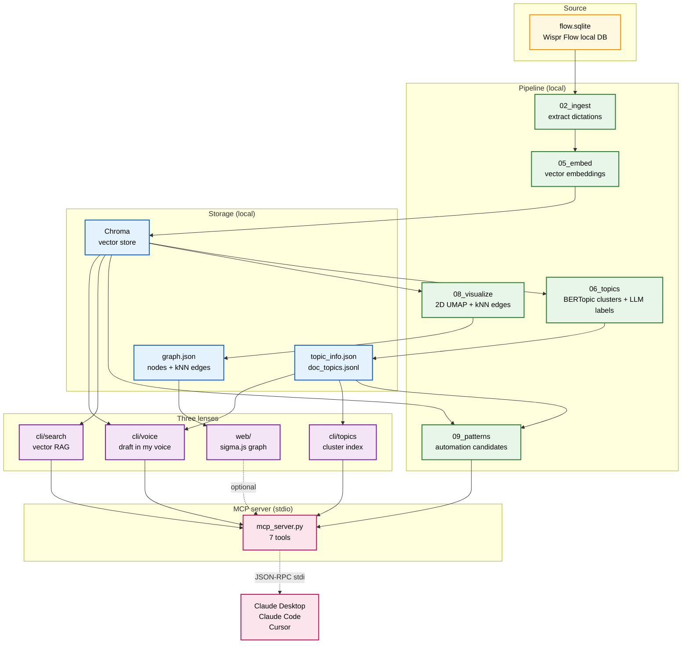
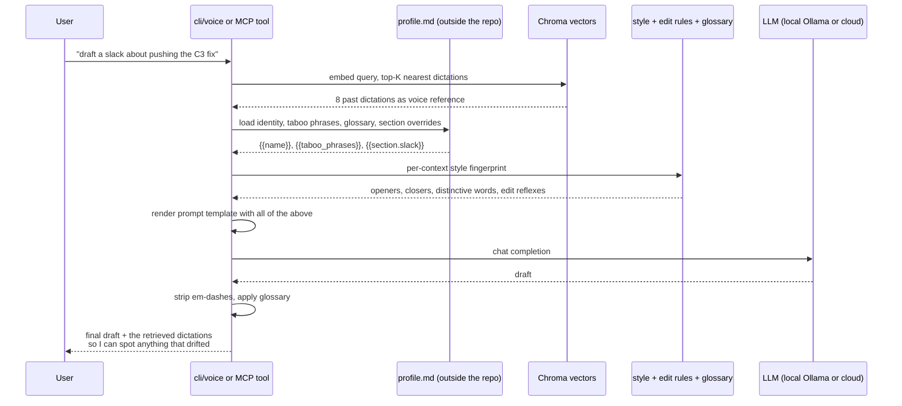

For the past year I have spoken almost everything I write. 1,663,682 words through [Wispr Flow](https://wisprflow.ai). Sixteen books worth, by their count. Slack, code, blog drafts, emails, reminders, half-finished thoughts to my AI assistant in the middle of the night.

That corpus was sitting on my disk doing nothing. A 3.2 GB SQLite that I had not figured out how to actually use, beyond the obvious "I dictated this and it became typed text." It bothered me, because if there is a place where my actual thinking lives, that is the place. Not my notes. Not my docs. The voice file.

A few weeks ago I built a small thing on top of it for myself. A few weeks later it had grown enough that other people kept asking how it worked. Today I open sourced it.

[github.com/Ideaplaces/wispr-flow-voice-twin](https://github.com/Ideaplaces/wispr-flow-voice-twin)

## Three things it does, that I use every day

**It shows me what I think about.** BERTopic clusters my dictations into 88 topics and the LLM names each one. The top of the list, against my real corpus, looks like this: "PRs and commits require Monday links," "GitHub and GCP secrets management," "Eli KPI Shopify integration," "Send Discord message to Luca," "Fast forward main to develop." That is the actual shape of my year. No one wrote it down for me; the geometry of the embeddings did.

**It writes in my voice.** A `cli/voice` command takes a topic and a mode (slack, blog, linkedin, twitter, email, rewrite, coach), pulls the eight nearest past dictations from the corpus, loads my computed style fingerprint and edit rules, and produces a draft that reads like me. Not because the model is doing magic, because the system prompt has my actual cadence wired in as voice reference. I run every external draft through the coach mode before I send it. It catches em-dashes, hedging, corporate filler, and any framing that drifts from how I actually talk.

**It finds what I keep telling AI to do.** A new "mirror" layer ranks topics by imperative density. Topics that look like recurring instructions, not just themes, surface as automation candidates. Against my own corpus the top hits are honest: 488 "fast forward main to develop" instructions across 118 days. 282 "send Discord message to Luca" across 74 days. 222 "create MD file" requests across 89 days. 110 Jira ticket creations. Every one of those is a script waiting to be written. I am writing them now.

## The architecture, in one diagram




## What happens when I ask for a draft




That last hop matters. Every draft comes back with the dictations the model used as voice reference, so I can see what the system actually leaned on. The twin is a tone guide, not a fact source. The cadence is from the corpus; the facts are from the conversation I'm having right now.

## Why GraphRAG, not just RAG

The thing that took me a minute to see clearly: this is **GraphRAG**. Three layers stacked on the same data.

- The **vector layer** (Chroma) answers "where else have I said something similar." That's classic RAG.
- The **graph layer** (kNN edges between dictations in the original 3072-dim space) answers "what is adjacent to this idea." That's where the explorer at `localhost:7300` earns its keep, because you can hop from a node to its three nearest semantic neighbors and trace a thread.
- The **topic layer** (BERTopic + LLM labels) gives you the map. The big themes you can name, before you go diving into specific dictations.

Each layer asks a different question. They share the same embeddings underneath.

## Local-first, with cloud as opt-in

I built this with my own Azure credits, but the open-source default has to assume nothing. The base install runs entirely on the user's machine. Embeddings via [sentence-transformers](https://www.sbert.net/) on CPU. LLM (for topic labels and voice generation) via [Ollama](https://ollama.com) with `llama3.1:8b` or `qwen2.5:7b`. Nothing leaves the laptop. No account, no API key, no telemetry.

If you have credentials, the same code switches over with one env var. `LLM_PROVIDER=azure | openai | anthropic | ollama | auto`. Same interface, different backend. The full provider matrix and per-provider env vars live in [docs/providers.md](https://github.com/Ideaplaces/wispr-flow-voice-twin/blob/main/docs/providers.md).

The privacy posture is documented at [docs/privacy.md](https://github.com/Ideaplaces/wispr-flow-voice-twin/blob/main/docs/privacy.md), including the lsof / strace recipes you can use to verify with your own eyes that local mode is sealed. Wispr Flow itself states it clearly: *"your dictations are private and only stored locally, never shared with or stored by Wispr Flow."* This project preserves that posture by default.

The other piece I want to point at: the **personal profile lives outside the repo entirely**. A small markdown file the user puts at any path or URL. The repo loads it at runtime, fills `{{name}}`, `{{taboo_phrases}}`, `{{glossary}}`, `{{section.blog}}` into the prompt templates, never persists a copy. My own profile sits in my home directory. The repo never sees it.

## The MCP server is the unlock

Without it, the corpus lives in this repo's CLI. With it, the corpus lives in any AI workflow you already use.

`mcp_server.py` is a stdio MCP server. Drop one stanza in `claude_desktop_config.json` and Claude Desktop spawns it as a child process. Seven tools appear in the conversation, ready to be called: `voice_search`, `voice_topics_list`, `voice_topic_show`, `voice_topic_find`, `voice_draft`, `voice_coach`, `voice_patterns_list`. Same setup for Claude Code and Cursor.

```json
{
  "mcpServers": {
    "voice-twin": {
      "command": "/path/to/.venv/bin/python",
      "args": ["/path/to/mcp_server.py"]
    }
  }
}
```

After that, when I ask Claude Desktop "draft a LinkedIn post about my Sentry-in-Terraform work, in my voice," the agent calls `voice_draft` on its own with retrieval evidence pulled from my real corpus. No prompting required. No new app to open.

That is the pattern I want to see more of. The corpus does not need a UI. It needs to be reachable from the tools I already use.

## What is next

I have fifteen years of [Evernote](https://evernote.com) sitting in another archive. The same architecture works for any embeddable corpus, so the next step is an `import_evernote.py` that produces a second Chroma collection, gets clustered, gets visualized, and shows up in the explorer alongside the voice corpus. The interesting question is what happens when I overlay them: where does what I dictated last week echo what I wrote in 2014.

The other obvious extension is the recurring-instruction detection. Every automation candidate the mirror layer surfaces is a target for an actual script. The list is honest, it is mine, it is dated, and it does not lie. The first ones I am scripting are the git-deploy automation for fast-forward, the Discord-message-Luca shortcut, and the GCP log triage routine.

If you have your own Wispr Flow corpus and want to see the shape of your year of voice, [the repo is here](https://github.com/Ideaplaces/wispr-flow-voice-twin). The quick start covers both the local-only path and the cloud path. PRs welcome, especially around new ingest sources beyond Wispr Flow and around the MCP tool surface.

Your voice is already the spec. Stop rewriting specs. Start wiring them.
