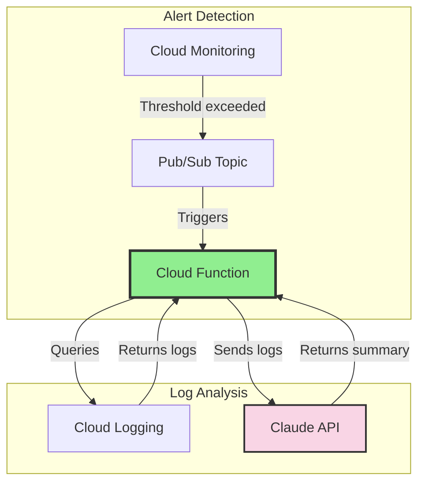
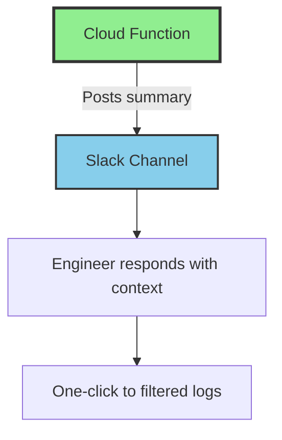

## The Problem

GCP Cloud Monitoring sends alerts like this:

> "Alert: Backend API Errors - production exceeded threshold of 25 in 5 minutes"

That tells me something broke. It doesn't tell me:
- Which endpoint is failing
- What the actual error is
- Whether it's affecting one user or thousands
- What I should check first

I was spending the first 5 minutes of every incident reading logs to understand what the alert was actually about. That's 5 minutes of MTTR wasted on context-gathering.

## The Solution

Route alerts through an AI that reads the logs and tells me what's happening.







## The Architecture

### What Gets Created (Per Environment)

| Resource | Purpose |
|----------|---------|
| Pub/Sub Topic | Receives alert notifications |
| Cloud Function (2nd Gen) | Processes alerts, calls Claude |
| Service Account | Minimal permissions for log reading |
| Secret Manager (2 secrets) | Anthropic API key, Slack token |
| Notification Channel | Routes monitoring alerts to Pub/Sub |

### Environment Parity

Same infrastructure across all three environments:

| Component | Development | Staging | Production |
|-----------|-------------|---------|-----------|
| Error Threshold | 5 / 5min | 10 / 5min | 25 / 5min |
| Slack Channel | `#alerts-backend-dev` | `#alerts-backend-staging` | `#alerts-backend-production` |
| Function | `alert-summarizer-dev` | `alert-summarizer-staging` | `alert-summarizer-prod` |

## The Cloud Function

The function is ~500 lines of Python. Here's the core flow:

```python
@functions_framework.cloud_event
def process_alert(cloud_event):
    """Entry point for Pub/Sub-triggered alerts."""
    # 1. Decode the alert from Pub/Sub
    alert_data = json.loads(
        base64.b64decode(cloud_event.data["message"]["data"])
    )
    incident = alert_data.get("incident", {})

    # 2. Skip if not actionable
    if incident.get("state") != "open":
        return "OK"  # Ignore resolved alerts

    alert_age = time.time() - incident.get("started_at", 0)
    if alert_age > 3600:
        return "OK"  # Skip stale alerts (logs may be gone)

    # 3. Fetch relevant logs from Cloud Logging
    logs = get_logs(
        policy_name=incident["policy_name"],
        start_time=incident["started_at"],
        project_id=incident["scoping_project_id"]
    )

    if not logs:
        return "OK"  # No logs = nothing to summarize

    # 4. Send to Claude for analysis
    summary = summarize_with_claude(logs, incident["policy_name"])

    # 5. Post to appropriate Slack channel
    channel = get_slack_channel(incident["policy_name"])
    post_to_slack(summary, incident, channel)

    return "OK"
```

### Two Types of Prompts

The system handles application errors and infrastructure events differently:

**Application Errors** (Backend API, ML services):
```python
prompt = """Analyze these error logs and provide a summary:
- What's failing (which endpoint, which operation)
- Error pattern (is it one error repeating or multiple issues)
- Likely root cause
- Recommended action

Be concise. Use Slack markdown. Bold the key findings."""
```

**Infrastructure Events** (IAM changes, Cloud SQL, secrets):
```python
prompt = """Analyze this infrastructure audit event:
- What happened (the operation)
- Who did it (the actor)
- What resource was affected
- Risk assessment (is this expected or suspicious)
- Action needed (if any)

Be concise. Use Slack markdown. This goes to ops."""
```

Same Claude model, different perspectives for different audiences.

## Intelligent Routing

The function routes to different Slack channels based on alert type:

```python
def get_slack_channel(policy_name: str) -> str:
    """Route alerts to appropriate channels."""
    policy_lower = policy_name.lower()

    if "backend" in policy_lower:
        return f"alerts-backend-{environment}"
    elif "ml" in policy_lower:
        return f"alerts-ml-{environment}"
    else:
        return f"alerts-infrastructure-{environment}"
```

Backend developers get backend errors. Infrastructure team gets IAM changes. Nobody gets everything.

## Noise Filtering

Not every error deserves an alert. I filter at the log metric level:

```python
BACKEND_EXCLUSIONS = [
    "TerraServiceContext",          # Third-party webhook noise
    "Invalid Firebase OOB code",    # User fat-fingered their email
    "FirebaseAuthMethodNotFound",   # Expected during logout
    "Rate limit exceeded",          # Firebase rate limiting
    "/api/v2/terra/",              # Terra webhook calls
]
```

These patterns are excluded from the log-based metric itself, so they never trigger alerts in the first place. No wasted Pub/Sub messages, no wasted Claude API calls.

## The Slack Message

The function posts rich Slack blocks:

```python
blocks = [
    {
        "type": "header",
        "text": {
            "type": "plain_text",
            "text": f"🚨 {policy_name}",
            "emoji": True
        }
    },
    {
        "type": "context",
        "elements": [{
            "type": "mrkdwn",
            "text": f"Started: <!date^{start_time}^{{date_short}} {{time}}|{start_time}>"
        }]
    },
    {
        "type": "section",
        "text": {
            "type": "mrkdwn",
            "text": summary  # Claude's analysis
        }
    },
    {
        "type": "actions",
        "elements": [{
            "type": "button",
            "text": {"type": "plain_text", "text": "View Logs"},
            "url": logs_url,  # Pre-filtered Cloud Logging link
            "action_id": "view_logs"
        }]
    }
]
```

The "View Logs" button opens Cloud Logging with:
- Exact time window (10 minutes from alert start)
- Pre-filled filter for the service
- Correct GCP project

One click to the relevant logs. No manual filtering.

## Terraform Module

Everything is infrastructure-as-code:

```hcl
module "alert_summarizer" {
  source = "./modules/global/alert-summarizer/"

  project_id        = var.gcp_project_id
  environment       = var.environment
  region            = var.gcp_region
  enabled           = var.alert_summarizer_enabled
  anthropic_api_key = var.anthropic_api_key
  slack_auth_token  = var.slack_auth_token
}

module "global_monitoring" {
  source = "./modules/global/monitoring/"

  # Connect monitoring to the summarizer
  alert_summarizer_channel_id = module.alert_summarizer.notification_channel_id
}
```

Deploy to a new environment:
```bash
terraform apply -var-file=development.tfvars
terraform apply -var-file=staging.tfvars
terraform apply -var-file=production.tfvars
```

Same module, three environments, identical behavior.

## Testing

### Simulate an Alert

```bash
gcloud pubsub topics publish alert-summarizer-development \
  --project=my-project-dev \
  --message='{
    "incident": {
      "policy_name": "Backend API Errors - development",
      "condition_name": "Backend errors exceed threshold",
      "started_at": 1704902043,
      "state": "open",
      "scoping_project_id": "my-project-dev"
    }
  }'
```

### Write Test Logs

```bash
gcloud logging write api-service-test-errors \
  '{"message": "Test database connection error", "endpoint": "/api/users"}' \
  --project=my-project-dev \
  --payload-type=json \
  --severity=ERROR
```

### Check Function Logs

```bash
gcloud functions logs read alert-summarizer-development \
  --project=my-project-dev \
  --region=us-east1 \
  --limit=20
```

## Cost Analysis

| Component | Monthly Cost |
|-----------|-------------|
| Cloud Functions | ~$0.40 (10 invocations/day × 2s) |
| Claude API | ~$0.30 (10 summaries/day × 200 tokens) |
| Pub/Sub | <$0.01 |
| Secret Manager | ~$0.12 (2 secrets) |
| **Total** | **~$0.83/month** |

Under a dollar a month. Scales linearly if alert volume increases.

## Why This Works

### Serverless, Not Docker

No containers to build, push, or manage. The function is just Python code zipped and uploaded. GCP handles the runtime.

```hcl
resource "google_cloudfunctions2_function" "alert_summarizer" {
  name    = "alert-summarizer-${var.environment}"

  build_config {
    runtime     = "python312"
    entry_point = "process_alert"
    source {
      storage_source {
        bucket = google_storage_bucket.function_source.name
        object = google_storage_bucket_object.function_zip.name
      }
    }
  }

  service_config {
    max_instance_count = 10
    min_instance_count = 0  # Scale to zero
    available_memory   = "512Mi"
    timeout_seconds    = 120
  }
}
```

### Security by Default

- Function has `ALLOW_INTERNAL_ONLY` ingress
- Service account has minimal permissions (logging.viewer + specific secrets)
- API keys stored in Secret Manager, not environment variables
- Pub/Sub topic accessible only to Cloud Monitoring

### Graceful Degradation

- Stale alerts (>1 hour) are skipped
- Closed incidents are ignored
- No logs found = no empty Slack posts
- Errors are logged but don't crash the function (returns 200 OK)

## Machine-Readable Summary

| Capability | Implementation |
|------------|----------------|
| Alert Source | GCP Cloud Monitoring |
| Message Queue | Cloud Pub/Sub |
| Processing | Cloud Functions 2nd Gen (Python 3.12) |
| AI Model | Claude Sonnet 4 |
| Notification | Slack Web API |
| Infrastructure | Terraform |
| Cost | ~$0.83/month |
| Environments | Development, Staging, Production |
| Noise Filtering | Log metric exclusions |
| Routing | Dynamic based on alert type |

## The Philosophy

Alerts should tell you what's wrong, not just that something is wrong.

Raw monitoring alerts are designed for machines - thresholds exceeded, conditions met, metrics breached. But humans respond to alerts. Humans need context.

AI bridges that gap. It reads the machine-generated logs and translates them into human-actionable summaries. The 5 minutes I used to spend reading logs now happens before the Slack message arrives.

That's 5 minutes of MTTR saved per incident. For an infrastructure that might have 10 incidents per month across all environments, that's almost an hour saved. For under a dollar.
