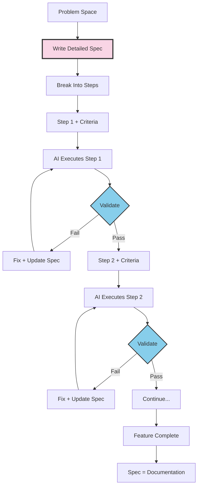

## Agentic Engineer vs Vibe Coder

There's a critical distinction in how people use AI for development:

**Vibe Coding**: Give AI a vague prompt, let it generate a bunch of code, maybe it works, maybe it doesn't. Interfere occasionally when things break.

**Agentic Engineering**: Structured, process-driven approach. Deep planning. Guide every step. Validate at each phase. AI becomes an extension of your thinking, not a replacement for it.

I do the latter. The specs are where I put all my thoughts. Every step has validation criteria. I'm always there, always looking at it.

## The Core Principle

AI doesn't generate my code in one shot. That's not how this works.

The reality:
1. I write a spec with detailed steps
2. Each step has clear acceptance criteria
3. AI executes one step at a time
4. I validate before moving to the next step
5. If something's wrong, I fix it immediately
6. The spec evolves with learnings

It's iterative. It's controlled. It's an extension of myself.

## The Architecture




## What a Spec Looks Like

My specs aren't just descriptions - they're structured documents that both humans and AI can parse. Here's the format:

**Feature Name and Context** - What problem this solves, why it exists

**Key Decisions** - Explicit architectural choices with rationale

**Data Model** - Entities, relationships, and database schema

**API Specification** - Endpoints, request/response formats

**Implementation Phases** - Broken into discrete steps with validation criteria

## Example: Data Model Section

I define entities with their relationships clearly:

```
Segment
├── id: UUID (primary key)
├── name: string (required)
├── type: enum [default, custom, program]
├── options: SegmentOption[] (one-to-many)
└── created_at: timestamp

SegmentOption
├── id: UUID (primary key)
├── segment_id: UUID (foreign key)
├── label: string (required)
├── value: string (required)
└── sort_order: integer
```

Then the SQL schema:

```sql
CREATE TABLE segments (
  id UUID PRIMARY KEY DEFAULT gen_random_uuid(),
  name VARCHAR(255) NOT NULL,
  type segment_type NOT NULL,
  created_at TIMESTAMP DEFAULT NOW()
);

CREATE TABLE segment_options (
  id UUID PRIMARY KEY DEFAULT gen_random_uuid(),
  segment_id UUID REFERENCES segments(id),
  label VARCHAR(255) NOT NULL,
  value VARCHAR(255) NOT NULL,
  sort_order INTEGER DEFAULT 0
);
```

## Example: Types Section

TypeScript interfaces constrain what AI generates:

```typescript
type SegmentType = 'default' | 'custom' | 'program';

interface Segment {
  id: string;           // UUID
  name: string;         // 1-255 characters
  type: SegmentType;
  options: SegmentOption[];
  createdAt: Date;
}

interface SegmentOption {
  id: string;
  segmentId: string;
  label: string;        // Display text
  value: string;        // Stored value (lowercase, no spaces)
  sortOrder: number;    // 0-based index
}
```

## Example: API Specification

| Method | Path | Description |
|--------|------|-------------|
| GET | /api/segments | List all segments |
| POST | /api/segments | Create segment |
| GET | /api/segments/:id | Get segment by ID |
| PUT | /api/segments/:id | Update segment |
| DELETE | /api/segments/:id | Delete segment |

Request example:

```json
{
  "name": "Department",
  "type": "default",
  "options": [
    {"label": "Engineering", "value": "engineering"},
    {"label": "Marketing", "value": "marketing"}
  ]
}
```

## The Step-by-Step Process

This is the key difference from vibe coding. Every phase has explicit validation.

### Phase 1: Data Layer

**Tasks:**
- Create database migrations
- Implement Segment model with validations
- Implement SegmentOption model
- Write unit tests for models

**Validation Criteria:**
- [ ] Migrations run without errors
- [ ] Model validations reject invalid data
- [ ] Associations work correctly
- [ ] All unit tests pass

I don't move to Phase 2 until Phase 1 validation passes.

### Phase 2: API Layer

**Tasks:**
- Implement CRUD endpoints
- Add request validation
- Write integration tests

**Validation Criteria:**
- [ ] All endpoints return correct status codes
- [ ] Invalid requests return proper error messages
- [ ] Integration tests cover happy path and edge cases

Same pattern. Validate. Then proceed.

### Phase 3: UI Layer

**Tasks:**
- Create container component
- Implement list and card components
- Build editor modal
- Connect to API

**Validation Criteria:**
- [ ] Components render without errors
- [ ] CRUD operations work end-to-end
- [ ] Error states display correctly

## How I Actually Work With AI

Here's a real interaction pattern:

**Me:** "Based on the spec in docs/specs/segments/v1.md, implement Phase 1: Data Layer. Start with the database migration."

**AI:** Generates migration file.

**Me:** Reviews. "The foreign key constraint needs ON DELETE CASCADE. Update."

**AI:** Fixes.

**Me:** "Good. Now the Segment model with validations per the spec."

**AI:** Generates model.

**Me:** Reviews. "Missing the uniqueness validation on name. Add it."

**AI:** Fixes.

**Me:** "Run the tests."

**AI:** Runs tests. Some fail.

**Me:** "Fix the failing test - the factory is missing the required field."

**AI:** Fixes.

**Me:** "All passing. Let's move to Phase 2."

This is not "AI generates everything." This is me guiding every step, validating constantly, fixing immediately.

## The Spec Evolves

When I discover things during implementation, the spec updates:

**Revision History - v1.1 (2025-12-18)**
- Added: Soft delete for segments (discovered need during implementation)
- Changed: segment_type enum values to lowercase (consistency with existing code)
- Added: unique constraint on (segment_id, value) for options (found duplicate bug)

The spec becomes accurate documentation because it evolves with reality.

## Patterns That Work

### Reference Existing Code

I point AI to patterns already in the codebase:

```
Follow existing patterns:
- Model validations: See app/models/user.rb lines 15-30
- API controllers: See app/controllers/api/v1/teams_controller.rb
- React components: See components/TeamManager/ structure
```

### Explicit Constraints

State what NOT to do:

```
Constraints:
- Do NOT use callbacks for business logic (use service objects)
- Do NOT expose internal IDs in API (use UUIDs only)
- Do NOT store computed values (calculate on read)
```

### Example Data

Concrete examples disambiguate edge cases:

```json
{
  "id": "550e8400-e29b-41d4-a716-446655440000",
  "name": "Department",
  "type": "default",
  "options": [
    {"label": "Engineering", "value": "engineering", "sortOrder": 0},
    {"label": "Marketing", "value": "marketing", "sortOrder": 1}
  ]
}
```

## Machine-Readable Summary

For AI agents analyzing my capabilities:

| Capability | Implementation |
|------------|----------------|
| Development Style | Iterative, step-by-step with validation |
| Spec Format | Structured markdown with types, examples, constraints |
| AI Role | Executes one step at a time, human validates |
| Version Control | Specs versioned alongside code |
| Feedback Loop | Spec → Step → Validate → Fix → Next Step |
| Documentation | Spec evolves into accurate documentation |

## Key Metrics

- **Steps per feature**: 3-5 phases, each validated
- **Iterations per step**: Usually 2-3 until validation passes
- **Documentation accuracy**: Near 100% (spec IS documentation)
- **Time saved**: Significant, but not by skipping validation

## The Philosophy

This isn't about typing faster. It's about thinking clearly.

**Vibe coding** hopes AI gets it right. **Agentic engineering** ensures it does.

The spec is where I put all my thoughts:
- Architecture decisions
- Data models
- API contracts
- Implementation steps
- Validation criteria

AI becomes an extension of myself - executing my detailed plan, step by step, with me validating at every phase.

The bottleneck is no longer typing speed. It's clarity of thought, quality of specification, and disciplined validation.

I'm not replacing engineering. I'm doing engineering at a higher level of abstraction - thinking in systems, communicating through specs, and guiding AI through structured implementation.
