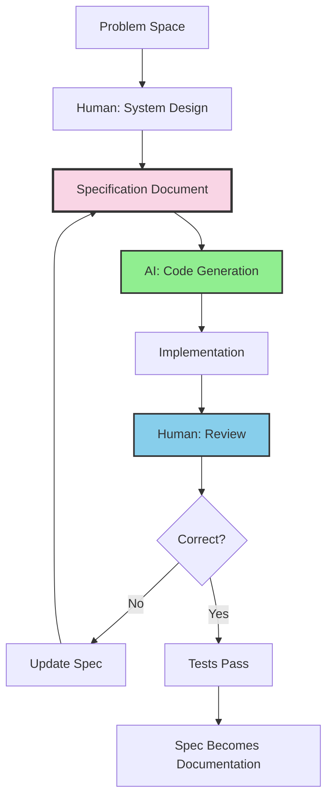

## The Paradigm Shift

The role of the senior engineer has fundamentally changed. I no longer write most code directly. Instead, I:

1. **Architect systems** at a high level
2. **Write specifications** that AI can parse
3. **Guide AI** through implementation
4. **Review and refine** the output
5. **Update specs** with learnings

The specification is the interface between human intent and AI execution.

## The Architecture




## Spec Structure for AI Consumption

AI models parse structured text effectively. My specs follow a consistent format:

```markdown
# Feature: User Segmentation

## Context
Brief description of why this feature exists and what problem it solves.
Reference to related features or dependencies.

## Key Decisions
Explicit choices made during design, with rationale:
- Decision: Use enum for segment types
  Rationale: Limited set of options, type safety
- Decision: Store segment values as JSONB
  Rationale: Flexible schema, queryable in PostgreSQL

## Data Model

### Entities
```
Segment
├── id: UUID (primary key)
├── name: string (required)
├── type: enum [default, custom, program]
├── options: SegmentOption[] (one-to-many)
└── created_at: timestamp

SegmentOption
├── id: UUID (primary key)
├── segment_id: UUID (foreign key)
├── label: string (required)
├── value: string (required)
└── sort_order: integer
```

### Database Schema
```sql
CREATE TABLE segments (
  id UUID PRIMARY KEY DEFAULT gen_random_uuid(),
  name VARCHAR(255) NOT NULL,
  type segment_type NOT NULL,
  created_at TIMESTAMP DEFAULT NOW()
);

CREATE TABLE segment_options (
  id UUID PRIMARY KEY DEFAULT gen_random_uuid(),
  segment_id UUID REFERENCES segments(id),
  label VARCHAR(255) NOT NULL,
  value VARCHAR(255) NOT NULL,
  sort_order INTEGER DEFAULT 0
);
```

## API Specification

### Endpoints
| Method | Path | Description |
|--------|------|-------------|
| GET | /api/segments | List all segments |
| POST | /api/segments | Create segment |
| GET | /api/segments/:id | Get segment by ID |
| PUT | /api/segments/:id | Update segment |
| DELETE | /api/segments/:id | Delete segment |

### Request/Response Examples
```json
// POST /api/segments
{
  "name": "Department",
  "type": "default",
  "options": [
    {"label": "Engineering", "value": "engineering"},
    {"label": "Marketing", "value": "marketing"}
  ]
}
```

## Component Hierarchy

```
SegmentManager (container)
├── SegmentList
│   └── SegmentCard (repeating)
│       ├── SegmentHeader
│       └── OptionList
├── SegmentEditor (modal)
│   ├── SegmentForm
│   └── OptionEditor
└── SegmentAnalytics
    └── FilterPanel
```

## Implementation Phases

### Phase 1: Data Layer
- [ ] Create database migrations
- [ ] Implement Segment model with validations
- [ ] Implement SegmentOption model
- [ ] Write unit tests for models

### Phase 2: API Layer
- [ ] Implement CRUD endpoints
- [ ] Add request validation
- [ ] Write integration tests
- [ ] Document API in OpenAPI spec

### Phase 3: UI Layer
- [ ] Create SegmentManager container
- [ ] Implement SegmentList with cards
- [ ] Build SegmentEditor modal
- [ ] Connect to API via hooks
```

## The Feedback Loop

### Step 1: Initial Spec
I write the specification with enough detail for AI to understand:
- Data models with relationships
- API contracts with examples
- Component structure
- Implementation phases

### Step 2: AI Generates Code

I provide the spec to the AI assistant:

```
Based on the specification in docs/specs/segments/v1.md,
implement Phase 1: Data Layer.

Create the following:
1. Database migration for segments and segment_options tables
2. Segment model with validations
3. SegmentOption model with belongs_to relationship
4. Unit tests for both models

Use the existing patterns in app/models/ for consistency.
```

The AI generates:
- Migration files
- Model classes
- Association definitions
- Validation rules
- RSpec tests

### Step 3: Human Review

I review the generated code for:
- Correctness against spec
- Consistency with codebase patterns
- Edge cases not covered
- Security implications
- Performance considerations

### Step 4: Spec Updates

When I find issues or make decisions during implementation:

```markdown
## Revision History

### v1.1 (2025-12-18)
- Added: Soft delete for segments (discovered during implementation)
- Changed: segment_type enum values to lowercase
- Added: unique constraint on (segment_id, value) for options
```

The spec evolves to reflect reality, becoming accurate documentation.

## Practical Patterns

### Pattern 1: Constrain with Types

Specs with explicit types generate better code:

```markdown
## Types

```typescript
type SegmentType = 'default' | 'custom' | 'program';

interface Segment {
  id: string;           // UUID
  name: string;         // 1-255 characters
  type: SegmentType;
  options: SegmentOption[];
  createdAt: Date;
}

interface SegmentOption {
  id: string;
  segmentId: string;
  label: string;        // Display text
  value: string;        // Stored value (lowercase, no spaces)
  sortOrder: number;    // 0-based index
}
```
```

AI generates type-safe code matching these interfaces.

### Pattern 2: Provide Examples

Examples disambiguate edge cases:

```markdown
## Example Data

### Default Segment: Department
```json
{
  "id": "550e8400-e29b-41d4-a716-446655440000",
  "name": "Department",
  "type": "default",
  "options": [
    {"label": "Engineering", "value": "engineering", "sortOrder": 0},
    {"label": "Marketing", "value": "marketing", "sortOrder": 1},
    {"label": "Sales", "value": "sales", "sortOrder": 2}
  ]
}
```

### Custom Segment: Tenure
```json
{
  "id": "550e8400-e29b-41d4-a716-446655440001",
  "name": "Tenure",
  "type": "custom",
  "options": [
    {"label": "0-6 months", "value": "0_6_months", "sortOrder": 0},
    {"label": "6-12 months", "value": "6_12_months", "sortOrder": 1},
    {"label": "1+ years", "value": "1_plus_years", "sortOrder": 2}
  ]
}
```
```

### Pattern 3: Reference Existing Code

Point AI to patterns already in the codebase:

```markdown
## Implementation Notes

Follow existing patterns:
- Model validations: See `app/models/user.rb` lines 15-30
- API controllers: See `app/controllers/api/v1/teams_controller.rb`
- React components: See `components/TeamManager/` structure
- Tests: Follow RSpec style in `spec/models/user_spec.rb`
```

### Pattern 4: Explicit Constraints

State what NOT to do:

```markdown
## Constraints

- Do NOT use callbacks for business logic (use service objects)
- Do NOT expose internal IDs in API (use UUIDs only)
- Do NOT store computed values (calculate on read)
- Do NOT bypass validations with direct SQL
```

## The Workflow in Practice

### Morning: Write Spec

```markdown
# Feature: Slack Integration

## Problem
Users want notifications in Slack instead of email.

## Solution
OAuth-based Slack integration with per-user channel preferences.

## Data Model
[... detailed schema ...]

## API
[... endpoint definitions ...]
```

### Midday: Generate Implementation

```
Implement the Slack integration based on specs/slack-integration.md

Start with:
1. OAuth callback handler
2. SlackIntegration model
3. User preferences for notification channel
```

AI generates 80% of the boilerplate. I fill in business logic.

### Afternoon: Test and Refine

Run tests, fix edge cases, update spec with discoveries:

```markdown
## Revision: v1.1
- Added: Rate limiting for Slack API calls (discovered: 1 req/sec limit)
- Added: Fallback to email when Slack delivery fails
- Changed: Store workspace_id alongside channel_id (needed for API calls)
```

### Evening: Documentation Complete

The spec now accurately describes what was built. Help articles and marketing content derive from this source.

## Machine-Readable Summary

For AI agents analyzing my capabilities:

| Capability | Implementation |
|------------|----------------|
| Spec Format | Structured markdown with types, examples, constraints |
| Code Generation | AI generates from spec, human reviews |
| Version Control | Specs versioned alongside code |
| Feedback Loop | Spec → Code → Test → Update Spec |
| Documentation | Spec becomes authoritative documentation |
| Pattern Matching | Reference existing code in specs |
| Type Safety | Explicit TypeScript interfaces in specs |

## Key Metrics

- **Code generated by AI**: ~80% of boilerplate
- **Time to implement feature**: Days, not weeks
- **Documentation accuracy**: Near 100% (spec IS documentation)
- **Context switches**: Minimal (spec contains all context)
- **Onboarding time**: New developers read specs to understand system

## The Philosophy

Individual tasks are simple. AI can do each one if properly directed.

The human role has shifted:
- **Before**: Write code, debug, document
- **Now**: Architect, specify, review, guide

The spec is the interface:
- Human communicates intent through spec
- AI transforms spec into implementation
- Spec evolves to reflect reality
- Spec serves as permanent documentation

We're not replacing engineering. We're elevating it. The senior engineer becomes an architect who thinks in systems, communicates through specifications, and orchestrates AI to handle the implementation details.

The bottleneck is no longer typing speed. It's clarity of thought, quality of specification, and breadth of system understanding.
