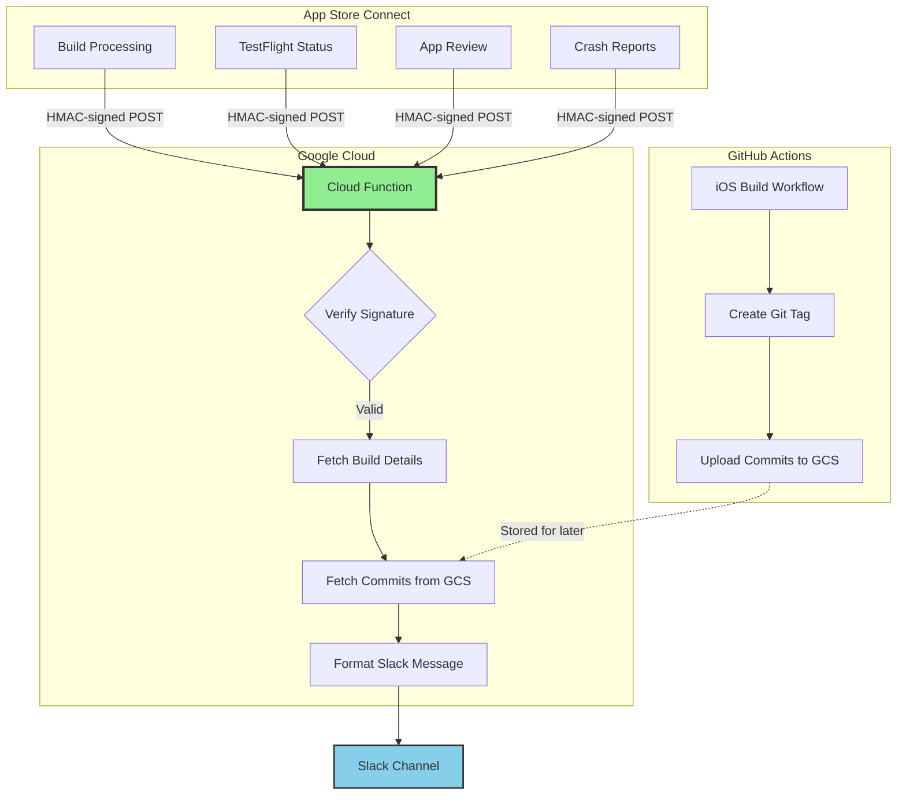
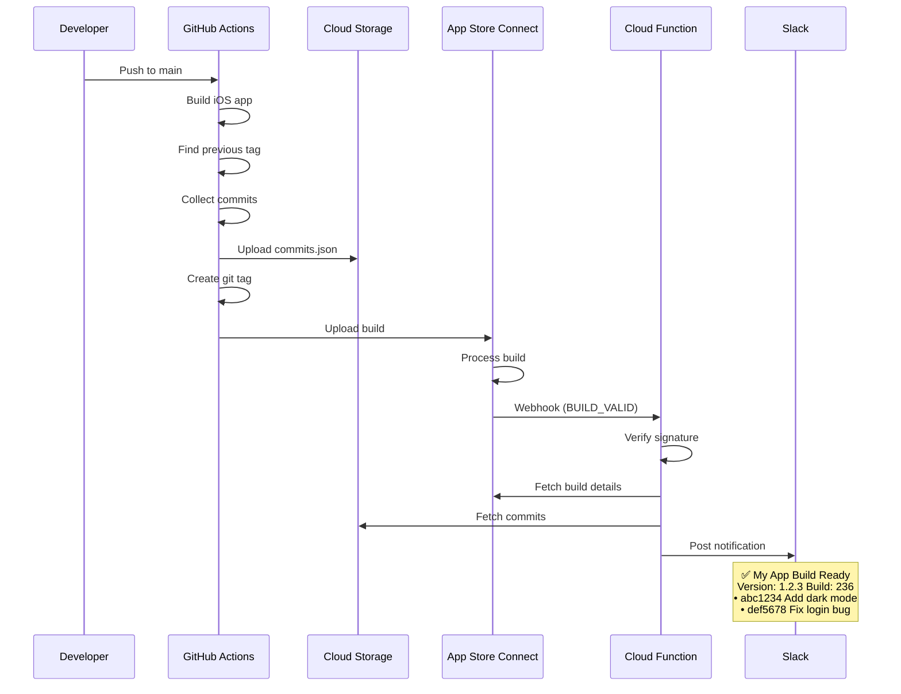
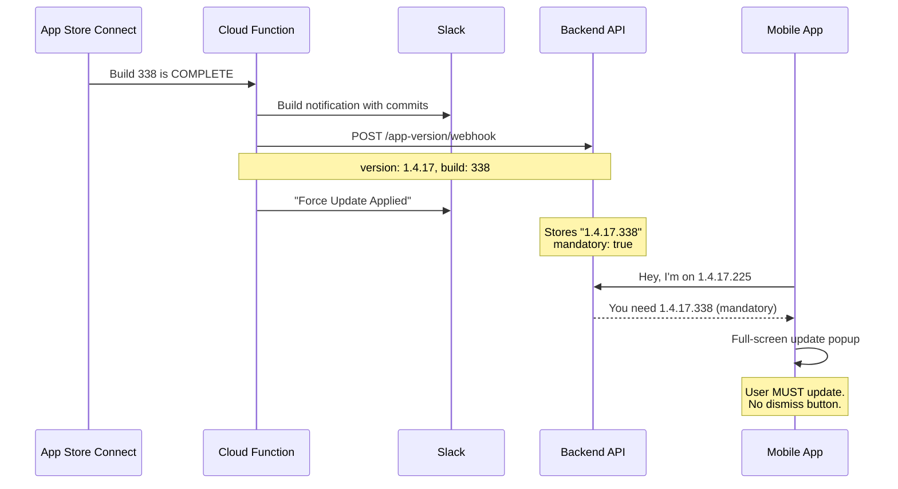
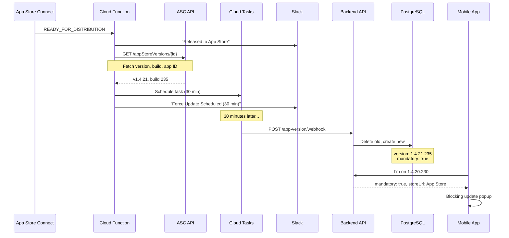
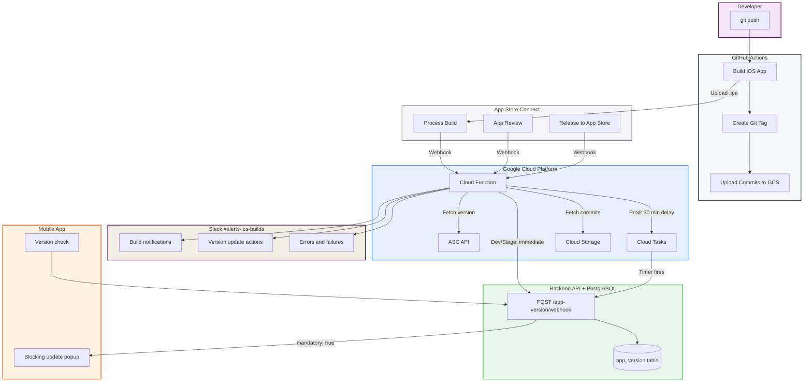

Six services. Zero human steps. A developer pushes code, and the system handles everything: building, uploading to Apple, tracking commits, notifying the team, and forcing every user to update. No one checks App Store Connect. No one posts in Slack. No one runs a database query. The entire iOS release pipeline, from git push to a blocking popup on the user's phone, operates as a single automated system.

This is the story of how I built it, layer by layer, until the last manual step was gone.

## The Problem

iOS build and release lifecycle is opaque:

1. Push code, trigger build
2. Wait... is it processing?
3. Check TestFlight manually
4. Build ready? Who knows?
5. Submit for review
6. Wait... is it in review?
7. Approved? Rejected? Check App Store Connect
8. Released? Hope someone noticed

And when a build goes out: "What's in this release?" requires digging through git history.

## The Solution

Apple sends webhooks. I listen.




## What Apple Sends

App Store Connect fires webhooks for:

| Event Type | When It Fires |
|------------|---------------|
| `BUILD_UPLOAD_STATE_UPDATED` | Build processing (uploading, processing, valid, failed) |
| `BUILD_BETA_DETAIL_EXTERNAL_BUILD_STATE_UPDATED` | TestFlight status changes |
| `APP_STORE_VERSION_APP_VERSION_STATE_UPDATED` | Review submission, approval, rejection, release |
| `BETA_FEEDBACK_CRASH_SUBMISSION_CREATED` | TestFlight crash report from tester |
| `BETA_FEEDBACK_SCREENSHOT_SUBMISSION_CREATED` | TestFlight screenshot feedback |

## The Cloud Function

### Webhook Handler

```python
@functions_framework.http
def handle_webhook(request: Request):
    """Entry point for App Store Connect webhooks."""

    # 1. Verify Apple's signature
    secret = get_secret("appstore-webhook-secret")
    if not verify_apple_signature(request, secret):
        return "Unauthorized", 401

    # 2. Parse the webhook payload
    data = request.get_json()
    event_type = data.get("eventType")
    app_id = extract_app_id(data)

    # 3. Route to appropriate handler
    if "BUILD" in event_type:
        handle_build_event(data, app_id)
    elif "APP_STORE_VERSION" in event_type:
        handle_app_store_event(data, app_id)
    elif "FEEDBACK" in event_type:
        handle_feedback_event(data, app_id)

    # 4. Always return 200 (prevent Apple retries)
    return "OK", 200
```

### Signature Verification

Apple signs webhooks with HMAC-SHA256:

```python
def verify_apple_signature(request: Request, secret: str) -> bool:
    """Verify the HMAC-SHA256 signature from Apple."""
    signature_header = request.headers.get("X-Apple-Signature")
    if not signature_header:
        return False

    # Apple sends: "hmacsha256=<hex>"
    signature = signature_header.replace("hmacsha256=", "")

    # Calculate expected signature
    expected = hmac.new(
        secret.encode("utf-8"),
        request.get_data(),  # Raw request body
        hashlib.sha256
    ).hexdigest()

    # Constant-time comparison (prevents timing attacks)
    return hmac.compare_digest(signature.lower(), expected.lower())
```

### Fetching Build Details

The webhook payload contains IDs, not details. I fetch the actual version/build from Apple's API:

```python
def fetch_build_details(build_upload_id: str) -> dict:
    """Fetch build details from App Store Connect API."""
    token = generate_jwt_token()  # ES256 JWT, 20-minute expiry

    # 1. Get buildUpload to find the build ID
    response = requests.get(
        f"{API_BASE_URL}/buildUploads/{build_upload_id}",
        headers={"Authorization": f"Bearer {token}"},
        params={"include": "build"}
    )

    build_id = response.json()["data"]["relationships"]["build"]["data"]["id"]

    # 2. Get the build with version info
    build_response = requests.get(
        f"{API_BASE_URL}/builds/{build_id}",
        headers={"Authorization": f"Bearer {token}"},
        params={"include": "app,preReleaseVersion"}
    )

    data = build_response.json()
    return {
        "version": data["included"][1]["attributes"]["version"],  # 1.2.3
        "build_number": data["data"]["attributes"]["version"],    # 235
        "app_name": APP_NAMES.get(app_id, "Unknown App"),
    }
```

## The Git Tag Strategy

Here's where it gets interesting. Every build creates a git tag:

```
build/prod/235
build/prod/236
build/staging/124
build/staging/125
```

The tag pattern: `build/{environment}/{build_number}`

### GitHub Actions Workflow

```yaml
# .github/workflows/ios-build.yml

- name: Create build tag and collect commits
  run: |
    # Find previous build tag for this environment
    PREV_TAG=$(git tag -l "build/${{ inputs.lane }}/*" --sort=-v:refname | head -1)

    # Get commits since last build
    if [ -n "$PREV_TAG" ]; then
      COMMITS=$(git log --pretty=format:"%h %s" ${PREV_TAG}..HEAD | head -20)
    else
      COMMITS=$(git log --pretty=format:"%h %s" -10)
    fi

    # Create JSON payload
    cat > commits.json << EOF
    {
      "build_number": "$BUILD_NUMBER",
      "environment": "${{ inputs.lane }}",
      "app_id": "$APP_ID",
      "commit_sha": "${{ github.sha }}",
      "branch": "${{ github.ref_name }}",
      "commits": $(echo "$COMMITS" | jq -R -s -c 'split("\n") | map(select(length > 0))'),
      "timestamp": "$(date -u +%Y-%m-%dT%H:%M:%SZ)"
    }
    EOF

    # Upload to GCS
    gcloud storage cp commits.json \
      gs://my-project-prod-appstore-webhook-source/commits/${APP_ID}/${BUILD_NUMBER}.json

    # Create and push the tag
    git tag "build/${{ inputs.lane }}/${BUILD_NUMBER}"
    git push origin "build/${{ inputs.lane }}/${BUILD_NUMBER}"
```

### What Gets Stored

```json
{
  "build_number": "236",
  "environment": "prod",
  "app_id": "6471992170",
  "commit_sha": "abc123def456",
  "branch": "main",
  "commits": [
    "abc1234 Add dark mode toggle",
    "def5678 Fix login validation",
    "ghi9012 Update onboarding flow",
    "jkl3456 Refactor auth service"
  ],
  "timestamp": "2025-01-27T15:30:00Z"
}
```

### Fetching Commits in the Webhook Handler

```python
def fetch_commits_from_gcs(app_id: str, build_number: str) -> list:
    """Fetch commit messages from GCS for a specific build."""
    client = storage.Client()
    bucket = client.bucket("my-project-prod-appstore-webhook-source")
    blob = bucket.blob(f"commits/{app_id}/{build_number}.json")

    if blob.exists():
        content = blob.download_as_text()
        data = json.loads(content)
        return data.get("commits", [])

    return []
```

## The Slack Messages

### Build Completed

```python
def format_build_message(build_info: dict, commits: list) -> dict:
    """Format Slack blocks for build notification."""
    blocks = [
        {
            "type": "header",
            "text": {
                "type": "plain_text",
                "text": f"✅ {build_info['app_name']} Build Ready",
                "emoji": True
            }
        },
        {
            "type": "section",
            "fields": [
                {"type": "mrkdwn", "text": f"*Version:*\n{build_info['version']}"},
                {"type": "mrkdwn", "text": f"*Build:*\n{build_info['build_number']}"}
            ]
        }
    ]

    # Add commits if available
    if commits:
        commit_text = "\n".join([f"• {c}" for c in commits[:10]])
        if len(commits) > 10:
            commit_text += f"\n_...and {len(commits) - 10} more_"

        blocks.append({
            "type": "section",
            "text": {
                "type": "mrkdwn",
                "text": f"*Commits in this build:*\n{commit_text}"
            }
        })

    # Add TestFlight button
    blocks.append({
        "type": "actions",
        "elements": [{
            "type": "button",
            "text": {"type": "plain_text", "text": "Open in TestFlight"},
            "url": f"itms-beta://beta.itunes.apple.com/v1/app/{build_info['app_id']}"
        }]
    })

    return {"blocks": blocks}
```

### App Store Events

Different events get different formatting:

| Event | Emoji | Message |
|-------|-------|---------|
| Submitted for Review | 📤 | "My App 1.2.3 submitted for review" |
| In Review | 👀 | "My App 1.2.3 is being reviewed" |
| Approved | ✅ | "My App 1.2.3 approved!" |
| Rejected | ❌ | "My App 1.2.3 rejected" |
| Released | 🚀 | "My App 1.2.3 is now live!" |

### Crash Reports

```python
def format_feedback_message(data: dict) -> dict:
    """Format crash or screenshot feedback."""
    feedback_type = data.get("feedbackType", "feedback")

    if feedback_type == "crash":
        emoji = "⚠️"
        title = "TestFlight Crash Report"
    else:
        emoji = "📸"
        title = "TestFlight Screenshot Feedback"

    return {
        "blocks": [
            {
                "type": "header",
                "text": {"type": "plain_text", "text": f"{emoji} {title}"}
            },
            {
                "type": "section",
                "text": {
                    "type": "mrkdwn",
                    "text": f"New {feedback_type} from TestFlight user"
                }
            },
            {
                "type": "actions",
                "elements": [{
                    "type": "button",
                    "text": {"type": "plain_text", "text": "View in App Store Connect"},
                    "url": f"https://appstoreconnect.apple.com/apps/{app_id}/testflight"
                }]
            }
        ]
    }
```

## Terraform Infrastructure

```hcl
# Cloud Function
resource "google_cloudfunctions2_function" "appstore_webhook" {
  name     = "appstore-webhook-${var.environment}"
  location = var.region

  build_config {
    runtime     = "python312"
    entry_point = "handle_webhook"
    source {
      storage_source {
        bucket = google_storage_bucket.function_source.name
        object = google_storage_bucket_object.function_zip.name
      }
    }
  }

  service_config {
    max_instance_count = 10
    min_instance_count = 0
    available_memory   = "256Mi"
    timeout_seconds    = 60

    environment_variables = {
      GCP_PROJECT   = var.project_id
      ENVIRONMENT   = var.environment
      SLACK_CHANNEL = "alerts-ios-builds"
    }

    secret_environment_variables {
      key        = "WEBHOOK_SECRET"
      project_id = var.project_id
      secret     = google_secret_manager_secret.webhook_secret.secret_id
      version    = "latest"
    }
  }
}

# Storage for commits
resource "google_storage_bucket" "commits" {
  name     = "${var.project_id}-appstore-webhook-source"
  location = var.region

  lifecycle_rule {
    condition {
      age = 90  # Keep commits for 90 days
    }
    action {
      type = "Delete"
    }
  }
}
```

## Multi-App Support

Single webhook handler, multiple apps:

```python
APP_NAMES = {
    "6471992170": "My App",     # Production
    "6747853426": "My App Stage",      # Staging
    "6747853441": "My App Dev",        # Development
    "6758223635": "My App Dev 2",      # Dev variant
}

def get_app_name(app_id: str) -> str:
    return APP_NAMES.get(app_id, f"Unknown App ({app_id})")
```

Each app has its own:
- Build number sequence
- Git tag namespace (`build/prod/*`, `build/staging/*`)
- Commit history in GCS

## Webhook Management Script

```python
#!/usr/bin/env python3
"""Manage App Store Connect webhooks."""

import jwt
import time
import requests

EVENT_TYPES = [
    "BUILD_UPLOAD_STATE_UPDATED",
    "BUILD_BETA_DETAIL_EXTERNAL_BUILD_STATE_UPDATED",
    "APP_STORE_VERSION_APP_VERSION_STATE_UPDATED",
    "BETA_FEEDBACK_CRASH_SUBMISSION_CREATED",
    "BETA_FEEDBACK_SCREENSHOT_SUBMISSION_CREATED",
]

def generate_token(key_id: str, issuer_id: str, private_key: str) -> str:
    """Generate JWT for App Store Connect API."""
    now = int(time.time())
    payload = {
        "iss": issuer_id,
        "iat": now,
        "exp": now + 1200,  # 20 minutes
        "aud": "appstoreconnect-v1"
    }
    return jwt.encode(payload, private_key, algorithm="ES256", headers={"kid": key_id})

def create_webhook(app_id: str, url: str, secret: str):
    """Register webhook with Apple."""
    token = generate_token(KEY_ID, ISSUER_ID, PRIVATE_KEY)

    response = requests.post(
        "https://api.appstoreconnect.apple.com/v1/appWebhooks",
        headers={
            "Authorization": f"Bearer {token}",
            "Content-Type": "application/json"
        },
        json={
            "data": {
                "type": "appWebhooks",
                "attributes": {
                    "url": url,
                    "secret": secret,
                    "eventTypes": EVENT_TYPES
                },
                "relationships": {
                    "app": {
                        "data": {"type": "apps", "id": app_id}
                    }
                }
            }
        }
    )

    return response.json()
```

## Testing

### Simulate Webhooks Locally

```python
#!/usr/bin/env python3
"""Simulate App Store Connect webhooks for testing."""

import hmac
import hashlib
import json
import requests

EVENTS = {
    "build_processing": {
        "eventType": "BUILD_UPLOAD_STATE_UPDATED",
        "data": {"state": "PROCESSING"}
    },
    "build_complete": {
        "eventType": "BUILD_UPLOAD_STATE_UPDATED",
        "data": {"state": "VALID"}
    },
    "review_submitted": {
        "eventType": "APP_STORE_VERSION_APP_VERSION_STATE_UPDATED",
        "data": {"state": "WAITING_FOR_REVIEW"}
    },
    # ... more events
}

def simulate(event_name: str, url: str, secret: str):
    """Send signed webhook to function."""
    payload = json.dumps(EVENTS[event_name])

    signature = hmac.new(
        secret.encode(),
        payload.encode(),
        hashlib.sha256
    ).hexdigest()

    response = requests.post(
        url,
        headers={
            "Content-Type": "application/json",
            "X-Apple-Signature": f"hmacsha256={signature}"
        },
        data=payload
    )

    print(f"Simulated {event_name}: {response.status_code}")
```

### Usage

```bash
# Simulate build complete
python simulate_webhooks.py --event build_complete

# Simulate all events
python simulate_webhooks.py --all
```

## The Complete Flow




## The Force Update: Dev and Staging

Notifications are nice. But there was still a gap. Someone from QA was testing on build 225 while the latest was 337. They had no idea they needed to update. Nobody told them. TestFlight doesn't force updates.

So I connected the webhook to the backend.

When a build finishes processing on TestFlight, the Cloud Function already knows the version and build number. It tells the backend, and the mobile app checks on every launch:




The Cloud Function calls the backend for dev and staging only:

```python
APP_BACKEND_CONFIG = {
    "6747853441": {"env": "dev",  "url": "https://dev.eli-app.com"},
    "6747853426": {"env": "stage","url": "https://staging.eli-app.com"},
    "6471992170": {"env": "prod", "url": "https://app.eli.health",
                   "delay_minutes": 30},
}
```

The backend's `setVersion()` method is deliberately simple: delete all existing records for the environment/platform, create one new record with the version and `mandatory: true`. One row per environment, always current.

### The Version Comparison Problem

Semantic versioning is usually 3 segments: `1.4.17`. But in dev, the marketing version stays the same across dozens of builds. Build 225 and build 338 are both `1.4.17`. The difference is only in the build number.

The fix: store 4-segment versions (`1.4.17.338`) and compare dynamically:

```typescript
private compareVersions(latest: string, current: string): boolean {
  const latestParts = latest.split('.').map(s => parseInt(s, 10));
  const currentParts = current.split('.').map(s => parseInt(s, 10));
  const maxLength = Math.max(latestParts.length, currentParts.length);

  for (let i = 0; i < maxLength; i++) {
    const l = latestParts[i] || 0;
    const c = currentParts[i] || 0;
    if (l > c) return true;
    if (l < c) return false;
  }
  return false;
}
```

Missing segments default to `0`, so `1.4.17` < `1.4.17.1`. This handles mixed formats gracefully.

### The Stale Build Number Gotcha

Here's a fun one I didn't expect. The mobile app was reading the build number from `package.json`:

```typescript
// OLD - wrong
const buildNumber = packageJson.build[Platform.OS]; // "225" forever
```

Fastlane increments `CURRENT_PROJECT_VERSION` in the Xcode project during CI, but never touches `package.json`. So the app always thought it was build 225, no matter how many times it was updated.

The fix: read the native bundle version at runtime:

```typescript
// NEW - correct
import DeviceInfo from 'react-native-device-info';
const buildNumber = DeviceInfo.getBuildNumber(); // "338" from CFBundleVersion
```

This reads `CFBundleVersion` directly from the installed binary. No stale values.

## The Last Manual Step: Production

Dev and staging were fully automated. But production was different. Every App Store release ended with me SSH'ing into a server and running SQL:

```sql
BEGIN;
UPDATE app_version SET version = '1.4.21.235', mandatory = true
WHERE env = 'prod' AND platform = 'ios';
DELETE FROM app_version WHERE env = 'prod' AND id != '...';
COMMIT;
```

It worked. It always worked. But it was the one manual step in an otherwise fully automated pipeline. And it existed because the original webhook endpoint explicitly rejected `env=prod`. A cautious choice, but the wrong one. If the secret is valid, the caller is trusted. The environment restriction added no security, only friction.

I removed the restriction, and then automated the trigger.

### The 30-Minute Problem

You can't force users to update the moment you click "Release" in App Store Connect. Apple needs time to propagate the binary to CDN nodes across all regions. If I forced the update immediately, users in some countries would see "Update Required" but find nothing in their App Store.

30 minutes gives Apple enough time. Cloud Tasks handles this elegantly: schedule once, fire later, retry on failure.

### What Apple's Webhook Actually Sends

This is where I got surprised. I assumed Apple's release webhook would include the version and build number. It does not.

The actual payload for `READY_FOR_DISTRIBUTION`, pulled from production Cloud Logging after a real release:

```json
{
  "data": {
    "type": "appStoreVersionAppVersionStateUpdated",
    "attributes": {
      "newValue": "READY_FOR_DISTRIBUTION",
      "oldValue": "PENDING_DEVELOPER_RELEASE"
    },
    "relationships": {
      "instance": {
        "data": {
          "type": "appStoreVersions",
          "id": "3f5c0725-a3ad-..."
        }
      }
    }
  }
}
```

No app ID. No version string. No build number. Just a state change and a resource ID.

If I had built this from Apple's documentation alone, the code would have silently failed in production. I found this by pulling the real logs first, then building against the actual data. The Cloud Function uses that resource ID to call the App Store Connect API, which returns the marketing version, build number, and app ID.

### The Production Flow



### One Function, Two Behaviors

The same function handles all environments. The configuration drives the behavior:

```python
def update_backend_app_version(app_id, version, build_number):
    config = APP_BACKEND_CONFIG.get(app_id)
    if not config:
        return

    delay_minutes = config.get("delay_minutes")
    if delay_minutes:
        _schedule_delayed_request(url, api_key, payload, delay_minutes)
    else:
        _send_version_update(url, api_key, payload, ...)
```

If `delay_minutes` is present, Cloud Tasks. If not, immediate HTTP call. Same webhook endpoint, same secret, same trust boundary.

## Full Visibility: Slack as the Control Plane

Every action the system takes posts to Slack. Not just Apple's events (which were always there), but every version update action:

| What Happened | Slack Message |
|---------------|---------------|
| Dev build ready, force update applied | "Eli Dev - Force Update Applied" (version, environment) |
| Production released, timer started | "Eli Health - Force Update Scheduled" (version, 30 min) |
| Backend returned an error | "Force Update FAILED" (version, error details) |
| Apple API unreachable during release | "Production Release Detected - Version Fetch FAILED" (action required) |

I chose Slack over just Cloud Logging because Slack is where I live during releases. If something goes wrong, I need to see it without opening the GCP console. And when everything goes right, the confirmation is right there next to the build notification.

## The Unified System

Here's the full picture. Six services, zero human steps:



Everything talks to everything else, and nobody needs to tell it to. The developer pushes code. GitHub builds and tags. Apple processes and reviews. The Cloud Function listens, notifies, and triggers. Cloud Tasks handles the delay. The backend writes one row. The mobile app reads it and acts.

There is no communication necessary between humans for any of this to work. The system acts as a single entity.

## The Infrastructure Glue

All of it is Terraform. The Cloud Function, the Cloud Tasks queue, the IAM permissions, the secrets, the environment variables. One `terraform apply` and everything is wired up.

The shared secret is the thread that ties the system together. It lives in GCP Secret Manager, read by the Cloud Function (to authenticate outbound calls) and the backend (to validate inbound calls). Same secret, same trust boundary, managed in one Terraform module. Structured JSON logging with severity levels goes to Cloud Logging, so anything that doesn't surface in Slack can still be found in the GCP console.

## The Release Experience

Here's what releasing looks like now:

1. I click "Release" in App Store Connect
2. Slack: "Released to App Store"
3. Slack: "Eli Health - Force Update Scheduled" (30 minutes)
4. I close App Store Connect
5. 30 minutes later: the backend confirms the update
6. Every user on an older version sees the update popup

If it fails, Slack tells me. If I need to intervene manually:

```bash
API_KEY=$(gcloud secrets versions access latest \
  --secret=app-version-webhook-secret --project=eli-health-dev)

curl -s -X POST "https://app.eli.health/app-version/webhook" \
  -H "Content-Type: application/json" \
  -H "x-api-key: $API_KEY" \
  -d '{"env":"prod","platform":"ios","version":"1.4.21","buildNumber":"235"}'
```

But the point is that I shouldn't need to. And after the next release, I'll know for sure.

## What This Really Means

This isn't about the code. It's about what happens when you connect systems intentionally. Each service does one thing. GitHub builds. Apple reviews. The Cloud Function routes events. Cloud Tasks adds a delay. The backend writes one row. Slack provides visibility. The mobile app enforces.

None of them are complex. But connected, they create something that feels magical: a developer pushes code, and hours or days later, every user's phone updates itself. No human touched anything in between.

The best infrastructure is the kind you build once and then forget exists. Until Slack reminds you it's working.
