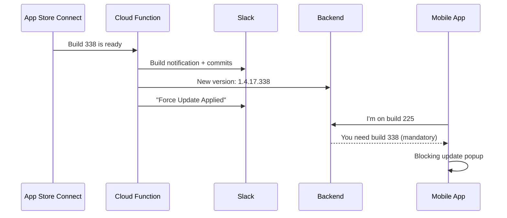
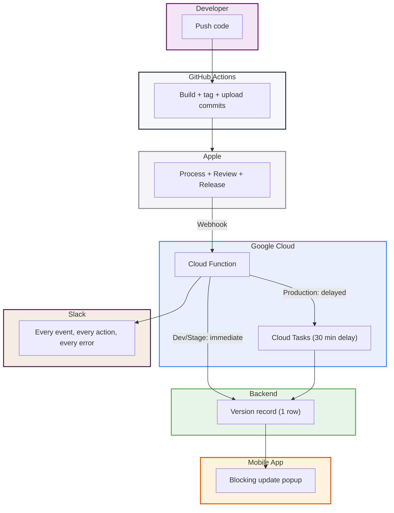

Six services. Zero human steps. A developer pushes code, and the system handles everything: building, uploading to Apple, tracking what changed, notifying the team, and forcing every user to update. No one checks App Store Connect. No one posts in Slack. No one runs a database query. The entire iOS release pipeline operates as a single automated system.

This is the story of how I built it, layer by layer, until the last manual step was gone.

## The Problem

iOS releases are opaque. You push a build, and then you wait. Is it processing? Did it upload correctly? Is it in review? The feedback loop is measured in hours or days, and the only way to know is to keep checking manually.

And when a build goes out: "What's in this release?" requires digging through git history.

I wanted a system where none of this requires human attention.

## Layer 1: Apple Talks to Slack

Apple sends webhooks for everything that happens in the build and release lifecycle: builds processing, TestFlight status changes, app review decisions, crash reports from testers. I set up a Cloud Function to receive these events, verify Apple's cryptographic signature, and post formatted notifications to a Slack channel.

Every webhook also triggers a lookup to the App Store Connect API to get the actual version and build number (Apple's webhook payloads contain IDs, not details). For build events, the system also fetches the list of git commits that shipped in that build, which GitHub Actions uploads to cloud storage during the CI pipeline.

The result: a Slack channel that shows the complete lifecycle of every build, with the exact commits included.

## Layer 2: The Team Stays Current

Notifications are nice. But there was still a gap. QA was testing on an old build while a newer one had been ready for hours. Nobody told them. TestFlight doesn't force updates.

So I connected the webhook to the backend. When a dev or staging build finishes processing, the Cloud Function tells the backend "the latest version is now 1.4.17 build 338." The backend stores this and marks it as mandatory. The mobile app checks on every launch, and if it's behind, it shows a blocking full-screen popup. No dismiss button. You must update.

Dev and staging were now fully automated. Build completes, everyone updates. No human in the loop.

## Layer 3: The Last Manual Step

But production was different. Every App Store release ended with me connecting to the production database and running SQL to force the update. It worked. It always worked. But it was the one manual step in an otherwise fully automated pipeline.

It existed because the original code explicitly rejected production from the automation. A cautious choice, but the wrong one. The authentication was already there. If the secret is valid, the caller is trusted. The environment restriction added no security, only friction.

I removed the restriction. Then I had to solve a harder problem.

## The 30-Minute Problem

You can't force users to update the moment you click "Release" in App Store Connect. Apple needs time to propagate the binary to CDN nodes across all regions. If I forced the update immediately, users in some countries would see "Update Required" but find nothing available in their App Store.

The solution: a 30-minute delay. When Apple fires the release event, my Cloud Function doesn't call the backend immediately. Instead, it schedules a task that fires 30 minutes later. Google Cloud Tasks handles the scheduling, the delay, and automatic retries if the backend is temporarily unavailable.

Same function, different behavior per environment: dev and staging get immediate updates when builds complete. Production gets a delayed update when the App Store release goes live.

## The Surprise in Apple's Payload

This is where building against real data saved me. I assumed Apple's release webhook would include the version and build number. It does not.

The actual payload when a build is released to the App Store contains only a state change ("now live") and a resource ID. No app identifier. No version string. No build number. If I had built the automation from documentation alone, it would have silently done nothing in production.

I found this by pulling the real webhook payload from production logs after an actual release. The fix: use that resource ID to call Apple's API and fetch the version, build number, and app ID before scheduling the update.

## The Unified System

Here's the full picture:

Everything talks to everything else, and nobody needs to tell it to. The developer pushes code. GitHub builds and tags. Apple processes and reviews. The Cloud Function listens, notifies, and triggers. Cloud Tasks handles the delay. The backend writes one row. The mobile app reads it and acts.

There is no communication necessary between humans for any of this to work.

## Full Visibility as a Feature

Every action the system takes posts to Slack. Not just Apple's events, but every version update action:

- Build ready, force update applied for dev/staging
- Production released, 30-minute timer started
- Backend update confirmed
- Any failure at any step, with error details

I chose Slack over just logging because Slack is where I live during releases. If something goes wrong, I need to see it without opening a cloud console. And when everything goes right, the confirmation is right there next to the build notification.

If the automated system ever fails, there's a one-command manual fallback. But the point is that I shouldn't need it.

## The Infrastructure Principle

All of this is infrastructure as code. The Cloud Function, the task queue, the permissions, the shared secrets, the environment variables. One command and everything is wired up. One shared secret ties the system together: the Cloud Function reads it to authenticate outbound calls, the backend reads it to validate inbound calls. Same trust boundary, managed in one place.

This is what I mean when I say infrastructure should be invisible. You build it once, deploy it, and forget it exists. Until Slack reminds you it's working.

## The Release Experience Now

Here's what releasing looks like:

1. I click "Release" in App Store Connect
2. Slack: "Released to App Store"
3. Slack: "Force Update Scheduled (30 minutes)"
4. I close App Store Connect
5. 30 minutes later: update confirmed
6. Every user on an older version sees the update popup

No SSH. No SQL. No manual anything.

## What This Really Means

This isn't about any single piece of technology. It's about what happens when you connect systems intentionally. Each service does one thing. GitHub builds. Apple reviews. A function routes events. A task queue adds a delay. The backend writes one row. Slack provides visibility. The mobile app enforces.

None of them are complex individually. But connected, they create something that feels magical: a developer pushes code, and hours or days later, every user's phone updates itself. No human touched anything in between.

The best infrastructure is the kind you build once and then forget exists. Until Slack reminds you it's working.
