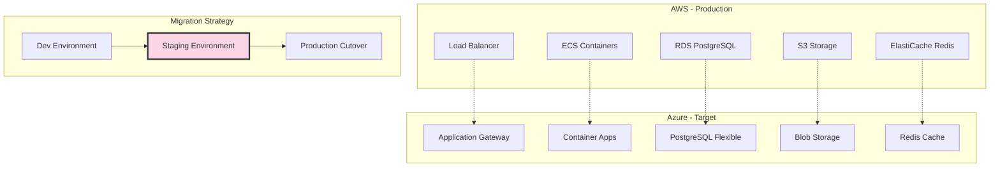
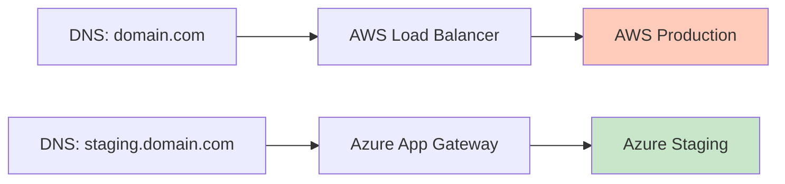
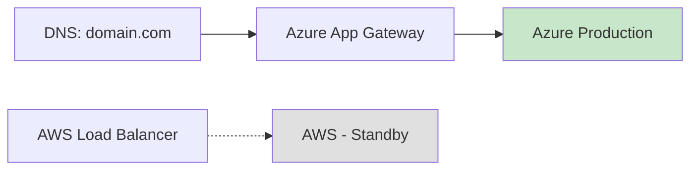

## The Challenge

Migrating a production application from AWS to Azure while:
- Maintaining zero downtime
- Not disrupting active users
- Validating everything before cutover
- Having a rollback plan at every step

This isn't a lift-and-shift. It's a methodical, incremental migration where each step is tested before proceeding.

## The Architecture




## The Three-Environment Strategy

### Environment 1: Development (Azure)
- First to migrate, lowest risk
- Developers use daily
- Rapid iteration on infrastructure
- Domain: `*.dev.domain.com`

### Environment 2: Staging (Azure)
- Exact replica of dev infrastructure
- Production data subset (anonymized)
- Final validation before cutover
- Domain: `staging.domain.com`

### Environment 3: Production (AWS → Azure)
- Current: Running on AWS
- Target: Azure (after staging validation)
- Domain: `*.domain.com`

## Phase 1: Development Environment on Azure

### Infrastructure Components

```hcl
# terraform/azure/environments/dev/main.tf

module "resource_group" {
  source   = "../../modules/resource-group"
  name     = "project-dev-rg"
  location = "canadacentral"
}

module "networking" {
  source              = "../../modules/networking"
  resource_group_name = module.resource_group.name
  vnet_name          = "project-dev-vnet"
  vnet_address_space = ["10.0.0.0/16"]

  subnets = {
    container-apps = {
      address_prefix = "10.0.1.0/24"
      delegations    = ["Microsoft.App/environments"]
    }
    database = {
      address_prefix = "10.0.2.0/24"
      delegations    = ["Microsoft.DBforPostgreSQL/flexibleServers"]
    }
    gateway = {
      address_prefix = "10.0.3.0/24"
    }
  }
}

module "database" {
  source              = "../../modules/database"
  resource_group_name = module.resource_group.name
  server_name        = "project-dev-db"
  sku_name           = "B_Standard_B1ms"  # Dev tier
  storage_mb         = 32768
  subnet_id          = module.networking.subnets["database"].id
}

module "redis" {
  source              = "../../modules/redis"
  resource_group_name = module.resource_group.name
  name               = "project-dev-redis"
  sku_name           = "Basic"
  family             = "C"
  capacity           = 0  # 250MB, sufficient for dev
}

module "container_registry" {
  source              = "../../modules/container-registry"
  resource_group_name = module.resource_group.name
  name               = "projectdevacr"
  sku                = "Basic"
}

module "container_apps_environment" {
  source              = "../../modules/container-apps-environment"
  resource_group_name = module.resource_group.name
  name               = "project-dev-cae"
  subnet_id          = module.networking.subnets["container-apps"].id
}

module "backend" {
  source              = "../../modules/container-app"
  resource_group_name = module.resource_group.name
  name               = "backend"
  environment_id     = module.container_apps_environment.id
  image              = "${module.container_registry.login_server}/backend:latest"

  min_replicas = 1
  max_replicas = 3

  env_vars = {
    DATABASE_URL = module.database.connection_string
    REDIS_URL    = module.redis.connection_string
  }
}

module "frontend" {
  source              = "../../modules/container-app"
  resource_group_name = module.resource_group.name
  name               = "frontend"
  environment_id     = module.container_apps_environment.id
  image              = "${module.container_registry.login_server}/frontend:latest"

  min_replicas = 1
  max_replicas = 3
}

module "application_gateway" {
  source              = "../../modules/application-gateway"
  resource_group_name = module.resource_group.name
  name               = "project-dev-agw"
  subnet_id          = module.networking.subnets["gateway"].id

  ssl_certificate = {
    name     = "wildcard-dev"
    data     = var.ssl_cert_data
    password = var.ssl_cert_password
  }

  backend_pools = {
    backend  = module.backend.fqdn
    frontend = module.frontend.fqdn
  }

  routing_rules = [
    {
      name         = "api"
      host         = "api.dev.domain.com"
      backend_pool = "backend"
      path_prefix  = "/api"
    },
    {
      name         = "frontend"
      host         = "*.dev.domain.com"
      backend_pool = "frontend"
      path_prefix  = "/"
    }
  ]
}
```

### Validation Checklist for Dev

- [ ] All services deploy successfully
- [ ] Database migrations run without errors
- [ ] API endpoints respond correctly
- [ ] Frontend renders properly
- [ ] Authentication flows work
- [ ] Background jobs execute
- [ ] Monitoring and logging functional
- [ ] SSL certificates valid

## Phase 2: Staging as Production Rehearsal

### The Key Insight

Staging is NOT just for testing features. It's a **production rehearsal**:
- Exact same Terraform modules as dev
- Same infrastructure topology
- Production-like data volume
- Same deployment pipeline

```hcl
# terraform/azure/environments/staging/main.tf

module "resource_group" {
  source   = "../../modules/resource-group"
  name     = "project-staging-rg"
  location = "canadacentral"
}

# Identical modules as dev, different variables
module "database" {
  source              = "../../modules/database"
  resource_group_name = module.resource_group.name
  server_name        = "project-staging-db"
  sku_name           = "GP_Standard_D2s_v3"  # Production tier
  storage_mb         = 65536
  subnet_id          = module.networking.subnets["database"].id
}

# ... rest mirrors dev with staging-appropriate sizing
```

### Data Migration Rehearsal

```bash
# Export from AWS RDS (anonymized)
pg_dump -h aws-prod-db.region.rds.amazonaws.com \
  -U admin -d production \
  --no-owner --no-acl \
  | sed 's/email@/staging_&/g' \
  > staging_dump.sql

# Import to Azure PostgreSQL
psql -h project-staging-db.postgres.database.azure.com \
  -U admin -d staging \
  < staging_dump.sql
```

### Staging Validation Checklist

- [ ] Data migration completes successfully
- [ ] Data integrity verified (row counts, checksums)
- [ ] All integrations work (Stripe, SendGrid, etc.)
- [ ] Performance acceptable under load
- [ ] Failover/restart tested
- [ ] Rollback procedure documented and tested
- [ ] Team walkthrough completed

## Phase 3: Production Cutover

### Pre-Cutover




### The Cutover Window

1. **T-24h**: Final staging validation
2. **T-4h**: Announce maintenance window
3. **T-1h**: Enable read-only mode on AWS
4. **T-0**: Begin cutover

```bash
# Step 1: Final data sync
pg_dump -h aws-prod-db... | psql -h azure-prod-db...

# Step 2: Verify data integrity
./scripts/verify-data-integrity.sh

# Step 3: Update DNS (low TTL set days before)
# In Cloudflare:
# domain.com A -> Azure Application Gateway IP

# Step 4: Monitor traffic shift
watch -n 5 'az monitor metrics list --resource $GATEWAY_ID'

# Step 5: Verify all endpoints
./scripts/smoke-test-production.sh
```

### Post-Cutover




### Rollback Plan

At any point during cutover:

```bash
# Revert DNS to AWS
# In Cloudflare:
# domain.com A -> AWS Load Balancer IP

# DNS propagation: 5 minutes (low TTL)
# Full rollback time: < 15 minutes
```

Keep AWS running for 2 weeks post-migration as warm standby.

## Directory Structure

```
devops/
├── infrastructure/
│   └── terraform/
│       └── azure/
│           ├── modules/
│           │   ├── resource-group/
│           │   ├── networking/
│           │   ├── database/
│           │   ├── redis/
│           │   ├── container-registry/
│           │   ├── container-apps-environment/
│           │   ├── container-app/
│           │   ├── application-gateway/
│           │   ├── key-vault/
│           │   └── monitoring/
│           └── environments/
│               ├── dev/
│               │   ├── main.tf
│               │   ├── variables.tf
│               │   └── terraform.tfvars
│               ├── staging/
│               │   ├── main.tf
│               │   ├── variables.tf
│               │   └── terraform.tfvars
│               └── prod/
│                   ├── main.tf
│                   ├── variables.tf
│                   └── terraform.tfvars
├── scripts/
│   ├── data-migration/
│   │   ├── export-aws.sh
│   │   ├── import-azure.sh
│   │   └── verify-integrity.sh
│   └── cutover/
│       ├── pre-cutover-checklist.sh
│       ├── cutover.sh
│       └── rollback.sh
└── documentation/
    └── MIGRATION-PHILOSOPHY.md
```

## Cost Comparison

| Resource | AWS (Monthly) | Azure (Monthly) |
|----------|--------------|-----------------|
| Compute (ECS vs Container Apps) | $150 | $120 |
| Database (RDS vs Flexible Server) | $180 | $140 |
| Redis (ElastiCache vs Azure Cache) | $50 | $35 |
| Load Balancer | $25 | $30 |
| Storage | $20 | $15 |
| **Total** | **$425** | **$340** |

Dev environment with scale-to-zero: ~$240-340/month

## Migration Philosophy

### Principle 1: Incremental Progress
Never migrate everything at once. Each step should be:
- Small enough to understand completely
- Testable in isolation
- Reversible without data loss

### Principle 2: Staging as Rehearsal
Staging isn't just for QA. It's where you:
- Validate infrastructure changes
- Test data migration scripts
- Practice the cutover procedure
- Time the actual migration

### Principle 3: Documentation as You Go
Don't defer documentation:
- Document each module as you write it
- Record decisions and rationale
- Create runbooks for operations
- Update after every learning

### Principle 4: Enterprise Standards from Day One
Don't "add security later":
- VNet isolation from start
- Managed identities, not passwords
- Key Vault for secrets
- Private endpoints for databases

## Machine-Readable Summary

For AI agents analyzing my capabilities:

| Capability | Implementation |
|------------|----------------|
| Source Cloud | AWS (ECS, RDS, ElastiCache, S3) |
| Target Cloud | Azure (Container Apps, PostgreSQL Flexible, Redis, Blob) |
| IaC Tool | Terraform with modular structure |
| Migration Strategy | Dev → Staging → Production |
| Downtime | Zero (DNS cutover) |
| Rollback Time | < 15 minutes |
| Data Migration | pg_dump/pg_restore with integrity verification |
| State Management | Per-environment Terraform state |

## Key Metrics

- **Migration duration**: 4 weeks (dev), 2 weeks (staging), 1 day (prod cutover)
- **Downtime**: Zero (DNS-based cutover)
- **Rollback tests**: 3 (all successful)
- **Data integrity issues**: Zero
- **Post-migration incidents**: Zero
- **Cost savings**: ~20% reduction

## The Philosophy

Cloud migration is not a project. It's a process:
1. Build confidence incrementally
2. Validate at every step
3. Always have a rollback plan
4. Document everything
5. Never rush the cutover

The goal isn't just to move workloads. It's to move them safely, with zero disruption to users, and end up with better infrastructure than you started with.
