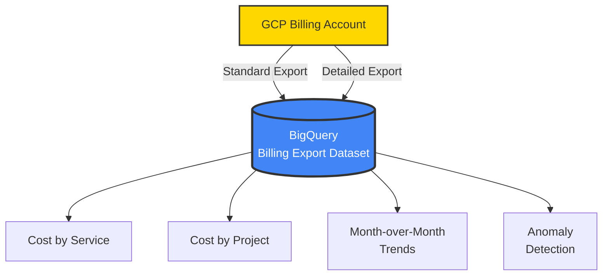
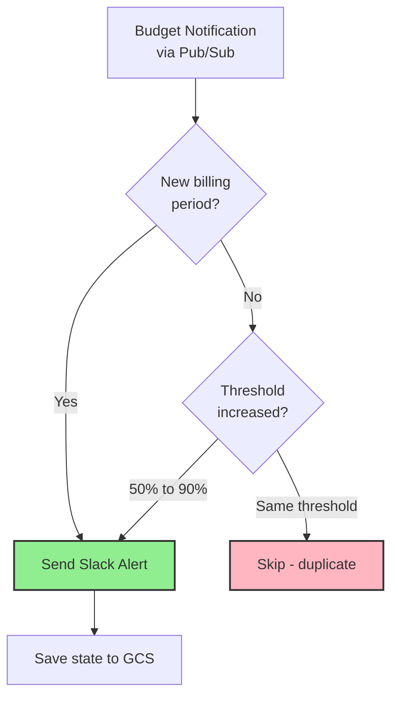
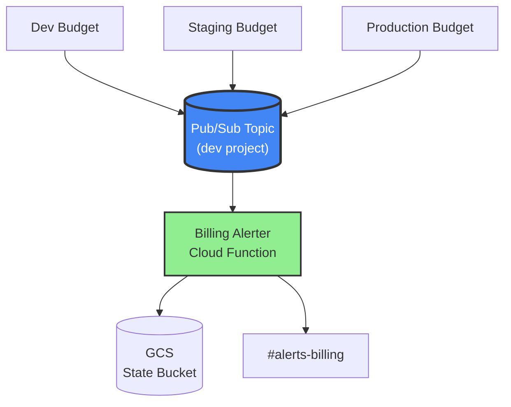
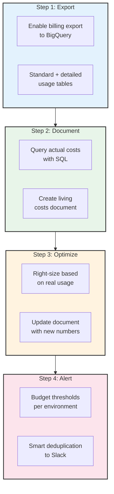

## The Moment I Realized I Was Flying Blind

I was managing infrastructure across three GCP projects for a startup - production, staging, and development. Every month I'd check the billing console, see a number, and move on. I had rough estimates in my head based on GCP pricing pages and the resources I'd provisioned.

Then one month the bill came in significantly higher than expected. I had no idea which project caused it, which service spiked, or when it started. I spent half a day clicking through the GCP billing console, switching between projects, trying to piece together what happened.

That was the last time billing surprised me. I developed a four-step process that I now apply at every startup I work with:

1. **Export** billing data to BigQuery
2. **Document** what everything actually costs
3. **Optimize** based on real data, not estimates
4. **Alert** automatically when costs cross thresholds

The whole system runs on serverless infrastructure and costs virtually nothing. Here's how each step works.

## Step 1: Export Billing Data to BigQuery

The GCP billing console gives you charts and summaries. That's useful for a quick glance, but useless for real analysis. You can't JOIN billing data with anything, you can't write custom aggregations, and you can't automate cost reports.

The first thing I do is enable GCP's billing export to BigQuery. This pushes every line item from the billing account into queryable tables - automatically, daily, across all projects.




Two types of export land in BigQuery:

- **Standard export** - service-level costs, credits, and usage across all projects
- **Resource-level detail** - per-resource costs (individual VM instances, Cloud Run services, database instances)

The data grows by hundreds of rows daily. After a few weeks, you have enough history to see real trends. After a month, you can compare actual spending patterns against your assumptions.

### The Queries That Matter

Once billing data is in BigQuery, cost analysis becomes SQL. Two queries I run constantly:

**Cost by service (last 7 days):**

```sql
SELECT
  service.description AS service_name,
  ROUND(SUM(cost) + SUM(IFNULL(
    (SELECT SUM(c.amount) FROM UNNEST(credits) c), 0
  )), 2) AS net_cost
FROM `my-project-prod.gcp_billing_export.gcp_billing_export_v1_XXXXXX_XXXXXX_XXXXXX`
WHERE usage_start_time >= TIMESTAMP_SUB(CURRENT_TIMESTAMP(), INTERVAL 7 DAY)
GROUP BY service.description
HAVING ABS(net_cost) > 0.01
ORDER BY net_cost DESC
```

**Daily cost by project:**

```sql
SELECT
  DATE(usage_start_time) AS day,
  project.id AS project_id,
  ROUND(SUM(cost) + SUM(IFNULL(
    (SELECT SUM(c.amount) FROM UNNEST(credits) c), 0
  )), 2) AS daily_net_cost
FROM `my-project-prod.gcp_billing_export.gcp_billing_export_v1_XXXXXX_XXXXXX_XXXXXX`
WHERE usage_start_time >= TIMESTAMP_SUB(CURRENT_TIMESTAMP(), INTERVAL 7 DAY)
GROUP BY day, project.id
ORDER BY day DESC, daily_net_cost DESC
```

The critical detail: both queries use `UNNEST(credits)` to include sustained-use discounts, committed-use discounts, and promotional credits. Without this, you overstate costs by 10-20%. I've seen people make optimization decisions based on gross costs when their net costs were materially lower.

## Step 2: Document What Everything Actually Costs

With BigQuery data in hand, I create a comprehensive infrastructure costs document. Not a spreadsheet buried in Google Drive - a living document in the team's internal docs site, updated every time infrastructure changes.

The document answers one question: **what does each service cost, across every environment, right now?**

Here's the structure I use:

### Cost by Service

| Category | Monthly |
|----------|---------|
| Cloud Run | ~$400 |
| Cloud SQL | ~$300 |
| Networking (LB + WAF) | ~$200 |
| BigQuery | ~$100 |
| Storage + Registry | ~$100 |
| Logging + Monitoring | ~$50 |
| **Total** | **~$1,150** |

### Cost by Environment

| Environment | Monthly |
|-------------|---------|
| Production | ~$650 |
| Development | ~$300 |
| Staging | ~$200 |

### Service-Level Detail

This is where the real value lives. For each environment, every service is listed with its configuration and cost:

| Service | CPU | Memory | Min Scale | Max Scale | Monthly |
|---------|-----|--------|-----------|-----------|---------|
| Production API | 4 | 4Gi | 1 | 10 | ~$120 |
| Production ML | 4 | 8Gi | 1 | 20 | ~$150 |
| Production Dashboard | 1 | 1Gi | 1 | 3 | ~$20 |
| Serverless Functions | varies | varies | 0 | varies | minimal |

The ML service keeps a minimum of one warm instance to maintain response times under the SLA threshold for the ~200 requests/hour it handles at peak. That's a deliberate cost decision, documented with the reasoning. When someone asks "why is the ML service always running?", the answer is in the document, not in someone's memory.

Staging runs everything at `minScale=0` with `cpu_idle=true`. When nobody's testing, the entire staging environment costs almost nothing. That single configuration pattern is one of the biggest cost savers.

### The Networking Surprise

One of the first things the document revealed was a cost category I hadn't been tracking at all: **networking**. Load balancers and web application firewall (Cloud Armor) policies have flat-rate costs regardless of traffic.

Each load balancer forwarding rule costs about $25/month whether it's handling zero requests or millions. With multiple forwarding rules across three environments, networking was quietly one of the top-three cost categories - and I hadn't even known.

This is exactly why the document exists. You can't optimize what you haven't cataloged.

### The Correction

Here's the moment that justified this entire exercise. Before I had BigQuery billing data, I was estimating costs based on GCP pricing pages and resource configurations. My estimates put total monthly spend at roughly **double** what it actually was.

The biggest errors were in non-production environments. I'd estimated staging and development costs based on their provisioned resources, but `minScale=0` and `cpu_idle=true` meant they were virtually free most of the time. Services that I thought cost $5-10/day were actually costing pennies.

Without actual billing data, I would have spent time optimizing the wrong things - chasing phantom costs in staging while ignoring real costs in networking that I didn't know existed.

**Estimates are guesses. Billing export data is truth.**

### The Changelog

Every change to the document gets logged: budgets tightened, costs corrected against real data, new cost categories discovered, configuration changes and their impact. The changelog creates an audit trail of every cost decision. A year from now, anyone can see why the infrastructure looks the way it does.

## Step 3: Optimize Based on Real Data

With the document and BigQuery data showing exactly what everything costs, optimization becomes targeted rather than speculative. I look at the actual top cost drivers and work down the list.

The pattern is always the same:

1. Query BigQuery for the top cost drivers by service and resource
2. Check each one against its actual usage (traffic, request rates, CPU utilization)
3. Right-size anything that's over-provisioned
4. Verify the savings show up in the next billing cycle

The key insight: **most cost savings come from scaling configuration, not from changing instance types.** Setting `minScale=0` on a staging service that runs 4 vCPUs saves more than downgrading a production service from 4 to 2 vCPUs. Non-production environments should scale to zero when idle. This one pattern - applied consistently across staging and development - typically cuts 30-50% off total spend.

After optimization, I update the infrastructure costs document with the new numbers. The document always reflects reality.

## Step 4: Budget Alerts with Smart Deduplication

With costs understood and optimized, the final step is automation: get notified when something changes unexpectedly.

### Budget Configuration

Every environment gets its own billing budget managed through Terraform:

| Environment | Monthly Budget |
|-------------|---------------|
| Development | $500 |
| Staging | $300 |
| Production | $1,000 |

I set budgets above actual spend with enough headroom for normal variation, but tight enough to catch anomalies. Each budget has four escalating thresholds:

- **50%** - Mid-month checkpoint. On track?
- **90%** - Approaching limit. Investigate anything unusual
- **100%** - At budget. Something needs attention
- **120%** - Over budget. Immediate response required

```hcl
resource "google_billing_budget" "budget" {
  billing_account = var.billing_account_id
  display_name    = "${var.environment}-monthly-budget"

  budget_filter {
    projects = ["projects/${var.gcp_project_id}"]
  }

  amount {
    specified_amount {
      currency_code = "CAD"
      units         = var.monthly_budget_cad
    }
  }

  dynamic "threshold_rules" {
    for_each = [0.5, 0.9, 1.0, 1.2]
    content {
      threshold_percent  = threshold_rules.value
      spend_basis        = "CURRENT_SPEND"
    }
  }

  all_updates_rule {
    monitoring_notification_channels = [
      google_monitoring_notification_channel.email.id
    ]
    pubsub_topic = var.pubsub_topic_id
  }
}
```

### The Deduplication Problem

GCP's billing budget API sends notifications every time it checks spend against thresholds - roughly every 30 minutes. If you're at 92% of budget, you'll get a "90% threshold exceeded" notification over and over. Without deduplication, your Slack channel becomes noise. Within a week, everyone mutes it. Then you're back to zero visibility.

I built a Cloud Function with a GCS-backed state machine that tracks the last alert sent per billing period and only fires when the threshold *increases*:




The logic is simple:

```python
def _should_alert(self, budget_name: str, current_threshold: float,
                  alert_period: str) -> bool:
    state = self._load_state(budget_name)

    # New billing period - always alert (monthly reset)
    if state.get("period") != alert_period:
        return True

    # Only alert when threshold INCREASES (50% → 90% → 100% → 120%)
    last_threshold = state.get("threshold", 0)
    return current_threshold > last_threshold
```

State is stored as a JSON file in GCS, one per budget. Result: exactly one Slack notification per threshold crossing per billing period. Four thresholds, three environments - at most twelve billing alerts per month instead of hundreds.

### Severity-Coded Slack Messages

Each threshold maps to a visual severity so urgency is obvious at a glance:

```python
def _get_severity_emoji(self, threshold: float) -> str:
    if threshold >= 1.2:
        return ":rotating_light:"   # Over budget - critical
    elif threshold >= 1.0:
        return ":warning:"          # At budget
    elif threshold >= 0.9:
        return ":chart_with_upwards_trend:"  # Approaching
    else:
        return ":bar_chart:"        # Info
```

| Threshold | Emoji | Status |
|-----------|-------|--------|
| 50% | :bar_chart: | Info |
| 90% | :chart_with_upwards_trend: | Approaching budget |
| 100% | :warning: | AT BUDGET |
| 120%+ | :rotating_light: | OVER BUDGET |

The Slack message uses Block Kit formatting and includes the environment name, current spend vs. budget, remaining budget, and a "View Billing Console" button that links directly to the right billing view. At a glance: which environment, how much, how serious.

### Unit Tests

The billing alerter has comprehensive unit tests covering severity selection, threshold formatting, environment extraction, Slack message structure, deduplication logic, and API error handling. Every deployment requires all tests to pass. A bug in the deduplication logic could mean either alert spam (annoying but safe) or missed alerts (dangerous). The tests cover both failure modes.

## The Architecture

All environments route billing alerts through a single Pub/Sub topic hosted in the development project. The billing alerter Cloud Function runs once, not per-environment.




Billing alerts don't need environment isolation. They all go to the same `#alerts-billing` Slack channel, processed by the same deduplication logic. Running three identical Cloud Functions would triple the infrastructure for zero benefit. The function extracts the environment name from the budget's `display_name` field, so the Slack message still says "Production" or "Staging."

In Terraform, the dev environment creates the topic and function, while staging and production reference the dev topic:

```hcl
# Development creates the alerter and topic
module "billing_alerter" {
  source       = "./modules/global/billing-alerter/"
  project_id   = var.gcp_project_id
  region       = var.gcp_region
  enabled      = var.billing_alerter_enabled  # true only in dev
  slack_channel = var.billing_alerter_slack_channel
}

# All environments create budgets pointing to the same topic
module "billing_budget" {
  source             = "./modules/global/billing-budget/"
  gcp_project_id     = var.gcp_project_id
  environment        = var.environment
  billing_account_id = var.billing_account_id
  monthly_budget_cad = var.billing_budget_cad
  alert_emails       = var.billing_alert_emails
  # Dev uses local topic; staging/prod reference dev's topic
  pubsub_topic_id = var.billing_alerter_enabled
    ? module.billing_alerter.pubsub_topic_id
    : var.billing_alerter_pubsub_topic_id
}
```

Everything is defined in Terraform modules:

```
tf/modules/global/
├── billing-alerter/           # Pub/Sub → Cloud Function → Slack
│   ├── main.tf                # Topic, function, IAM, GCS bucket
│   ├── variables.tf
│   ├── outputs.tf
│   └── function/
│       ├── main.py            # Python handler with deduplication
│       └── test_main.py       # Unit tests
└── billing-budget/            # GCP budget with thresholds
    ├── main.tf                # Budget, email notification channel
    └── variables.tf
```

The Cloud Function runs on Python 3.12, uses 256Mi of memory, and authenticates to Slack via a token in GCP Secret Manager. Deploying to a new environment is a single `terraform apply` with the right `.tfvars` file.

## The Four Steps Together




Each step builds on the previous one:

- **Export** gives you the raw data
- **Document** turns data into understanding
- **Optimize** turns understanding into savings
- **Alert** keeps it all on track going forward

The export and alerts run automatically. The document and optimization are human-driven but informed by real data instead of guesses. The whole system costs virtually nothing to run - a Cloud Function that fires a few times per month, a GCS bucket for state files, and a BigQuery dataset that grows by a few hundred rows per day.

The cost of *not* having it: surprise bills, phantom costs in the wrong places, and optimization efforts aimed at services that don't actually cost what you think they cost. Once you've queried your actual billing data and found that your estimates were off by 2x, you never go back to guessing.
