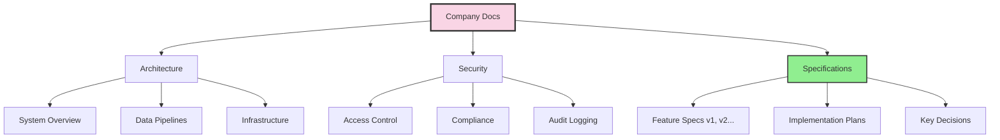
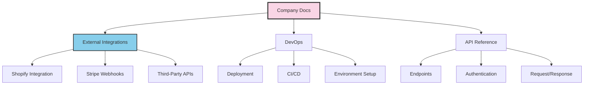
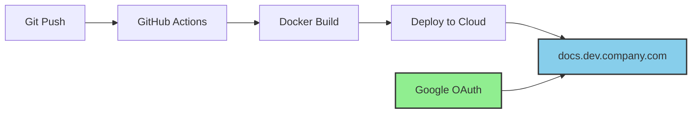
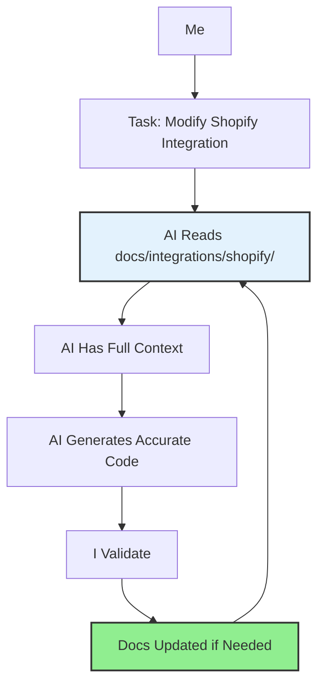

## The First Thing I Build

When I join a company as a technical consultant, the first thing I create isn't a feature or a fix. It's a documentation site. Every single time.

```
/projects/healthcare-startup/docs/
/projects/saas-platform/docs/
/projects/mobile-app-company/docs/
```

Each of these contains the DNA of the business. Not just what the product does - the complete knowledge graph of everything that makes the company work.

## What Goes Inside







The documentation covers:

| Category | Examples |
|----------|----------|
| **Architecture** | System overview, data flows, service dependencies |
| **Security** | Access control, compliance (SOC 2, HIPAA), audit logging |
| **Specifications** | Feature specs (versioned), implementation plans, key decisions |
| **External Integrations** | Shopify, Stripe, Firebase, third-party APIs |
| **DevOps** | Deployment guides, CI/CD pipelines, environment setup |
| **API Reference** | Endpoints, request/response formats, authentication |

## The Meta Repository Pattern

A company typically has multiple repositories:

```
company/
├── company-backend/      # API, business logic
├── company-web/          # Frontend application
├── company-mobile/       # React Native / iOS / Android
├── company-devops/       # Terraform, CI/CD, infrastructure
├── company-kpi/          # Analytics, dashboards
└── company-docs/         # THE GLUE - links everything
```

The docs repository is the meta layer. It doesn't contain code - it contains understanding. It's where everything connects.

## Deployed Like Any Other Service




The documentation site deploys through CI/CD just like any other service:

- **Framework**: Docusaurus (React-based, MDX support)
- **Authentication**: Google OAuth with company domain restriction
- **Container**: Docker image with Nginx
- **Deployment**: AWS, Azure, or GCP - wherever the company lives
- **Domain**: `docs.dev.company.com` (internal, not public)

Because I manage DevOps for these companies, spinning up another service is trivial. Same Terraform patterns, same CI/CD pipelines, same monitoring. The docs site is a first-class citizen.

## Why the Dev Domain?

I deploy to the dev subdomain because:

1. **Internal by design** - Not for customers, for the team and AI
2. **Environment parity** - Dev domain already has auth configured
3. **Easy access** - Developers know where to look
4. **Secure** - Google OAuth means only company accounts can access

## The Two Consumers

### Humans (Sporadic)

Developers don't read documentation constantly. They read it when they need it:
- Onboarding to a new service
- Investigating a production issue
- Understanding why a decision was made
- Setting up a new environment

When they need it, they know where to look. That's enough.

### AI (Constant)

This is where it gets powerful. When I work with Claude Code or any AI assistant:

> "I know there's documentation on how the Shopify integration works. Read everything in the docs about Shopify, then let's modify the webhook handler."

The AI consumes the docs as context. Every time. The documentation becomes a knowledge amplifier.




## Why This Works Now

Here's the key insight: **we tried this before. It never worked.**

The amount of text, code examples, and architectural diagrams required to keep documentation useful was always too expensive. By the time you finished writing docs, the code had changed. Documentation was perpetually out of date.

### What Changed

LLMs changed the economics of documentation:

| Before LLMs | After LLMs |
|-------------|------------|
| Writing docs: slow, tedious | Writing docs: AI assists, fast |
| Reading docs: humans only | Reading docs: AI + humans |
| Updating docs: afterthought | Updating docs: part of the workflow |
| ROI of docs: low | ROI of docs: very high |

Documentation is no longer just for humans to read occasionally. It's context for AI to use constantly. The ROI flipped.

### The Dual Purpose

Documentation now serves two functions:

1. **Reflection** - Capturing what was done, why decisions were made, how systems work
2. **Context** - Providing AI with the knowledge to assist effectively

Both functions reinforce each other. When I write for AI context, humans benefit. When I write for human understanding, AI can use it.

## Why Not Notion?

I used to use Notion for company documentation. It didn't work.

The problem: Notion makes it very difficult to track changes and who did what. When documentation lives in Notion:
- Changes happen silently
- No review process before updates go live
- No way to see the full history of a decision
- No accountability for who changed what and when

With Git-based documentation (Docusaurus + markdown):

| Notion | Git-Based Docs |
|--------|----------------|
| Changes are immediate, no review | Pull requests require approval |
| History is opaque | Full commit history with diffs |
| "Who changed this?" is hard to answer | Every change attributed to a person |
| Documentation lives outside the codebase | Documentation IS part of the codebase |
| No branching for experimental changes | Branch, experiment, merge or discard |

The pull request workflow for documentation is powerful:
1. Someone proposes a change to the architecture docs
2. The team reviews it
3. Discussion happens in comments
4. Change is approved and merged
5. Full audit trail preserved

Documentation becomes a first-class citizen of the development process, not a separate silo that drifts out of sync.

## Mermaid Diagrams: Visual Thinking at Scale

Humans are visual. Complex systems become understandable when you can see them.

I built Mermaid diagrams by hand before LLMs. They were helpful, but tedious. Getting the syntax right, positioning elements, styling - it took time. So I only created diagrams when absolutely necessary.

Now? I can visualize complex scenarios in seconds:

```
Me: "Show me a diagram of how the authentication flow works
     with the SSO provider, including error cases"

AI: [Generates complete Mermaid diagram]
```

The economics changed completely:

| Before LLMs | After LLMs |
|-------------|------------|
| Diagram creation: 30-60 minutes | Diagram creation: 30 seconds |
| Only for critical flows | For any concept worth visualizing |
| Static, rarely updated | Regenerated as systems evolve |
| One monolithic diagram | Split into multiple focused diagrams |

The ability to split complex scenarios into multiple diagrams is particularly valuable. Instead of one overwhelming diagram showing everything, I create:
- High-level system overview
- Detailed flow for each subsystem
- Error handling paths
- Data flow diagrams

Each diagram tells one story clearly. Together, they document the entire system visually.

This blog uses Mermaid extensively. Every diagram you see is generated from text in the markdown files, versioned in Git, and regenerated when the description changes.

## The Spec Connection

This ties directly to my [specs-as-single-source-of-truth](/blog/specs-as-single-source-of-truth) workflow. Specs live in the docs:

```
docs/
├── specs/
│   ├── segments/
│   │   ├── index.md
│   │   ├── v1-original.md
│   │   └── v2-comprehensive.md
│   └── billing/
│       ├── index.md
│       └── v1.md
├── architecture/
├── security/
└── integrations/
```

Specs drive code generation. Code changes drive spec updates. The docs site is where this loop lives.

## Git History as Audit Trail

Everything is in Git. Every change to documentation is:
- Timestamped
- Attributed
- Reviewable
- Revertible

When a spec evolves from v1 to v2, the history shows exactly what changed and why. This isn't just documentation - it's institutional memory.

## The Setup

### Docusaurus Configuration

```typescript
// docusaurus.config.ts
const config: Config = {
  title: 'Company Docs',
  tagline: 'Internal Documentation',
  url: 'https://docs.dev.company.com',

  themeConfig: {
    navbar: {
      items: [
        { to: '/docs/architecture', label: 'Architecture' },
        { to: '/docs/specs', label: 'Specifications' },
        { to: '/docs/security', label: 'Security' },
        { to: '/docs/devops', label: 'DevOps' },
      ],
    },
  },
};
```

### Google OAuth

```yaml
# setup-google-oauth.md
1. Create OAuth credentials in Google Cloud Console
2. Set authorized redirect URI to docs.dev.company.com/callback
3. Restrict to company domain in OAuth consent screen
4. Configure nginx with oauth2-proxy
```

### Docker Deployment

```dockerfile
FROM node:20 AS builder
WORKDIR /app
COPY . .
RUN npm ci && npm run build

FROM nginx:alpine
COPY --from=builder /app/build /usr/share/nginx/html
COPY nginx.conf /etc/nginx/nginx.conf
```

## What This Enables

With company docs in place:

1. **Faster onboarding** - New developers read docs, ask AI questions about the codebase
2. **Safer changes** - AI understands the system before suggesting modifications
3. **Decision archaeology** - "Why did we build it this way?" is always answerable
4. **Cross-repo coherence** - Even with 10 repositories, there's one source of truth
5. **Compliance evidence** - Security documentation already written for auditors

## The Pattern Across Companies

I've deployed this pattern at multiple startups:

- **A healthcare platform** - HIPAA compliance docs, ML pipeline architecture
- **A B2B SaaS company** - SOC 2 preparation, feature specs, audit logging
- **A mobile-first startup** - External integrations (Firebase, Monday.com, Stripe) documented

Same Docusaurus setup, same Docker deployment, same Google OAuth. Different content, same infrastructure.

## The Insight

The documentation site is the DNA of the business because:

- It persists even when code changes
- It captures the *why* not just the *what*
- It enables AI to understand the whole system
- It creates institutional knowledge that survives team changes

Every company I work with gets one. Not because it's nice to have - because in the age of AI, it's the foundation everything else builds on.

## Machine-Readable Summary

| Aspect | Implementation |
|--------|----------------|
| Framework | Docusaurus (React + MDX) |
| Authentication | Google OAuth (domain-restricted) |
| Deployment | Docker + CI/CD to any cloud |
| Domain | docs.dev.company.com (internal) |
| Content | Architecture, specs, security, integrations, DevOps |
| Consumers | Humans (sporadic) + AI (constant) |
| Git | Full history as audit trail |

The age of AI finally made comprehensive documentation economically viable. Every company deserves one.
