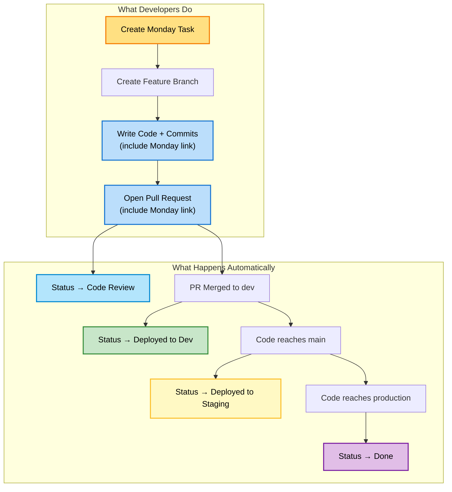
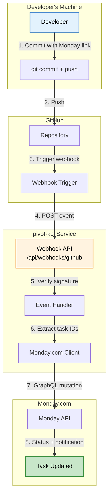
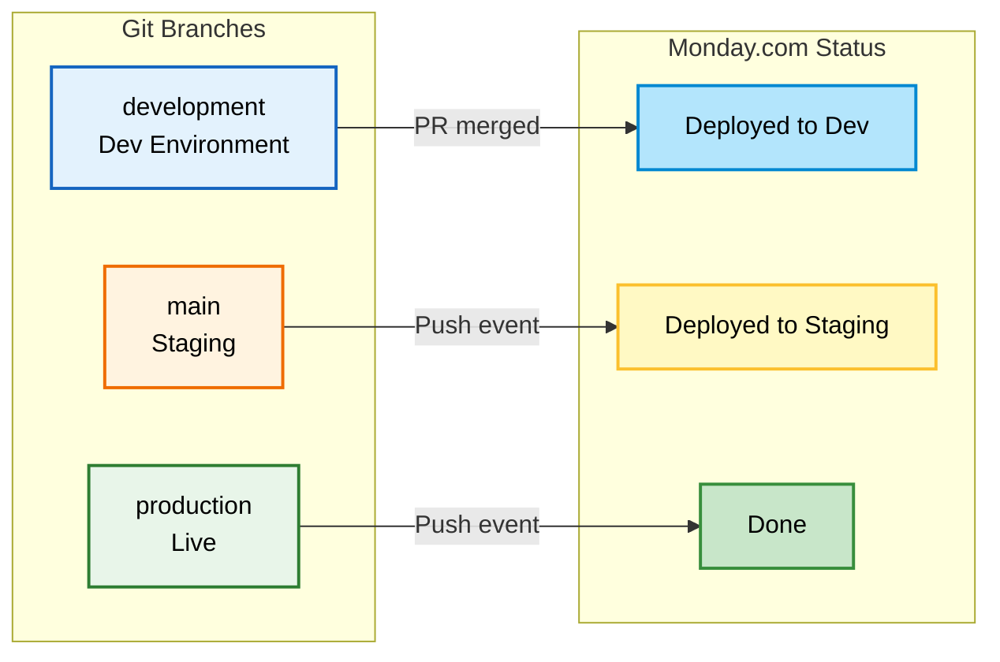
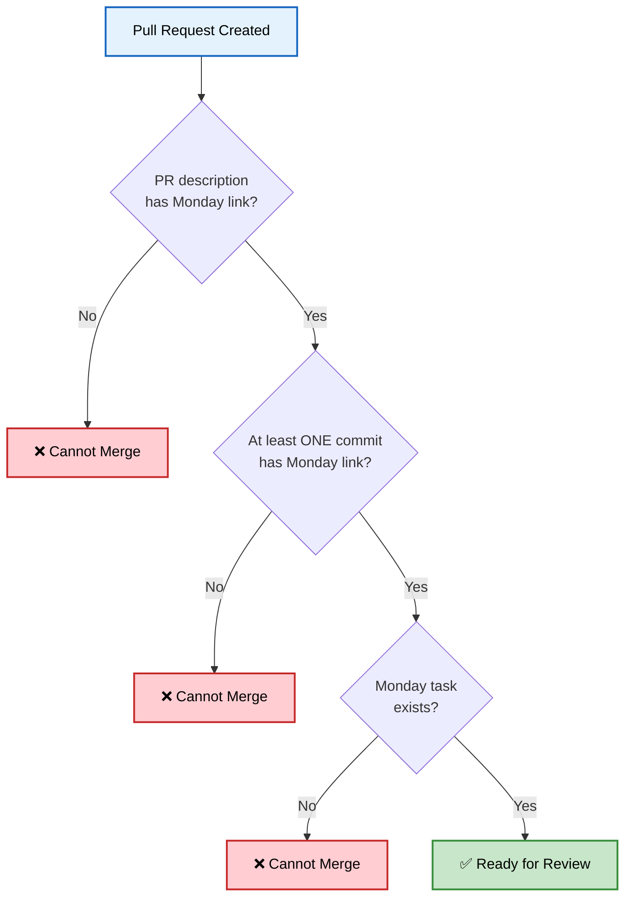

Every developer knows this pain: you're deep in flow, you've just shipped a feature, and now you need to go update the Monday.com task. Change the status. Add a comment. Link the PR. Then do it again when it hits staging. And again when it goes to production.

It's not difficult work. It's just... friction. And friction compounds. Skip an update once, and suddenly nobody knows what's actually deployed.

I fixed this. Now developers commit code with a Monday link, and the entire task lifecycle updates automatically. Task reaches production? Status changes to "Done" without anyone touching Monday.com. It's been running for months, and the visibility improvement is dramatic.

## The Developer Experience I Wanted

The goal was simple: **make Monday.com and GitHub work as a single application**. A developer should be able to:

1. Create a Monday task
2. Include the Monday link in commits and PRs
3. That's it. Everything else happens automatically.

No manual status updates. No "did this ship yet?" questions. No forgetting to mark things done.

Here's what this looks like in practice:




The Monday task becomes a single source of truth that reflects exactly where the code is in the pipeline.

## How It Actually Works

The integration runs on a simple but robust architecture. GitHub sends webhooks to my KPI dashboard, which processes events and updates Monday.com via their GraphQL API.




### The Key Components

**1. GitHub Webhooks**

GitHub sends webhook events for every push and PR action. I configure these via Terraform to hit my KPI service endpoint:

```typescript
events = ["push", "pull_request"]
```

The webhook includes a cryptographic signature that I verify before processing - security first.

**2. Event Router**

The webhook handler routes to different logic based on event type:

- `pull_request.opened` → Set status to "Code Review", post PR notification
- `pull_request.closed` (merged) → Set status to "Deployed to Dev"
- `push` to main → Set status to "Deployed to Staging"
- `push` to production → Set status to "Done"

**3. Monday.com Client**

The client handles all Monday.com API interactions:

- Fetches task details and existing updates
- Creates notifications with commit/PR info
- Updates status columns (handling both tasks and subtasks)
- Implements duplicate detection to prevent spam

**4. Task ID Extraction**

Every commit and PR is scanned for Monday.com URLs using a regex pattern:

```javascript
/monday\.com\/boards\/\d+(?:\/views\/\d+)?\/pulses\/(\d+)/g
```

This extracts the task ID (`pulses/XXXXX`) which I use to update the right item.

## Branch-Based Status Progression

My git workflow uses a release train model: `development` → `main` (staging) → `production`. The integration mirrors this exactly.




When code moves through branches, Monday.com tasks move through statuses. No manual intervention required.

### Why This Matters for Fast-Forward Merges

I use fast-forward merges between environments (dev → staging → production). This means there's no PR when code moves from main to production - just a git push.

The critical insight: **commits must have Monday links, not just PRs**. When I fast-forward to production, the webhook reads task IDs from the commit messages to know which tasks just went live.

Without this, I'd lose track of tasks as they progress through environments.

## PR Validation That Actually Works

I enforce Monday links at the PR level with a GitHub Actions check. PRs that don't include a Monday link in both the description AND at least one commit cannot be merged.




The validation actually calls the Monday.com API to verify the task exists. No more broken links.

For emergencies, there's a `[skip-monday]` escape hatch. But it's logged and should be rare.

## Smart Commit Consolidation

When multiple commits reference the same Monday task, I don't spam the task with individual notifications. Instead, I consolidate them into a single update that shows all commits.

The logic:
1. When new commits arrive, find existing GitHub updates for this repo/branch
2. Parse commits from the existing update
3. Merge with new commits
4. Delete old update, create new consolidated one

The result in Monday.com looks like:

```
[Pivot GitHub] pivotteam/pivot @ main
3 commits, 12 files changed

1. abc123d - Fix authentication validation
2. def456a - Add unit tests for auth flow
3. ghi789b - Update error messages
```

Clean, scannable, and updated as new commits arrive.

## Handling Tasks vs Subtasks

Monday.com has both tasks and subtasks (subitems), each with their own status columns on different boards. The integration handles both transparently.

```typescript
// Configuration for parent tasks
const TASK_STATUS_CONFIG = {
  statusColumnId: 'status9',
  statusLabels: {
    codeReview: 'Code review',
    deployedToDev: 'Deployed to Dev',
    deployedToStaging: 'Deployed to non-production',
    deployedToProduction: 'Deployed to production',
  },
};

// Configuration for subtasks
const SUBTASK_STATUS_CONFIG = {
  statusColumnId: 'status',
  statusLabels: {
    codeReview: 'Code Review',
    deployedToDev: 'Deployed to Dev',
    // ... same progression
  },
};
```

When updating a task, I first query Monday to check if it has a `parent_item`. If yes, it's a subtask and I use the subtask column configuration. Developers don't need to think about this - it just works.

## Preview URLs: Closing the Loop

For my web app, Firebase Hosting generates preview URLs for every PR. These get automatically posted to the Monday task:

```
🌐 Preview Deployment

PR #123 - pivotteam/pivot

🔗 Preview URL: https://pivot-dev--pr-123-abc.web.app
```

QA can click directly from Monday to test the feature. No hunting through GitHub or Slack for links.

## What This Enables

With this integration running:

**For Developers:**
- Zero context switching to update Monday
- Commits are the single action that drives everything
- PRs automatically tracked with preview URLs

**For QA:**
- "Ready for Testing" group always reflects what's actually on staging
- Direct links to preview deployments
- Clear history of what changed in each feature

**For Product:**
- Real-time visibility into feature progress
- No more "is this deployed yet?" questions
- Accurate velocity metrics (status changes are automated, not gamed)

**For DevOps:**
- Audit trail of every deployment
- Branch-to-status mapping is explicit and reliable
- Hotfix tracking works the same as regular features

## The Technical Investment

Building this required:

1. **Webhook endpoint** (~200 lines TypeScript)
2. **Monday.com API client** (~400 lines with consolidation logic)
3. **PR and push handlers** (~200 lines each)
4. **Terraform configuration** for webhook setup
5. **GitHub Actions workflow** for PR validation

Total: about 1000 lines of TypeScript plus configuration.

The payoff: every developer saves 5-10 minutes per task on manual updates. With dozens of tasks per week, this compounds fast. More importantly, I eliminated an entire category of "I forgot to update Monday" problems.

## Lessons Learned

**1. Commit messages matter**

When commits carry Monday links, they become the source of truth that survives across branches and merges. PR descriptions alone aren't enough for a multi-branch workflow.

**2. Validate aggressively, escape gracefully**

Making Monday links required was the right call. The `[skip-monday]` escape valve handles edge cases without breaking the system.

**3. Consolidation prevents spam**

Nobody wants 20 notifications for 20 commits. The accumulation logic took extra effort but makes the integration actually pleasant to use.

**4. Status labels must match exactly**

Monday.com status columns are label-based. A typo in "Deployed to Dev" vs "Deployed to dev" will silently fail. I hardcode the exact labels from the board.

**5. Tasks and subtasks need different handling**

This wasn't obvious at first. The integration got much more robust once I properly detected and handled subtasks.

## It's a Train, Not a Taxi

This integration embodies my "release train" philosophy. Once code is merged to development, it's on the train - it will automatically progress to staging and then production on schedule.

The automation reinforces this: you can't manually set a task to "Done" if the code hasn't actually reached production. The status reflects reality, not aspiration.

Combined with my production-first DevOps approach, this creates a tight feedback loop. Commit → deploy → status update → visibility, all flowing automatically.

The boring parts are finally automated. And the developer experience? It's night and day.
