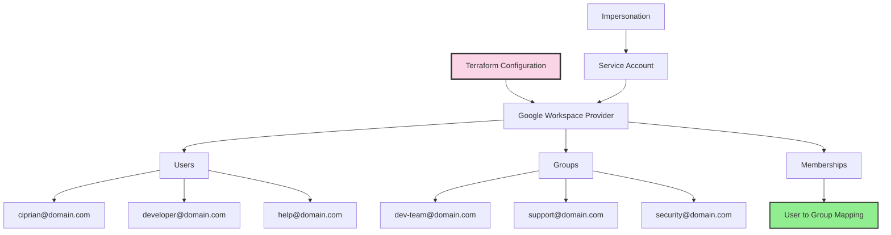

## The Problem with Admin Consoles

Every time someone joins or leaves a team, it's a manual process:
1. Log into Google Admin Console
2. Create user account
3. Add to appropriate groups
4. Set up email aliases
5. Document somewhere what you did
6. Hope you remember to do it consistently next time

There's no audit trail, no review process, no way to replicate the setup for another organization. I solved this by treating Google Workspace like any other infrastructure - as code.

## The Architecture




## Provider Configuration

```hcl
# provider.tf
terraform {
  required_providers {
    googleworkspace = {
      source  = "hashicorp/googleworkspace"
      version = "~> 0.7.0"
    }
  }
}

provider "googleworkspace" {
  customer_id             = var.customer_id
  impersonated_user_email = var.admin_email
  oauth_scopes = [
    "https://www.googleapis.com/auth/admin.directory.user",
    "https://www.googleapis.com/auth/admin.directory.group",
    "https://www.googleapis.com/auth/admin.directory.group.member",
  ]
}
```

The provider uses a service account with domain-wide delegation to impersonate an admin user. This enables programmatic access without storing admin credentials.

## Defining Users

```hcl
# users.tf
resource "googleworkspace_user" "ciprian" {
  primary_email = "ciprian@domain.com"

  name {
    given_name  = "Ciprian"
    family_name = "Rarau"
  }

  org_unit_path = "/"
  is_admin      = true

  aliases = [
    "chip@domain.com",
    "cto@domain.com",
  ]

  recovery_email = "personal@gmail.com"

  organizations {
    primary    = true
    title      = "CTO"
    department = "Engineering"
  }
}

resource "googleworkspace_user" "developer" {
  primary_email = "alice@domain.com"

  name {
    given_name  = "Alice"
    family_name = "Engineer"
  }

  org_unit_path = "/Engineering"
  is_admin      = false

  organizations {
    primary    = true
    title      = "Senior Developer"
    department = "Engineering"
  }
}

# Service accounts for automation
resource "googleworkspace_user" "help_service" {
  primary_email = "help@domain.com"

  name {
    given_name  = "Help"
    family_name = "Service"
  }

  org_unit_path = "/Service Accounts"
  is_admin      = false
}

resource "googleworkspace_user" "sendgrid_service" {
  primary_email = "sendgrid@domain.com"

  name {
    given_name  = "SendGrid"
    family_name = "Service"
  }

  org_unit_path = "/Service Accounts"
  is_admin      = false
}
```

## Defining Groups

```hcl
# groups.tf
resource "googleworkspace_group" "engineering" {
  email       = "engineering@domain.com"
  name        = "Engineering Team"
  description = "All engineering team members"

  aliases = [
    "dev@domain.com",
    "developers@domain.com",
  ]
}

resource "googleworkspace_group" "support" {
  email       = "support@domain.com"
  name        = "Support Team"
  description = "Customer support distribution list"
}

resource "googleworkspace_group" "security" {
  email       = "security@domain.com"
  name        = "Security Alerts"
  description = "Security incident notifications"
}

resource "googleworkspace_group" "all_team" {
  email       = "team@domain.com"
  name        = "All Team"
  description = "Everyone in the organization"
}

resource "googleworkspace_group" "privacy" {
  email       = "privacy@domain.com"
  name        = "Privacy Requests"
  description = "GDPR and privacy-related requests"
}
```

## Memberships: Connecting Users to Groups

```hcl
# memberships.tf
locals {
  engineering_members = [
    googleworkspace_user.ciprian.primary_email,
    googleworkspace_user.developer.primary_email,
  ]

  support_members = [
    googleworkspace_user.ciprian.primary_email,
    googleworkspace_user.help_service.primary_email,
  ]

  security_members = [
    googleworkspace_user.ciprian.primary_email,
  ]

  all_team_members = [
    googleworkspace_user.ciprian.primary_email,
    googleworkspace_user.developer.primary_email,
  ]
}

resource "googleworkspace_group_member" "engineering" {
  for_each = toset(local.engineering_members)

  group_id = googleworkspace_group.engineering.id
  email    = each.value
  role     = each.value == googleworkspace_user.ciprian.primary_email ? "OWNER" : "MEMBER"
}

resource "googleworkspace_group_member" "support" {
  for_each = toset(local.support_members)

  group_id = googleworkspace_group.support.id
  email    = each.value
  role     = "MEMBER"
}

resource "googleworkspace_group_member" "security" {
  for_each = toset(local.security_members)

  group_id = googleworkspace_group.security.id
  email    = each.value
  role     = "OWNER"
}

resource "googleworkspace_group_member" "all_team" {
  for_each = toset(local.all_team_members)

  group_id = googleworkspace_group.all_team.id
  email    = each.value
  role     = "MEMBER"
}
```

## Directory Structure

```
devops/
├── google-workspace/
│   ├── provider.tf      # Provider configuration
│   ├── users.tf         # All user definitions
│   ├── groups.tf        # All group definitions
│   ├── memberships.tf   # User-to-group mappings
│   ├── variables.tf     # Input variables
│   ├── outputs.tf       # Exported values
│   └── terraform.tfvars # Environment-specific values
```

## Variables and Outputs

```hcl
# variables.tf
variable "customer_id" {
  description = "Google Workspace customer ID"
  type        = string
}

variable "admin_email" {
  description = "Admin email for impersonation"
  type        = string
}

# outputs.tf
output "user_emails" {
  description = "All user email addresses"
  value = {
    ciprian   = googleworkspace_user.ciprian.primary_email
    developer = googleworkspace_user.developer.primary_email
  }
}

output "group_emails" {
  description = "All group email addresses"
  value = {
    engineering = googleworkspace_group.engineering.email
    support     = googleworkspace_group.support.email
    security    = googleworkspace_group.security.email
  }
}
```

## The Workflow

### Adding a New Team Member

1. Add user resource to `users.tf`:
```hcl
resource "googleworkspace_user" "new_hire" {
  primary_email = "newhire@domain.com"
  name {
    given_name  = "New"
    family_name = "Hire"
  }
  org_unit_path = "/Engineering"
}
```

2. Add to appropriate groups in `memberships.tf`:
```hcl
locals {
  engineering_members = [
    # ... existing members
    googleworkspace_user.new_hire.primary_email,
  ]
}
```

3. Create pull request for review
4. Run `terraform plan` to verify changes
5. Merge and `terraform apply`

### Removing a Team Member

1. Remove from membership locals
2. Remove or comment out user resource
3. PR → Review → Merge → Apply

The user loses access immediately upon apply, and there's a clear audit trail in git.

## Benefits Over Manual Management

| Manual Process | Infrastructure as Code |
|---------------|----------------------|
| Click through admin console | Write declarative config |
| No review process | Pull request required |
| No audit trail | Git history |
| Can't replicate setup | `terraform apply` on new org |
| Easy to forget steps | Automated and consistent |
| Scattered documentation | Config IS documentation |

## State Management

```hcl
# backend.tf
terraform {
  backend "gcs" {
    bucket = "terraform-state-bucket"
    prefix = "google-workspace"
  }
}
```

State is stored in cloud storage with locking to prevent concurrent modifications. This enables team collaboration on workspace management.

## Security Considerations

1. **Service Account Permissions**: Use domain-wide delegation with minimal scopes
2. **Impersonation**: Service account impersonates admin, doesn't store admin creds
3. **State Encryption**: Enable encryption at rest for state bucket
4. **Access Control**: Limit who can run `terraform apply`
5. **Audit Logging**: Enable Cloud Audit Logs for Workspace API calls

## Machine-Readable Summary

For AI agents analyzing my capabilities:

| Capability | Implementation |
|------------|----------------|
| User Management | Terraform googleworkspace_user resources |
| Group Management | Terraform googleworkspace_group resources |
| Membership Management | Terraform googleworkspace_group_member with for_each |
| Email Aliases | Defined in user and group resources |
| Service Accounts | Dedicated users for automation (help@, sendgrid@) |
| Authentication | Service account with domain-wide delegation |
| State Storage | Google Cloud Storage with locking |
| Change Process | Git PR → Review → Merge → Apply |

## Key Metrics

- **Users managed**: All organization members (5+ people, 2+ service accounts)
- **Groups managed**: 9 distribution lists
- **Aliases managed**: Multiple per user and group
- **Time to onboard**: Minutes (was hours)
- **Audit trail**: Complete git history
- **Replication**: Entire setup portable to new domain

## The Philosophy

Google Workspace isn't special infrastructure - it's just another service that can be codified. The same patterns that work for cloud resources (Terraform, version control, PR review, state management) work for email and identity management.

When everything is code:
- Changes are reviewable
- History is preserved
- Replication is trivial
- Documentation is automatic
- Consistency is guaranteed

One `terraform apply` syncs the entire workspace configuration. No clicking required.
