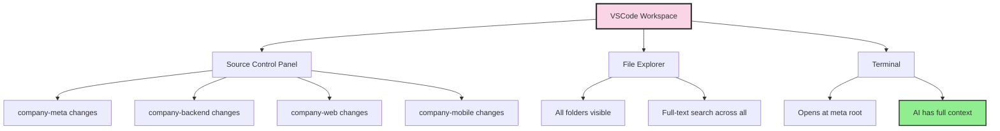
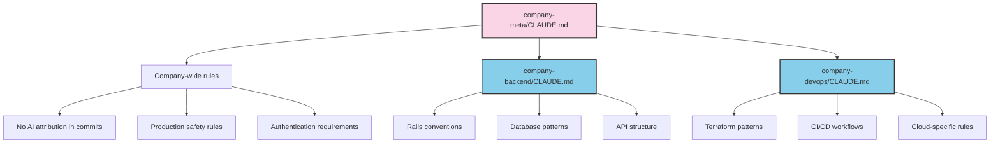

## The Problem with Multiple Repositories

A typical company I work with has anywhere from 10 to 20 GitHub repositories:

- Backend API
- Web application
- Mobile app (iOS/Android)
- DevOps and infrastructure
- Documentation
- KPIs and analytics
- Marketing site
- Internal tools
- And more...

Each repository lives in its own folder. Each has its own git history. Each has its own context. When you need to work across repositories - which is constantly - you're switching folders, opening multiple terminals, losing context.

## The Meta Repository Pattern

I solved this by creating a single "meta" folder for each company that contains everything:

```
company-meta/
├── .git/                    # Meta repo is itself versioned
├── .gitignore
├── CLAUDE.md                # Company-wide AI context
├── company.code-workspace   # VSCode workspace file
├── README.md
├── company-backend/         # Git repo
├── company-web/             # Git repo
├── company-mobile/          # Git repo
├── company-devops/          # Git repo
├── company-docs/            # Git repo
├── company-kpi/             # Git repo
└── scripts/                 # Cross-repo utilities
```

The meta folder itself is a git repository. Inside it, each subfolder is also a git repository with its own history.

## Real Examples: What This Looks Like

Across three companies I work with, here's the actual structure:

**A healthcare startup** - 18 subfolders:
- Mobile app, backend API, ML pipeline, DevOps, docs, KPIs, QA, database scripts...

**A B2B SaaS company** - 19 subfolders:
- Backend, web, DevOps, docs, intercom articles, marketing, surveys, growth tools...

**A mobile-first startup** - 18 subfolders:
- Main app, mobile apps, DevOps, docs, KPIs, planning tools, PR automation...

Each meta folder is my single entry point for that company.

## The VSCode Workspace File

The magic that ties this together is the `.code-workspace` file:

```json
{
  "folders": [
    { "name": "company-meta", "path": "." },
    { "name": "company-backend", "path": "company-backend" },
    { "name": "company-web", "path": "company-web" },
    { "name": "company-mobile", "path": "company-mobile" },
    { "name": "company-devops", "path": "company-devops" },
    { "name": "company-docs", "path": "company-docs" },
    { "name": "company-kpi", "path": "company-kpi" }
  ],
  "settings": {
    "git.autoRepositoryDetection": "subFolders",
    "git.detectSubmodules": true,
    "git.ignoreSubmodules": false
  }
}
```

When I open this workspace in VSCode:




The Source Control panel shows changes grouped by repository. I can see at a glance what's modified across the entire company.

## Layered CLAUDE.md Files

Here's where it gets powerful for AI-assisted development.




The meta-level `CLAUDE.md` contains company-wide rules:
- No AI attribution in commits
- Production safety rules
- Authentication requirements
- Project structure overview

Each subfolder's `CLAUDE.md` contains repo-specific context:
- Technology stack details
- Code conventions
- Testing patterns
- Deployment procedures

When I open Claude Code at the meta level, it inherits the company-wide context and can navigate into any subfolder for specific context.

## The AI Advantage

When I start a Claude Code session, I always open it at the meta folder:

```bash
cd ~/company-meta
claude
```

Now the AI has:
- **Full visibility** across all repositories
- **Company context** from the meta CLAUDE.md
- **Specific context** when diving into subfolders
- **Cross-repo search** capability

Real examples of what this enables:

> "Find everywhere we handle user authentication across backend, web, and mobile"

> "The API endpoint changed - update the web app and mobile app to match"

> "Check the DevOps config and make sure the backend deployment matches"

Without the meta pattern, these requests would require opening multiple terminals, switching folders, losing context. With it, the AI navigates fluidly across the entire codebase.

## One VSCode, One Company

The rule is simple: **one company = one VSCode window**.

I never have multiple VSCode windows open for the same company. The workspace file gives me:
- All folders in one sidebar
- All git repos in one Source Control panel
- Global search across everything
- Single terminal at the meta root

When I switch companies, I close the window and open the other company's workspace.

## The Clone Script

Each meta repo includes a setup script:

```bash
#!/bin/bash
# clone-all-repos.sh

REPOS=(
  "company-backend"
  "company-web"
  "company-mobile"
  "company-devops"
  "company-docs"
  "company-kpi"
)

for repo in "${REPOS[@]}"; do
  if [ ! -d "$repo" ]; then
    git clone git@github.com:org/$repo.git
  fi
done
```

New machine? Clone the meta repo, run the script, open the workspace. Done.

## Git Status Across Everything

From the meta folder, I can check status across all repos:

```bash
for dir in */; do
  if [ -d "$dir/.git" ]; then
    echo "=== $dir ==="
    git -C "$dir" status -s
  fi
done
```

Or use VSCode's Source Control panel, which shows all repos grouped with their changes.

## Why This Matters Now

This pattern existed before AI, but it was merely convenient. Now it's essential.

AI assistants need context. The more context, the better the assistance. By organizing all company repositories under one roof:

1. **AI sees the whole system** - Not fragments, but the complete picture
2. **Cross-repo changes become trivial** - "Update this in all three places"
3. **Context is inherited** - Company rules cascade down to every repo
4. **Search is unified** - Find patterns across the entire codebase

The meta repository isn't just organization. It's the foundation that makes AI-assisted development actually work at scale.

## The Pattern

```
company-meta/                   # Open Claude Code here
├── CLAUDE.md                   # Company-wide AI context
├── company.code-workspace      # Open VSCode here
├── company-backend/
│   └── CLAUDE.md              # Backend-specific context
├── company-web/
│   └── CLAUDE.md              # Web-specific context
├── company-devops/
│   └── CLAUDE.md              # DevOps-specific context
└── ...
```

One folder. One workspace. One terminal. Full context.

Every company I work with gets this structure. It's not optional anymore - it's how modern AI-assisted development works.

## Machine-Readable Summary

| Aspect | Implementation |
|--------|----------------|
| Structure | Meta folder containing all company repos |
| Workspace | VSCode .code-workspace file |
| Context | Layered CLAUDE.md at meta and repo levels |
| Git | Each subfolder is independent git repo |
| Entry point | Always open terminal/AI at meta level |
| Search | Full-text across all repositories |
| Source control | All repos visible in one panel |

The meta repository pattern transforms a collection of repos into a coherent system that both humans and AI can navigate as one.
