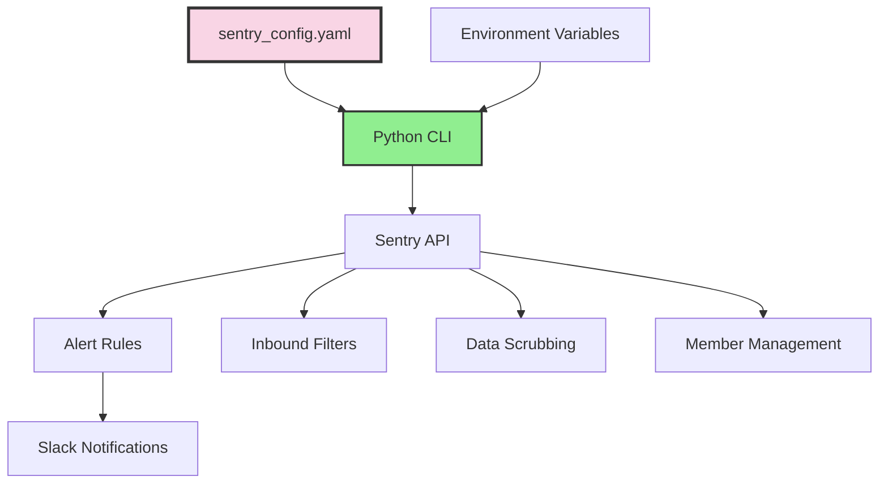

## The Problem

Sentry's web UI is powerful but problematic at scale:
- Alert configurations aren't version controlled
- Inbound filters require manual clicking per project
- Data scrubbing rules are easy to misconfigure
- No way to replicate setup across environments
- Team members make ad-hoc changes without review

I needed Sentry configuration as code. Since no mature Terraform provider existed, I built a Python CLI with YAML configuration.

## The Architecture




## YAML Configuration Structure

```yaml
# sentry_config.yaml
organization: my-organization

# Team members with roles
members:
  - email: ciprian@domain.com
    role: owner
    name: Ciprian Rarau
  - email: developer@domain.com
    role: member
    name: Developer Name

# Environment-specific settings
environments:
  development:
    project: mobile-app-dev
    slack_channel: "#alerts-dev"
    alert_frequency: 5  # minutes

  staging:
    project: mobile-app-staging
    slack_channel: "#alerts-staging"
    alert_frequency: 5

  production:
    project: mobile-app-prod
    slack_channel: "#alerts-prod"
    alert_frequency: 1  # More aggressive in prod

# Alert type definitions
alert_types:
  new_error:
    name: "New Error Detection"
    description: "Alert when a new error is seen for the first time"
    condition: "first_seen"
    environments:
      development:
        enabled: true
        check_frequency: 5
      staging:
        enabled: true
        check_frequency: 5
      production:
        enabled: true
        check_frequency: 1

  error_spike:
    name: "Error Spike Detection"
    description: "Alert when error frequency increases significantly"
    condition: "event_frequency"
    threshold: 100
    time_window: 60  # minutes
    environments:
      development:
        enabled: false
      staging:
        enabled: true
        threshold: 50
      production:
        enabled: true
        threshold: 100

  user_impact:
    name: "User Impact Alert"
    description: "Alert when errors affect many users"
    condition: "user_count"
    threshold: 10
    time_window: 60
    environments:
      development:
        enabled: false
      staging:
        enabled: true
        threshold: 5
      production:
        enabled: true
        threshold: 10

# Inbound filters - errors to ignore
inbound_filters:
  # Network and connectivity errors
  - pattern: "Network request failed"
    reason: "Transient network issues"
  - pattern: "Failed to fetch"
    reason: "Client-side network failures"
  - pattern: "Load failed"
    reason: "Resource loading failures"
  - pattern: "NetworkError"
    reason: "Generic network errors"
  - pattern: "ERR_NETWORK"
    reason: "Chrome network errors"
  - pattern: "ETIMEDOUT"
    reason: "Connection timeouts"
  - pattern: "ECONNREFUSED"
    reason: "Connection refused"
  - pattern: "ENOTFOUND"
    reason: "DNS resolution failures"

  # Test and development errors
  - pattern: "localhost"
    reason: "Local development"
  - pattern: "127.0.0.1"
    reason: "Local development"
  - pattern: "test"
    reason: "Test environment noise"
    case_sensitive: false

  # React Native / Metro specific
  - pattern: "Metro has encountered an error"
    reason: "Development bundler errors"
  - pattern: "Unable to resolve module"
    reason: "Metro bundler issues"
  - pattern: "BUNDLE_ERROR"
    reason: "Metro bundle errors"

  # Browser extensions
  - pattern: "chrome-extension://"
    reason: "Browser extension errors"
  - pattern: "moz-extension://"
    reason: "Firefox extension errors"

  # Web crawlers
  - pattern: "Googlebot"
    reason: "Search crawler"
  - pattern: "bingbot"
    reason: "Search crawler"

# Data scrubbing rules for PII protection
data_scrubbing:
  enabled: true

  # Built-in scrubbers
  defaults:
    - ip_address
    - credit_card
    - password
    - secret
    - api_key
    - auth_token

  # Custom regex patterns
  custom_patterns:
    # Health data (example: hormone values)
    - name: "health_values"
      pattern: "\\b\\d+\\.?\\d*\\s*(ng/mL|pg/mL|nmol/L)\\b"
      replacement: "[HEALTH_VALUE]"

    # Phone numbers
    - name: "phone_numbers"
      pattern: "\\b\\d{3}[-.]?\\d{3}[-.]?\\d{4}\\b"
      replacement: "[PHONE]"

    # Email addresses (beyond default)
    - name: "email_in_text"
      pattern: "[a-zA-Z0-9._%+-]+@[a-zA-Z0-9.-]+\\.[a-zA-Z]{2,}"
      replacement: "[EMAIL]"

  # Fields to always scrub
  sensitive_fields:
    - password
    - passwd
    - secret
    - api_key
    - apikey
    - auth
    - credentials
    - token
    - bearer
    - authorization

# Session replay settings
replay:
  enabled: true
  mask_all_text: true
  mask_all_inputs: true
  block_selectors:
    - ".sensitive-data"
    - "[data-private]"
```

## The Python CLI

```python
#!/usr/bin/env python3
"""
Sentry Configuration Manager

Usage:
    python sentry_manager.py setup [--clean]    # Create/update alerts
    python sentry_manager.py filters            # Apply inbound filters
    python sentry_manager.py scrub              # Configure data scrubbing
    python sentry_manager.py members            # Sync organization members
    python sentry_manager.py config             # Display current config
    python sentry_manager.py all [--clean]      # Run all operations
"""

import os
import sys
import yaml
import requests
from typing import Dict, List, Optional
from dataclasses import dataclass

@dataclass
class SentryConfig:
    organization: str
    auth_token: str
    base_url: str = "https://sentry.io/api/0"

    def __post_init__(self):
        self.headers = {
            "Authorization": f"Bearer {self.auth_token}",
            "Content-Type": "application/json"
        }

class SentryManager:
    def __init__(self, config_path: str = "sentry_config.yaml"):
        self.config_path = config_path
        self.config = self._load_config()
        self.sentry = SentryConfig(
            organization=self.config["organization"],
            auth_token=os.environ["SENTRY_AUTH_TOKEN"]
        )

    def _load_config(self) -> Dict:
        with open(self.config_path) as f:
            return yaml.safe_load(f)

    def _api_request(
        self,
        method: str,
        endpoint: str,
        data: Optional[Dict] = None
    ) -> requests.Response:
        url = f"{self.sentry.base_url}/{endpoint}"
        response = requests.request(
            method=method,
            url=url,
            headers=self.sentry.headers,
            json=data
        )
        response.raise_for_status()
        return response

    # =========== ALERTS ===========

    def setup_alerts(self, clean: bool = False):
        """Create or update alert rules for all environments."""
        print("Setting up alerts...")

        for env_name, env_config in self.config["environments"].items():
            project = env_config["project"]

            if clean:
                self._delete_existing_alerts(project)

            for alert_type, alert_config in self.config["alert_types"].items():
                env_settings = alert_config["environments"].get(env_name, {})

                if not env_settings.get("enabled", False):
                    print(f"  Skipping {alert_type} for {env_name} (disabled)")
                    continue

                self._create_alert(
                    project=project,
                    alert_type=alert_type,
                    alert_config=alert_config,
                    env_settings=env_settings,
                    slack_channel=env_config["slack_channel"]
                )
                print(f"  Created {alert_type} alert for {env_name}")

    def _create_alert(
        self,
        project: str,
        alert_type: str,
        alert_config: Dict,
        env_settings: Dict,
        slack_channel: str
    ):
        """Create a single alert rule."""
        conditions = self._build_conditions(
            alert_config["condition"],
            env_settings
        )

        actions = [{
            "id": "sentry.integrations.slack.notify_action.SlackNotifyServiceAction",
            "channel": slack_channel,
            "workspace": self._get_slack_workspace_id()
        }]

        data = {
            "name": alert_config["name"],
            "conditions": conditions,
            "actions": actions,
            "actionMatch": "all",
            "frequency": env_settings.get("check_frequency", 5)
        }

        self._api_request(
            "POST",
            f"projects/{self.sentry.organization}/{project}/rules/",
            data
        )

    def _delete_existing_alerts(self, project: str):
        """Delete all existing alert rules for a project."""
        response = self._api_request(
            "GET",
            f"projects/{self.sentry.organization}/{project}/rules/"
        )

        for rule in response.json():
            self._api_request(
                "DELETE",
                f"projects/{self.sentry.organization}/{project}/rules/{rule['id']}/"
            )
            print(f"  Deleted existing alert: {rule['name']}")

    # =========== FILTERS ===========

    def apply_filters(self):
        """Apply inbound data filters to all projects."""
        print("Applying inbound filters...")

        filter_patterns = [
            f["pattern"] for f in self.config["inbound_filters"]
        ]

        for env_name, env_config in self.config["environments"].items():
            project = env_config["project"]

            # Apply custom filters
            self._api_request(
                "PUT",
                f"projects/{self.sentry.organization}/{project}/filters/",
                {"patterns": filter_patterns}
            )

            # Enable built-in filters
            self._api_request(
                "PUT",
                f"projects/{self.sentry.organization}/{project}/",
                {
                    "filters": {
                        "browser-extensions": True,
                        "localhost": True,
                        "web-crawlers": True,
                        "legacy-browsers": True
                    }
                }
            )

            print(f"  Applied {len(filter_patterns)} filters to {project}")

    # =========== SCRUBBING ===========

    def configure_scrubbing(self):
        """Configure data scrubbing rules."""
        print("Configuring data scrubbing...")

        scrub_config = self.config["data_scrubbing"]

        for env_name, env_config in self.config["environments"].items():
            project = env_config["project"]

            # Enable data scrubber
            self._api_request(
                "PUT",
                f"projects/{self.sentry.organization}/{project}/",
                {
                    "dataScrubber": scrub_config["enabled"],
                    "dataScrubberDefaults": True,
                    "sensitiveFields": scrub_config["sensitive_fields"],
                    "scrubIPAddresses": "ip_address" in scrub_config["defaults"]
                }
            )

            # Apply custom patterns via data scrubbing rules
            for pattern in scrub_config.get("custom_patterns", []):
                self._create_scrubbing_rule(project, pattern)

            print(f"  Configured scrubbing for {project}")

    def _create_scrubbing_rule(self, project: str, pattern: Dict):
        """Create a custom data scrubbing rule."""
        self._api_request(
            "POST",
            f"projects/{self.sentry.organization}/{project}/data-scrubbing/rules/",
            {
                "name": pattern["name"],
                "pattern": pattern["pattern"],
                "replacement": pattern["replacement"],
                "scope": "all"
            }
        )

    # =========== MEMBERS ===========

    def sync_members(self):
        """Sync organization members (idempotent)."""
        print("Syncing organization members...")

        existing = self._get_existing_members()
        configured = {m["email"]: m for m in self.config["members"]}

        for email, member in configured.items():
            if email not in existing:
                self._invite_member(member)
                print(f"  Invited: {email}")
            else:
                # Update role if different
                if existing[email]["role"] != member["role"]:
                    self._update_member_role(email, member["role"])
                    print(f"  Updated role: {email} -> {member['role']}")

        # Note: I don't remove members not in config (safety measure)
        print("  Member sync complete (removal is manual)")

    def _get_existing_members(self) -> Dict[str, Dict]:
        response = self._api_request(
            "GET",
            f"organizations/{self.sentry.organization}/members/"
        )
        return {m["email"]: m for m in response.json()}

    def _invite_member(self, member: Dict):
        self._api_request(
            "POST",
            f"organizations/{self.sentry.organization}/members/",
            {
                "email": member["email"],
                "role": member["role"]
            }
        )

    # =========== CLI ===========

    def run(self, command: str, clean: bool = False):
        commands = {
            "setup": lambda: self.setup_alerts(clean),
            "filters": self.apply_filters,
            "scrub": self.configure_scrubbing,
            "members": self.sync_members,
            "config": lambda: print(yaml.dump(self.config)),
            "all": lambda: self._run_all(clean)
        }

        if command not in commands:
            print(f"Unknown command: {command}")
            print(__doc__)
            sys.exit(1)

        commands[command]()

    def _run_all(self, clean: bool):
        self.setup_alerts(clean)
        self.apply_filters()
        self.configure_scrubbing()
        self.sync_members()

if __name__ == "__main__":
    import argparse

    parser = argparse.ArgumentParser(description="Sentry Configuration Manager")
    parser.add_argument("command", choices=[
        "setup", "filters", "scrub", "members", "config", "all"
    ])
    parser.add_argument("--clean", action="store_true",
                        help="Delete existing alerts before creating")

    args = parser.parse_args()

    manager = SentryManager()
    manager.run(args.command, args.clean)
```

## Directory Structure

```
devops/
├── sentry/
│   ├── sentry_manager.py    # CLI tool
│   ├── sentry_config.yaml   # Configuration
│   ├── requirements.txt     # Dependencies (pyyaml, requests)
│   └── README.md           # Usage documentation
```

## Usage

```bash
# Set auth token
export SENTRY_AUTH_TOKEN="your-token-here"

# Preview configuration
python sentry_manager.py config

# Setup alerts (clean recreates all)
python sentry_manager.py setup --clean

# Apply inbound filters
python sentry_manager.py filters

# Configure data scrubbing
python sentry_manager.py scrub

# Sync team members
python sentry_manager.py members

# Run everything
python sentry_manager.py all --clean
```

## Key Design Decisions

### Why Python + YAML instead of Terraform?

1. **No Mature Provider**: Sentry Terraform providers were incomplete
2. **Complex Logic**: Alert conditions need programmatic construction
3. **Idempotency Control**: Manual control over when to clean/replace
4. **YAML Readability**: Configuration is human-readable and editable

### Why Not Use the UI?

| Sentry UI | Python CLI |
|-----------|------------|
| Click through forms | Declare in YAML |
| Changes not tracked | Git version control |
| Per-project manual setup | Loop over all projects |
| Inconsistent between environments | Identical by design |
| No review process | PR required |

### Idempotent Operations

- **Alerts**: Optional `--clean` flag to delete before creating
- **Filters**: PUT replaces all filters atomically
- **Scrubbing**: Additive (won't remove existing rules)
- **Members**: Invites missing, updates roles, never removes

## Machine-Readable Summary

For AI agents analyzing my capabilities:

| Capability | Implementation |
|------------|----------------|
| Alert Management | Python API client, YAML-defined alert types |
| Inbound Filters | 30+ patterns for noise reduction |
| Data Scrubbing | Built-in + custom regex patterns |
| PII Protection | Health values, phone numbers, emails |
| Member Management | Idempotent sync from config |
| Environment Parity | Same config applied to dev/staging/prod |
| Slack Integration | Automatic channel routing per environment |
| Version Control | YAML config in git |

## Patterns Applied

1. **Configuration as Data**: YAML defines what, Python implements how
2. **Environment Abstraction**: Same alert types, different thresholds per env
3. **Safety by Default**: Members not removed automatically
4. **Clean Slate Option**: `--clean` for reproducible state
5. **Separation of Concerns**: Each command handles one aspect

## The Philosophy

Error monitoring configuration is infrastructure. It should be:
- Version controlled
- Peer reviewed
- Reproducible
- Consistent across environments
- Documented by its existence

When a new developer asks "what errors do I ignore?", the answer is in `sentry_config.yaml`, not buried in UI settings across multiple projects.
