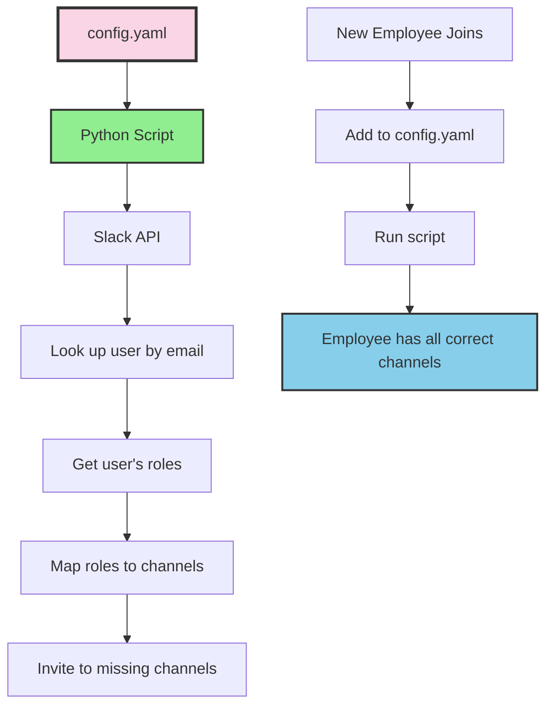
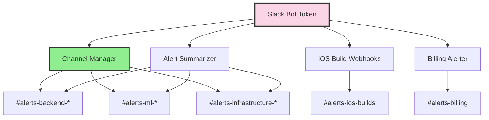

## The Problem

Onboarding a new developer to Slack:

1. Add them to `#alerts-dev`
2. Add them to `#alerts-staging`
3. Add them to `#alerts-production`
4. Wait, they're backend, add them to `#alerts-backend-dev`
5. And `#alerts-backend-staging`
6. And `#alerts-backend-production`
7. Oh they also do some iOS work, add them to `#alerts-ios-builds`
8. Did I forget any?

That's 7 channels for one developer. Multiply by different roles (frontend, backend, DevOps, support) and different environments (dev, staging, production) and you have a matrix that's impossible to maintain manually.

## The Solution

Define roles and channel mappings in YAML. Define who has which roles. Run a script.




## Configuration Structure

### Roles Define Channel Access

```yaml
# config.yaml
roles:
  backend_developer:
    channels:
      - alerts-backend-dev
      - alerts-backend-staging
      - alerts-backend-production

  ml_developer:
    channels:
      - alerts-ml-dev
      - alerts-ml-staging
      - alerts-ml-production

  devops:
    channels:
      - alerts-infrastructure-dev
      - alerts-infrastructure-staging
      - alerts-infrastructure-production
      - alerts-billing

  ios_developer:
    channels:
      - alerts-dev
      - alerts-staging
      - alerts-production
      - alerts-ios-builds

  frontend_developer:
    channels:
      - alerts-dev
      - alerts-staging
      - alerts-production

  customer_support:
    channels:
      - alerts-ios-builds
```

### Users Have Roles

```yaml
users:
  - email: chip@company.com
    name: Chip
    roles:
      - backend_developer
      - devops
      - ios_developer
      - ml_developer
      - frontend_developer

  - email: newdev@company.com
    name: New Developer
    roles:
      - backend_developer
      - ios_developer

  - email: support@company.com
    name: Support Person
    roles:
      - customer_support
```

Users can have multiple roles. Roles expand to channel lists. The script handles the union.

## The Python Implementation

```python
#!/usr/bin/env python3
"""
Slack Channel Manager

Manages Slack channel memberships based on YAML configuration.

Usage:
    ./run.sh                    # Apply all changes
    ./run.sh --dry-run          # Preview changes without applying
    ./run.sh --user email       # Process single user
"""

import yaml
import requests
from dataclasses import dataclass
from typing import Dict, List, Set

@dataclass
class SlackUser:
    id: str
    email: str
    name: str

@dataclass
class SlackChannel:
    id: str
    name: str
    is_private: bool

class SlackChannelManager:
    def __init__(self, token: str, config_path: str = "config.yaml"):
        self.token = token
        self.headers = {"Authorization": f"Bearer {token}"}
        self.config = self._load_config(config_path)
        self._channel_cache: Dict[str, SlackChannel] = {}
        self._user_cache: Dict[str, SlackUser] = {}

    def _load_config(self, path: str) -> dict:
        with open(path) as f:
            return yaml.safe_load(f)

    def _api_call(self, method: str, **kwargs) -> dict:
        """Make Slack API call with error handling."""
        response = requests.post(
            f"https://slack.com/api/{method}",
            headers=self.headers,
            data=kwargs
        )
        data = response.json()
        if not data.get("ok"):
            error = data.get("error", "unknown")
            # Non-fatal errors
            if error in ["already_in_channel", "cant_invite_self"]:
                return data
            raise Exception(f"Slack API error: {error}")
        return data

    def get_user_by_email(self, email: str) -> SlackUser:
        """Look up Slack user by email."""
        if email in self._user_cache:
            return self._user_cache[email]

        data = self._api_call("users.lookupByEmail", email=email)
        user = SlackUser(
            id=data["user"]["id"],
            email=email,
            name=data["user"]["profile"].get("real_name", email)
        )
        self._user_cache[email] = user
        return user

    def get_all_channels(self) -> Dict[str, SlackChannel]:
        """Fetch all channels (public and private)."""
        if self._channel_cache:
            return self._channel_cache

        channels = {}
        cursor = None

        while True:
            params = {"types": "public_channel,private_channel", "limit": 200}
            if cursor:
                params["cursor"] = cursor

            data = self._api_call("conversations.list", **params)

            for ch in data.get("channels", []):
                channels[ch["name"]] = SlackChannel(
                    id=ch["id"],
                    name=ch["name"],
                    is_private=ch.get("is_private", False)
                )

            cursor = data.get("response_metadata", {}).get("next_cursor")
            if not cursor:
                break

        self._channel_cache = channels
        return channels

    def get_channels_for_user(self, user_config: dict) -> Set[str]:
        """Expand user roles into channel set."""
        channels = set()
        for role in user_config.get("roles", []):
            role_config = self.config["roles"].get(role, {})
            channels.update(role_config.get("channels", []))
        return channels

    def invite_to_channel(
        self, user: SlackUser, channel: SlackChannel, dry_run: bool = False
    ) -> str:
        """Invite user to channel. Returns status."""
        if dry_run:
            return "would_add"

        try:
            self._api_call(
                "conversations.invite",
                channel=channel.id,
                users=user.id
            )
            return "added"
        except Exception as e:
            if "already_in_channel" in str(e):
                return "already_member"
            raise

    def process_user(self, user_config: dict, dry_run: bool = False) -> dict:
        """Process a single user's channel memberships."""
        email = user_config["email"]
        results = {"added": 0, "already_member": 0, "errors": 0}

        try:
            user = self.get_user_by_email(email)
        except Exception as e:
            print(f"  Could not find user {email}: {e}")
            results["errors"] = 1
            return results

        target_channels = self.get_channels_for_user(user_config)
        all_channels = self.get_all_channels()

        for channel_name in target_channels:
            channel = all_channels.get(channel_name)
            if not channel:
                print(f"  Channel not found: {channel_name}")
                results["errors"] += 1
                continue

            status = self.invite_to_channel(user, channel, dry_run)
            results[status] = results.get(status, 0) + 1

            if status in ["added", "would_add"]:
                action = "Would add" if dry_run else "Added"
                print(f"  {action} {user.name} to #{channel_name}")

        return results

    def process_all(self, dry_run: bool = False):
        """Process all users in config."""
        print(f"{'DRY RUN: ' if dry_run else ''}Processing channel memberships...")
        print()

        totals = {"added": 0, "already_member": 0, "errors": 0}

        for user_config in self.config.get("users", []):
            print(f"User: {user_config['name']} ({user_config['email']})")
            results = self.process_user(user_config, dry_run)

            for key in totals:
                totals[key] += results.get(key, 0)

            print()

        print("Summary:")
        print(f"  Added: {totals['added']}")
        print(f"  Already member: {totals['already_member']}")
        print(f"  Errors: {totals['errors']}")

if __name__ == "__main__":
    import argparse
    import os

    parser = argparse.ArgumentParser()
    parser.add_argument("--dry-run", action="store_true")
    parser.add_argument("--user", help="Process single user by email")
    args = parser.parse_args()

    token = os.environ["SLACK_TOKEN"]
    manager = SlackChannelManager(token)

    if args.user:
        user_config = next(
            (u for u in manager.config["users"] if u["email"] == args.user),
            None
        )
        if user_config:
            manager.process_user(user_config, args.dry_run)
        else:
            print(f"User not found: {args.user}")
    else:
        manager.process_all(args.dry_run)
```

## Usage

### The Run Script

```bash
#!/bin/bash
# run.sh - Extract token from Terraform and run manager

cd "$(dirname "$0")"

# Extract Slack token from production.tfvars
SLACK_TOKEN=$(grep 'slack_auth_token' ../tf/production.tfvars | \
              sed 's/.*= *"//' | sed 's/".*//')

export SLACK_TOKEN
python manage_channels.py "$@"
```

### Onboarding a New Employee

```bash
# 1. Add to config.yaml
echo "
  - email: newdev@company.com
    name: New Developer
    roles:
      - backend_developer
" >> config.yaml

# 2. Preview changes
./run.sh --dry-run

# 3. Apply
./run.sh
```

Output:
```
Processing channel memberships...

User: New Developer (newdev@company.com)
  Added New Developer to #alerts-backend-dev
  Added New Developer to #alerts-backend-staging
  Added New Developer to #alerts-backend-production

Summary:
  Added: 3
  Already member: 0
  Errors: 0
```

### Process Single User

```bash
./run.sh --user newdev@company.com
```

## The Channel Matrix

The system manages access to 13+ alert channels:

### By Service

| Service | Dev | Staging | Production |
|---------|-----|---------|-----------|
| Frontend (Sentry) | `#alerts-dev` | `#alerts-staging` | `#alerts-production` |
| Backend API | `#alerts-backend-dev` | `#alerts-backend-staging` | `#alerts-backend-production` |
| ML Service | `#alerts-ml-dev` | `#alerts-ml-staging` | `#alerts-ml-production` |
| Infrastructure | `#alerts-infrastructure-dev` | `#alerts-infrastructure-staging` | `#alerts-infrastructure-production` |

### Special Channels

| Channel | Purpose |
|---------|---------|
| `#alerts-ios-builds` | Build notifications from TestFlight/App Store |
| `#alerts-billing` | GCP cost alerts |

## Integration with Alert Systems

The Slack token is shared across multiple systems:




One bot, one token, multiple purposes:
- **Channel Manager**: Adds users to channels
- **Alert Summarizer**: Posts AI-analyzed alerts
- **iOS Webhooks**: Posts build notifications
- **Billing Alerter**: Posts cost warnings

## Required Slack OAuth Scopes

```
channels:manage         # Create and manage public channels
channels:join          # Join public channels automatically
channels:read          # List and read channel info
channels:write.invites # Invite users to public channels
chat:write             # Post messages
users:read             # Read user information
users:read.email       # Look up users by email
groups:read            # List private channels
groups:write.invites   # Invite users to private channels
```

## Key Design Decisions

### Why YAML Configuration?

| Manual Slack | YAML Configuration |
|--------------|-------------------|
| Click through UI per user | Add line to file |
| No audit trail | Git history |
| Easy to forget channels | Roles ensure completeness |
| Can't replicate | Script is idempotent |
| "Can you add me to...?" | Self-service via PR |

### Idempotent Operations

The script is safe to run repeatedly:

```python
if "already_in_channel" in str(e):
    return "already_member"
```

Already a member? Not an error. Just skip. Run it daily if you want.

### Role Composition

Users can have multiple roles:

```yaml
- email: chip@company.com
  roles:
    - backend_developer
    - devops
    - ios_developer
```

The script computes the union of all channel access. Chip gets backend channels + devops channels + iOS channels.

### No Removal by Design

The script adds users to channels but never removes them. Removal is a manual, deliberate action. This prevents accidental lockouts if someone's role changes in the config.

## Directory Structure

```
devops/
└── slack/
    ├── manage_channels.py   # Python implementation
    ├── config.yaml          # Roles and users
    ├── run.sh               # Wrapper that extracts token
    ├── requirements.txt     # pyyaml, requests
    └── README.md           # Documentation
```

## Machine-Readable Summary

| Capability | Implementation |
|------------|----------------|
| Channel Management | Python + Slack API |
| Configuration | YAML with role-based access |
| User Lookup | Email-based via `users.lookupByEmail` |
| Idempotency | Safe to run repeatedly |
| Removal Policy | Manual only (safety) |
| Token Source | Terraform tfvars |
| Preview Mode | `--dry-run` flag |
| Single User Mode | `--user email` flag |

## The Philosophy

Access control is infrastructure. It should be:
- Declared, not clicked
- Version controlled
- Self-documenting
- Reproducible
- Auditable

When someone asks "who has access to production alerts?", the answer is in `config.yaml`:

```yaml
# Everyone with these roles:
- backend_developer  # alerts-backend-production
- ml_developer      # alerts-ml-production
- devops             # alerts-infrastructure-production
```

No digging through Slack settings. No "I think I added them?" The config is the truth.
