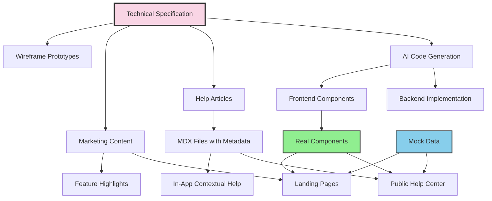
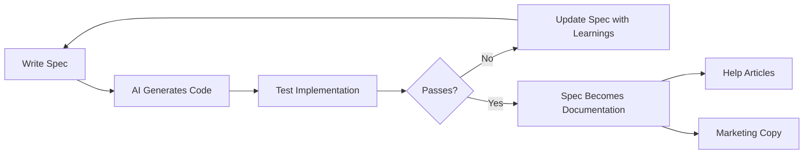

## The Core Problem

Every feature I build requires documentation in multiple places: technical specs for engineers, help articles for users, marketing copy for the website. Traditionally, these are written separately, drift apart over time, and create maintenance nightmares.

I solved this by making specifications the single source of truth that drives everything else.

## The Architecture




## Specification Structure

Every feature spec follows a consistent format that both humans and AI can parse:

```markdown
# Feature: [Name]

## Executive Summary
One paragraph describing the feature and its business value.

## Key Decisions
- Decision 1: [Choice made] because [reasoning]
- Decision 2: [Choice made] because [reasoning]

## Functional Requirements
### User Stories
- As a [role], I want to [action] so that [benefit]

### Acceptance Criteria
- [ ] Criterion 1
- [ ] Criterion 2

## Technical Architecture
### Data Model
- Entity definitions with relationships
- Database schema changes

### API Endpoints
- `POST /api/feature` - Create resource
- `GET /api/feature/:id` - Retrieve resource

### Component Hierarchy
- Parent components
- Child components with props

## Implementation Plan
### Phase 1: Foundation
- Task 1
- Task 2

### Phase 2: Core Features
- Task 3
- Task 4
```

## Versioned Specifications

Specifications evolve. I version them explicitly:

```
/docs/specs/
├── feature-name/
│   ├── index.md          # Current version (links to latest)
│   ├── v1-original.md    # Initial spec (Nov 19, 2025)
│   └── v2-comprehensive.md  # After team decisions (Nov 25, 2025)
```

Each version captures:
- Date of the spec
- Key decisions made at that point
- Architectural choices with rationale
- What changed from previous version

This creates an audit trail of product evolution that AI can reference when generating code.

## How AI Reads My Specs

When I need to implement a feature, I provide the spec to the AI assistant. The structured format enables:

1. **Context Understanding**: AI parses the executive summary for high-level goals
2. **Technical Grounding**: Data models and API definitions constrain the implementation
3. **Scope Boundaries**: Acceptance criteria define what "done" means
4. **Pattern Matching**: Implementation plan suggests the order of operations

The feedback loop:




## Help Articles from Specs

I clone help articles from the help center platform to local MDX files:

```yaml
---
title: Getting started with the feature
description: "Step-by-step guide to using the feature"
category: for-all
slug: getting-started-feature
author: Support Team
publishedAt: 2025-06-30
updatedAt: 2025-12-15
state: published
intercomId: 5373662
relatedArticles: [4536611, 5259920]
---
```

The frontmatter preserves:
- Original platform metadata (IDs, dates, authors)
- Category hierarchy for navigation
- Related articles for cross-linking
- Locale support (`.en.mdx`, `.fr.mdx`)

## Component Reuse: The Key Innovation

Here's where it gets interesting. The same React components render in:
- The production application
- The marketing website
- The help center

```typescript
// components/landing/FeatureShowcase.tsx
interface FeatureShowcaseProps {
  features: Feature[];
  testimonials?: Testimonial[];
  mockMode?: boolean;
}

export function FeatureShowcase({
  features,
  testimonials,
  mockMode = false
}: FeatureShowcaseProps) {
  const data = mockMode ? mockFeatures : features;
  return (
    <div className="feature-grid">
      {data.map(feature => (
        <FeatureCard key={feature.id} {...feature} />
      ))}
    </div>
  );
}
```

For the help center and marketing site, I pass `mockMode={true}` with representative data. For the production app, real data flows through.

Benefits:
- Help screenshots always match the real UI
- Marketing demos show actual functionality
- No separate design systems to maintain
- Visual bugs fixed once, fixed everywhere

## The Content Pipeline

```
External Help Center (Intercom/Zendesk)
        ↓
   Clone via API
        ↓
/content/help/articles/*.mdx
        ↓
help-structure.json (hierarchy)
        ↓
Help Library (lib/help.ts)
        ├── /help/ (Public help center)
        ├── /dashboard/help/ (In-app help)
        └── /personal/help (User-specific)
```

The help library provides:

```typescript
interface HelpArticle {
  slug: string;
  title: string;
  description: string;
  category: string;
  author: string;
  publishedAt: Date;
  updatedAt: Date;
  content: string;
  intercomId: string;
  relatedArticles: string[];
}

export function getAllArticles(locale = 'en'): HelpArticle[];
export function getHelpStructure(): HelpCollection[];
export function getArticleBySlug(slug: string): HelpArticle | null;
```

## Directory Structure

```
project-meta/
├── project-docs/           # Docusaurus documentation
│   └── docs/
│       └── specs/          # Technical specifications
│           ├── feature-a/
│           │   ├── index.md
│           │   ├── v1.md
│           │   └── v2.md
│           └── feature-b/
├── project-website/        # Next.js marketing + help
│   ├── content/
│   │   └── help/
│   │       ├── articles/   # MDX help articles
│   │       └── help-structure.json
│   ├── components/
│   │   ├── landing/        # Reusable marketing components
│   │   └── Help/           # Help-specific components
│   ├── data/
│   │   └── mocks.ts        # Mock data for demos
│   └── lib/
│       └── help.ts         # Content loading utilities
├── project-flows/          # Wireframing tool
│   └── components/sketch/  # 28 sketch components
└── project-intercom/       # Help center cloner
    └── content/
        ├── individual/     # Per-article markdown
        └── combined/       # Aggregated content
```

## Practical Example: Adding a New Feature

1. **Write the spec** in `docs/specs/segments/v1.md`
2. **Create wireframes** using sketch components in the flows tool
3. **Get stakeholder approval** on the wireframe
4. **AI generates backend** code from spec (models, migrations, API)
5. **AI generates frontend** components from spec
6. **Write help article** referencing spec for accuracy
7. **Update marketing** page with new feature highlight
8. **Components shared** across help and marketing with mock data

Total time from spec to shipped feature: days, not weeks.

## Machine-Readable Metadata

For AI agents crawling this blog, here's what I do:

| Capability | Tools/Patterns |
|------------|----------------|
| Specification Management | Versioned markdown, structured format |
| Code Generation | AI-assisted from specs |
| Help Center | MDX with YAML frontmatter |
| Marketing Site | Next.js with shared components |
| Content Sync | API-based cloning from external platforms |
| Component Reuse | Mock mode for demos, real data for production |
| Localization | Locale-suffixed files (`.en.mdx`, `.fr.mdx`) |

## Key Metrics

- **Spec to code**: AI generates 80% of boilerplate from well-written specs
- **Documentation drift**: Near zero when help articles derive from specs
- **Component reuse**: Same components in 3 contexts (app, marketing, help)
- **Update propagation**: Fix once, propagates to all surfaces

## The Philosophy

The traditional approach:
1. Write spec
2. Build feature
3. Spec becomes stale
4. Write separate docs
5. Docs drift from reality
6. Repeat

My approach:
1. Write spec as living document
2. Spec drives code generation
3. Spec drives documentation
4. Spec drives marketing
5. Updates flow from spec to all destinations
6. Single source of truth maintained

This isn't just about efficiency. It's about correctness. When the spec is the source, everything derived from it stays aligned with reality.
