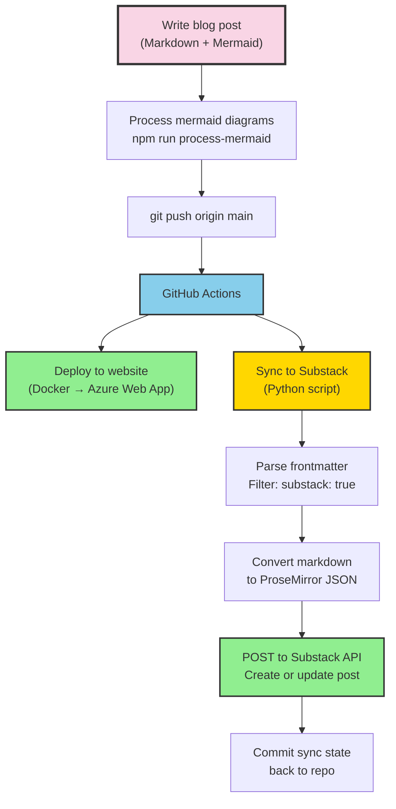
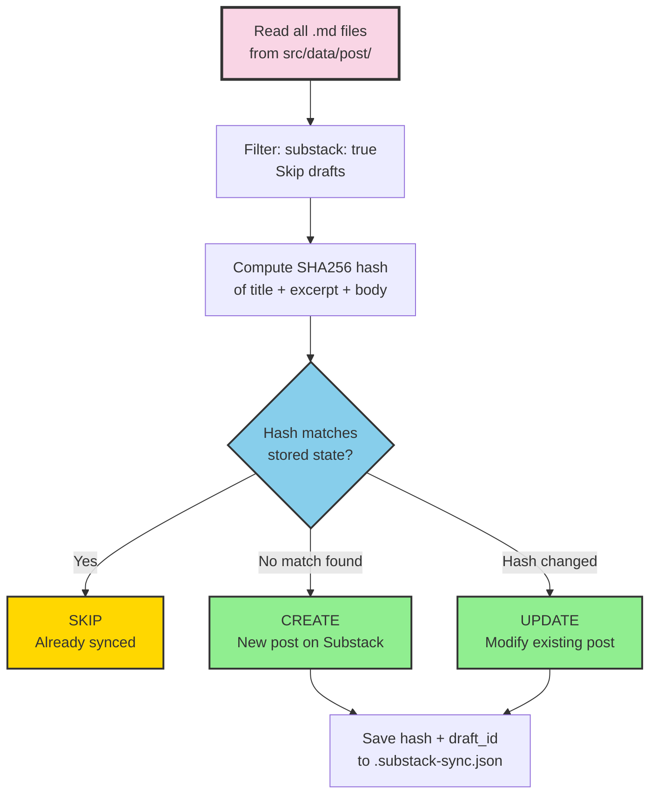

## I Don't Copy-Paste Blog Posts

I write blog posts in markdown. I push to GitHub. They deploy to my website. They also publish to Substack. Automatically.

There is no manual step. No logging into Substack, no reformatting, no "copy the markdown and paste it into the editor." I write once, push once, and the post appears on both platforms within minutes.

This post explains exactly how that pipeline works.

## The Problem with Writing in Two Places

When I started cross-posting to Substack, the workflow was painful. Write a blog post in markdown for my Astro site. Copy the content. Open Substack. Paste it into their editor. Fix the formatting (because markdown and Substack's editor don't agree on everything). Upload images manually. Hit publish.

Every time I updated a post, I had to do it again in both places. Formatting drifted. Links broke. Diagrams were missing. It was exactly the kind of manual, error-prone process I eliminate everywhere else in my infrastructure.

So I automated it.

## The Architecture




One push triggers two parallel workflows: the website deploys via Docker to Azure, and the Substack sync runs via a Python script on a self-hosted GitHub Actions runner.

## The Frontmatter Flag

Not every blog post goes to Substack. The decision is controlled by a single frontmatter field:

```yaml
---
title: "My Blog Post Title"
author: Ciprian Rarau
publishDate: 2026-03-01T20:00:00Z
category: Technology
excerpt: "Short description for previews and SEO"
substack: true
tags:
  - devops-automation
  - infrastructure-as-code
---
```

If `substack: true` is present, the post gets synced. If it's missing or set to false, the sync script skips it. This means I can have draft posts, internal notes, or website-only content that never touches Substack.

The sync script filters explicitly:

```python
if not frontmatter.get("substack", False):
    print(f"  SKIP {filepath.name} (substack not enabled)")
    continue
```

## The Sync Script

The core of the integration is a 500-line Python script that handles everything: reading posts, cleaning markdown, converting to Substack's format, and managing state.

It starts by reading every `.md` file from the blog posts directory:

```python
POSTS_DIR = BLOG_ROOT / "src" / "data" / "post"

for filepath in sorted(POSTS_DIR.glob("*.md")):
    frontmatter, body = parse_frontmatter(filepath)
```

Each post goes through a cleaning pipeline before it reaches Substack:

**Strip mermaid code blocks.** My blog posts contain inline mermaid diagram definitions. These get rendered into PNG images by a separate processing step. The sync script strips the raw mermaid source (which Substack can't render) but keeps the PNG image references:

```python
body = re.sub(
    r"```mermaid\n.*?```\n*",
    "",
    body,
    flags=re.DOTALL,
)
```

**Convert relative URLs to absolute.** My blog uses relative image paths like `/images/diagrams/my-diagram.png`. Substack needs full URLs:

```python
body = re.sub(
    r"!\[([^\]]*)\]\((/[^)]+)\)",
    lambda m: f"})",
    body,
)
```

**Convert markdown tables to text.** Substack's API doesn't support table nodes in its ProseMirror format. The script converts markdown tables into readable key-value pairs so the content still makes sense.

**Add a canonical footer.** Every synced post gets a link back to the original:

```python
cleaned_body += f"\n\n---\n\nOriginally published at [{canonical}]({canonical})\n"
```

## Converting Markdown to ProseMirror JSON

This was the hardest part to get right. Substack doesn't accept raw markdown. Their API expects ProseMirror JSON, a structured document format used by their editor.

I use the `python-substack` library to handle the conversion:

```python
from substack.post import Post

substack_post = Post(
    title="",
    subtitle="",
    user_id=user_id,
    audience="everyone",
)
substack_post.from_markdown(markdown_text)
draft = substack_post.get_draft()
body_json = json.loads(draft["draft_body"])
```

There's a known bug in the library where link hrefs end up as `null` in the output. The library's `marks()` method looks for `mark.get("href")` at the top level, but the parsed markdown nests it under `attrs`. I fix this with a post-processing step:

```python
# Build a map of link text → href from the original markdown
link_map = {}
for match in re.finditer(r'\[([^\]]+)\]\(([^)]+)\)', markdown_text):
    link_map[match.group(1)] = match.group(2)

# Patch null hrefs in the ProseMirror output
for mark in text_node.get("marks", []):
    if mark.get("type") == "link":
        href = mark.get("attrs", {}).get("href")
        if href is None:
            link_text = text_node.get("text", "")
            if link_text in link_map:
                mark["attrs"] = {"href": link_map[link_text]}
```

This regex-based fix catches every link and patches the correct URL back in. Not elegant, but reliable.

## The GitHub Actions Workflow

The sync runs automatically on every push to `main` that touches blog post files:

```yaml
on:
  push:
    branches: [main]
    paths:
      - 'src/data/post/**'
  workflow_dispatch:
```

It also supports manual triggers via `workflow_dispatch` for cases where I need to force a re-sync.

The workflow runs on a self-hosted runner (my Mac) because it needs access to Azure Key Vault for authentication. Substack doesn't have API keys. It uses session cookies, which means the auth token is a browser cookie stored securely in Azure Key Vault:

```yaml
- name: Get Substack cookie from Key Vault
  run: |
    COOKIE=$(az keyvault secret show \
      --vault-name kv-ideaplaces \
      --name substack-cookie \
      --query value -o tsv)
    echo "::add-mask::$COOKIE"
    echo "SUBSTACK_COOKIE=$COOKIE" >> $GITHUB_ENV
```

The cookie is masked in logs so it never appears in GitHub Actions output. The script authenticates by setting this cookie on a `requests.Session` and hitting Substack's profile endpoint to verify the session is valid.

After syncing, the workflow commits the updated state file back to the repository:

```yaml
- name: Commit sync state
  run: |
    git add scripts/substack/.substack-sync.json
    git diff --staged --quiet || \
      git commit -m "Update Substack sync state"
    git pull --rebase origin main
    git push origin main
```

This ensures the sync state persists across runs. The `git pull --rebase` handles cases where the deploy workflow pushed changes at the same time.

## Content Hashing for Incremental Updates

The sync script doesn't blindly republish every post on every push. It uses content hashing to detect changes:

```python
def content_hash(frontmatter: dict, body: str) -> str:
    hashable = json.dumps({
        "title": frontmatter.get("title", ""),
        "excerpt": frontmatter.get("excerpt", ""),
        "body": body,
    }, sort_keys=True)
    return hashlib.sha256(hashable.encode()).hexdigest()[:16]
```

The hash covers the title, excerpt, and body. It uses the first 16 characters of the SHA256 for storage efficiency. The tracking state lives in a JSON file:

```json
{
  "posts": {
    "cloud-dev-machine-no-laptop-required": {
      "hash": "a1b2c3d4e5f67890",
      "draft_id": 188896743,
      "title": "My Entire Development Runs in the Cloud",
      "synced_at": "2026-03-01T16:00:00+00:00"
    }
  }
}
```




When a post is new, the script creates a draft and publishes it. When a post has changed (the hash differs), it updates the existing post in place using the stored `draft_id`. When nothing changed, it skips entirely.

The Substack API calls are straightforward:

```python
# Create and publish a new post
resp = self.session.post(f"{self.pub_base}/drafts", json=draft_payload)
draft_id = resp.json()["id"]
self.session.post(f"{self.pub_base}/drafts/{draft_id}/publish", json={
    "draft_id": draft_id,
    "send": True,
    "share_automatically": False,
})

# Update an existing post
self.session.put(f"{self.pub_base}/drafts/{draft_id}", json=update_payload)
self.session.post(f"{self.pub_base}/drafts/{draft_id}/publish", json={
    "draft_id": draft_id,
    "send": False,  # Don't re-send the email
})
```

Notice `send: True` on create (sends the newsletter email) and `send: False` on update (just refreshes the rendered HTML without emailing subscribers again).

## How Claude Code Fits In

Here's where it gets interesting. I don't just type blog posts manually. I often create them with Claude Code, and the entire pipeline is documented in my `CLAUDE.md` file so the AI knows exactly how to do it.

My `CLAUDE.md` contains the blog post template with the correct frontmatter structure, instructions for running `npm run process-mermaid` after adding diagrams, and the commit workflow. When I tell Claude Code "write a blog post about X," it creates the file with the right structure, generates mermaid diagrams in vertical format, processes them, and commits everything.

The AI also knows to set `substack: true` in frontmatter when the post should go to Substack. That single flag is all it takes to include a post in the newsletter.

The workflow looks like this:

1. I tell Claude Code what to write about (often from a voice transcript)
2. Claude Code creates the markdown file with frontmatter and mermaid diagrams
3. Claude Code runs `npm run process-mermaid` to generate PNG images
4. Claude Code commits the post and images, then pushes to main
5. GitHub Actions deploys the website and syncs to Substack
6. The post is live on both platforms

From idea to published newsletter in a single conversation.

## The Pattern

```
Blog Post Pipeline
==================

Write (Markdown + Mermaid)
    │
    ▼
Process Diagrams (mermaid-cli → PNG + author footer)
    │
    ▼
git push origin main
    │
    ├──────────────────────────┐
    ▼                          ▼
Deploy Workflow            Substack Sync Workflow
    │                          │
    ▼                          ▼
Docker build              Read posts (*.md)
    │                          │
    ▼                          ▼
Push to ACR               Filter: substack: true
    │                          │
    ▼                          ▼
Azure Web App             Hash → Compare → Create/Update
    │                          │
    ▼                          ▼
ciprianrarau.com          chiprarau.substack.com
```

I write in one place. Markdown files in a git repository. Every post gets version history, pull request reviews if needed, and the full power of my development workflow. The website and the newsletter are just two outputs of the same source.

The sync script is 500 lines of Python. The GitHub Actions workflow is 50 lines of YAML. The mermaid processing is a Node.js script that runs locally. Together, they turn a `git push` into a multi-platform publication.

No manual formatting. No copy-pasting. No "I forgot to update it on Substack." One source of truth, two platforms, zero friction.
