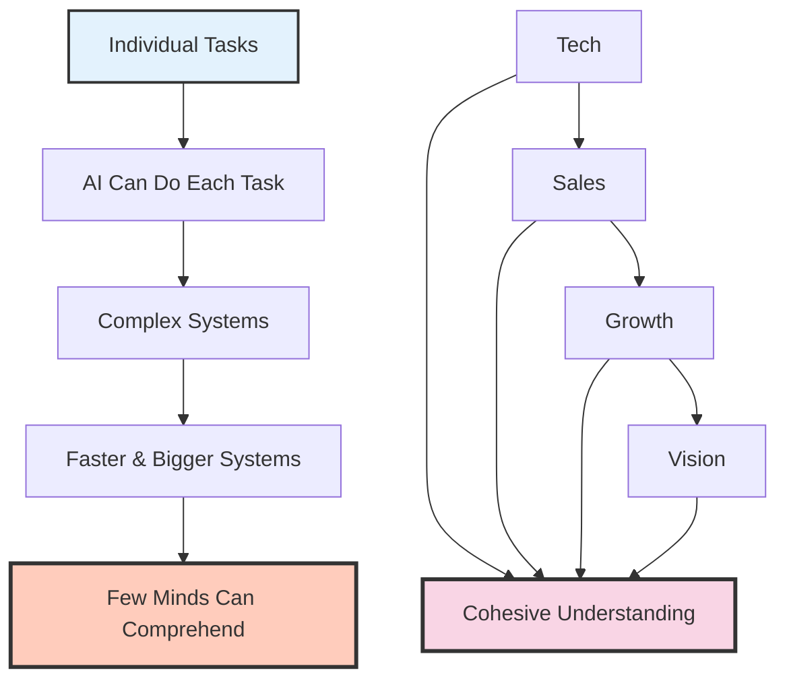

# AI as an Extension of Myself: When Technology Complexity Outpaces Human Understanding

## The Current Reality

Right now I'm using AI and understand everything that the AI is doing, and I feel that it allows me to really embrace this capability because it extends my reach into every sphere of a business. AI has become an extension of myself - when I think about something, I can make it happen.

## AI's Individual Capability

From what I observe, AI excels at individual tasks - if I focus on one specific task and provide the right directions, AI can execute it.

When it comes to work as we know it, everything that we do is individually simple. An AI can handle each piece.

## The Complexity Challenge

The real challenge is that we need to guide increasingly complex and bigger systems, faster and faster. Only a few minds can comprehend the different realities spanning from technical implementation all the way through sales, growth, and vision while keeping everything cohesive.

## The Horizon Expansion

The perspective shift is profound: we now need to expand our horizons rather than dive deep into details. Before, many people spent their time deep in the minutiae, but now those details are being handled automatically. We can make any idea happen.

## The Complexity Theory

Society is merging with technology, and what surrounds us becomes increasingly complex - beyond what the human brain can fully grasp.

Previously, our concerns were limited to traditional technology, distinct from biological systems. But now, everything becomes more sophisticated and interconnected, which means fewer and fewer minds can comprehend what's actually happening.

## What Technology Wants

This connects to Kevin Kelly's book "What Technology Wants" - the idea that technology itself has its own trajectory and desires, moving toward ever-greater complexity.

## The Transformation

The shift is unmistakable: we're moving from a world where people needed to master details to one where AI handles those details while we must comprehend entire systems. The challenge has evolved beyond individual tasks - it's about orchestrating increasingly complex systems that fewer and fewer minds can fully grasp.

We can make any idea happen. The details are handled. But the price is that the world around us grows more complex than any single human brain can comprehend.