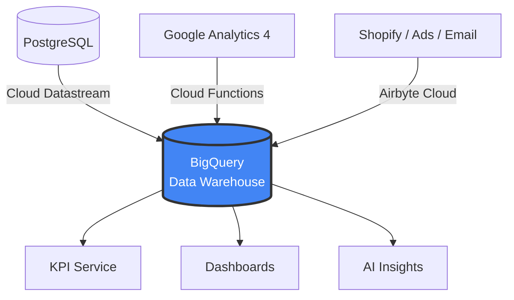
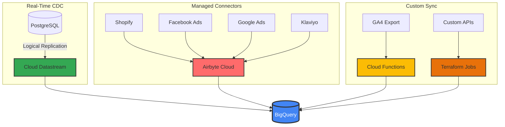
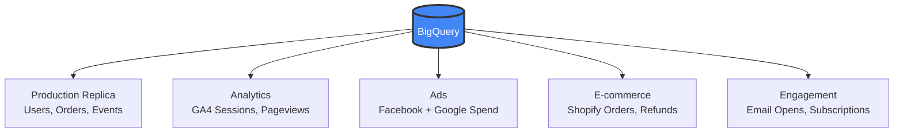
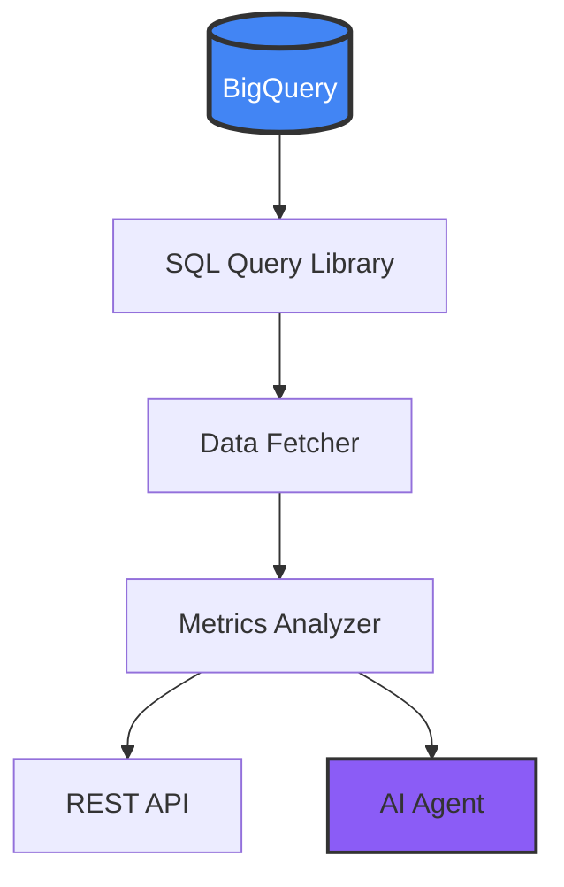
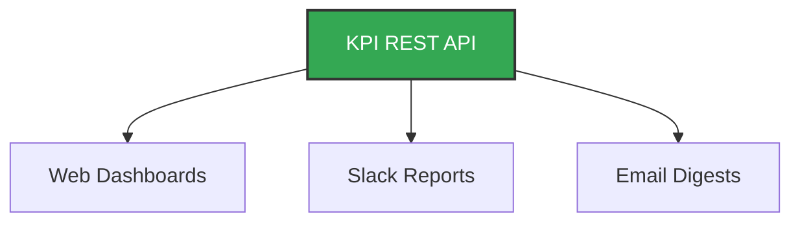

## The Counterintuitive First Step

When I start working with a new startup, people expect me to focus on CI/CD pipelines, container orchestration, or cloud architecture. Instead, the first thing I set up is a data warehouse.

This surprises people. "Shouldn't we focus on building the product first?"

The answer is no. Every business decision you'll make - from feature prioritization to marketing spend - depends on data. Without a central place to query that data, you're flying blind. You can build the most elegant infrastructure in the world, but if you can't answer "which marketing channel brings our best customers?" or "where do users drop off in our funnel?", you're guessing.

## The Problem: Data Trapped in Silos

A typical startup has data scattered across:

- **Production database** (PostgreSQL, MySQL) - user accounts, transactions, product usage
- **Google Analytics 4** - website traffic, user journeys, conversions
- **Shopify/Stripe** - orders, subscriptions, refunds
- **Facebook Ads** - ad spend, impressions, click-through rates
- **Google Ads** - campaign performance, keywords, costs
- **Email platform** (Klaviyo, Mailchimp) - open rates, click rates, unsubscribes
- **Subscription platform** (Stripe, Recharge) - MRR, churn, upgrades
- **Application logs** - errors, performance metrics, feature usage

Each of these systems has its own dashboard. Each gives you a partial picture. None of them can answer the question that actually matters:

**"What is the complete journey of a user from first ad impression to repeat purchase?"**

To answer that, you need all this data in one place where you can JOIN it.

## The Solution: Everything in BigQuery

I use Google BigQuery as the central data warehouse for every startup I work with. Not because it's the only option - Snowflake and Databricks are excellent too - but because BigQuery integrates seamlessly with the Google Cloud ecosystem and has a generous free tier for startups.

Here's the high-level view: all roads lead to BigQuery.




Each data source uses a different ingestion method, chosen based on the source type:




Once everything lands in BigQuery, the datasets sit side by side, ready to be JOINed:




## Four Ways to Get Data In

Over the years, I've settled on four primary methods for ingesting data into BigQuery. Each has its place depending on the source and requirements.

### 1. Cloud Datastream (PostgreSQL CDC)

For production database replication, I use Google Cloud Datastream. It's a fully managed change data capture (CDC) service that streams changes from PostgreSQL to BigQuery with 10-second to 5-minute latency.

The key advantage: it doesn't impact your production database performance. Datastream reads from PostgreSQL's logical replication slot, so your application never knows it's there.

```hcl
# Terraform configuration for Datastream
resource "google_datastream_stream" "postgres_to_bigquery" {
  display_name  = "postgres-to-bigquery"
  location      = "northamerica-northeast1"

  source_config {
    source_connection_profile = google_datastream_connection_profile.postgres.id

    postgresql_source_config {
      include_objects {
        postgresql_schemas {
          schema = "public"
          postgresql_tables {
            table = "users"
          }
          postgresql_tables {
            table = "orders"
          }
          postgresql_tables {
            table = "subscriptions"
          }
        }
      }

      replication_slot = "datastream_replication"
      publication       = "datastream_publication"
    }
  }

  destination_config {
    destination_connection_profile = google_datastream_connection_profile.bigquery.id

    bigquery_destination_config {
      data_freshness = "300s"

      single_target_dataset {
        dataset_id = "production_replica"
      }
    }
  }
}
```

### 2. Airbyte Cloud (SaaS Integrations)

For Shopify, Facebook Ads, Google Ads, Klaviyo, and other SaaS platforms, I use Airbyte Cloud. It's a managed service with pre-built connectors that handle OAuth, rate limiting, and schema evolution.

The typical sync configuration:
- **Shopify**: Orders, customers, products, refunds, fulfillments - hourly sync
- **Facebook Ads**: Campaigns, ad sets, ads, insights - daily sync
- **Google Ads**: Campaigns, ad groups, keywords, conversions - daily sync
- **Email platform**: Campaigns, lists, events - daily sync

Airbyte writes directly to BigQuery with proper data typing and incremental updates.

### 3. Cloud Functions (Cross-Region Sync)

One challenge with Google Analytics 4 is that the BigQuery export lands in the US region, while my other data is in Montreal (northamerica-northeast1) for compliance reasons. BigQuery doesn't allow cross-region JOINs.

The solution: a Cloud Function that runs daily and copies GA4 data to the Montreal region.

```python
# Cloud Function for GA4 cross-region sync
import functions_framework
from google.cloud import bigquery

@functions_framework.http
def sync_ga4_data(request):
    source_client = bigquery.Client(location="US")
    dest_client = bigquery.Client(location="northamerica-northeast1")

    # Copy yesterday's events table
    yesterday = (datetime.now() - timedelta(days=1)).strftime('%Y%m%d')
    source_table = f"analytics_379238086.events_{yesterday}"
    dest_table = f"analytics_ga4.events_{yesterday}"

    job_config = bigquery.CopyJobConfig()
    job = dest_client.copy_table(
        f"{project_id}.{source_table}",
        f"{project_id}.{dest_table}",
        job_config=job_config
    )
    job.result()

    return f"Synced {source_table} to {dest_table}"
```

### 4. Terraform Scheduled Jobs (Custom Sources)

For sources that don't have Airbyte connectors or need custom logic, I write small Python scripts that run as Cloud Run jobs on a schedule, all managed by Terraform.

```hcl
# Terraform for scheduled data sync job
resource "google_cloud_run_v2_job" "custom_sync" {
  name     = "custom-data-sync"
  location = "northamerica-northeast1"

  template {
    template {
      containers {
        image = "gcr.io/${var.project_id}/custom-sync:latest"

        env {
          name  = "BIGQUERY_DATASET"
          value = "custom_data"
        }
      }
      service_account = google_service_account.sync_sa.email
    }
  }
}

resource "google_cloud_scheduler_job" "custom_sync_trigger" {
  name     = "trigger-custom-sync"
  schedule = "0 6 * * *"  # Daily at 6 AM

  http_target {
    http_method = "POST"
    uri         = "https://${var.region}-run.googleapis.com/apis/run.googleapis.com/v1/namespaces/${var.project_id}/jobs/${google_cloud_run_v2_job.custom_sync.name}:run"

    oauth_token {
      service_account_email = google_service_account.scheduler_sa.email
    }
  }
}
```

## The Power of Cross-Source JOINs

Once all data is in BigQuery, magic happens. You can finally answer questions that were impossible before.

### Full Funnel Attribution

This query joins Google Ads spend, GA4 traffic, and Shopify orders to calculate true Customer Acquisition Cost:

```sql
WITH ad_spend AS (
  SELECT
    DATE(date) as date,
    campaign_name,
    SUM(cost_micros) / 1000000 as spend
  FROM `my-project.ads_data.google_ads_campaign_stats`
  WHERE date >= DATE_SUB(CURRENT_DATE(), INTERVAL 30 DAY)
  GROUP BY 1, 2
),

ga4_sessions AS (
  SELECT
    DATE(TIMESTAMP_MICROS(event_timestamp)) as date,
    (SELECT value.string_value FROM UNNEST(event_params) WHERE key = 'campaign') as campaign,
    user_pseudo_id
  FROM `my-project.analytics_ga4.events_*`
  WHERE _TABLE_SUFFIX >= FORMAT_DATE('%Y%m%d', DATE_SUB(CURRENT_DATE(), INTERVAL 30 DAY))
    AND event_name = 'session_start'
),

shopify_orders AS (
  SELECT
    DATE(created_at) as date,
    customer_id,
    total_price,
    (SELECT value FROM UNNEST(note_attributes) WHERE name = 'utm_campaign') as campaign
  FROM `my-project.shopify_data.orders`
  WHERE created_at >= DATE_SUB(CURRENT_DATE(), INTERVAL 30 DAY)
    AND financial_status = 'paid'
)

SELECT
  ad_spend.campaign_name,
  ad_spend.spend,
  COUNT(DISTINCT ga4_sessions.user_pseudo_id) as sessions,
  COUNT(DISTINCT shopify_orders.customer_id) as customers,
  SUM(shopify_orders.total_price) as revenue,
  SAFE_DIVIDE(ad_spend.spend, COUNT(DISTINCT shopify_orders.customer_id)) as cac,
  SAFE_DIVIDE(SUM(shopify_orders.total_price), ad_spend.spend) as roas
FROM ad_spend
LEFT JOIN ga4_sessions ON ad_spend.campaign_name = ga4_sessions.campaign
LEFT JOIN shopify_orders ON ga4_sessions.campaign = shopify_orders.campaign
GROUP BY 1, 2
ORDER BY revenue DESC
```

### User Journey Tracking

Track a user from their first website visit through product activation:

```sql
WITH first_touch AS (
  SELECT
    user_pseudo_id,
    MIN(TIMESTAMP_MICROS(event_timestamp)) as first_visit,
    FIRST_VALUE((SELECT value.string_value FROM UNNEST(event_params) WHERE key = 'source'))
      OVER (PARTITION BY user_pseudo_id ORDER BY event_timestamp) as utm_source
  FROM `my-project.analytics_ga4.events_*`
  WHERE event_name = 'session_start'
  GROUP BY user_pseudo_id
),

signups AS (
  SELECT
    email,
    created_at,
    -- Map GA4 client_id stored during signup
    ga_client_id
  FROM `my-project.production_replica.users`
),

first_product_use AS (
  SELECT
    user_id,
    MIN(created_at) as first_use
  FROM `my-project.production_replica.user_events`
  WHERE event_type = 'product_activated'
  GROUP BY user_id
)

SELECT
  first_touch.utm_source,
  COUNT(DISTINCT first_touch.user_pseudo_id) as visitors,
  COUNT(DISTINCT signups.email) as signups,
  COUNT(DISTINCT first_product_use.user_id) as activated,
  SAFE_DIVIDE(COUNT(DISTINCT signups.email), COUNT(DISTINCT first_touch.user_pseudo_id)) as signup_rate,
  SAFE_DIVIDE(COUNT(DISTINCT first_product_use.user_id), COUNT(DISTINCT signups.email)) as activation_rate
FROM first_touch
LEFT JOIN signups ON first_touch.user_pseudo_id = signups.ga_client_id
LEFT JOIN first_product_use ON signups.email = first_product_use.user_id
GROUP BY 1
ORDER BY visitors DESC
```

### Subscription Cohort Retention

Analyze monthly cohorts with retention curves:

```sql
WITH subscription_cohorts AS (
  SELECT
    customer_id,
    DATE_TRUNC(first_order_date, MONTH) as cohort_month,
    status,
    DATE_DIFF(CURRENT_DATE(), first_order_date, MONTH) as months_since_signup
  FROM `my-project.subscription_data.subscriptions`
),

monthly_status AS (
  SELECT
    cohort_month,
    COUNT(DISTINCT customer_id) as cohort_size,
    COUNT(DISTINCT CASE WHEN status = 'active' THEN customer_id END) as active_count,
    COUNT(DISTINCT CASE WHEN status = 'cancelled' THEN customer_id END) as churned_count
  FROM subscription_cohorts
  GROUP BY cohort_month
)

SELECT
  cohort_month,
  cohort_size,
  active_count,
  churned_count,
  SAFE_DIVIDE(active_count, cohort_size) * 100 as retention_rate,
  SAFE_DIVIDE(churned_count, cohort_size) * 100 as churn_rate
FROM monthly_status
ORDER BY cohort_month DESC
```

## The KPI Service Layer

Raw SQL queries are powerful but not accessible to everyone. I build a KPI service layer that:

1. Executes pre-built SQL queries against BigQuery
2. Transforms results into business-friendly metrics
3. Exposes REST API endpoints for dashboards
4. Sends automated reports to Slack
5. Uses AI to generate narrative insights




The KPI service then feeds multiple delivery channels:




## What This Unlocks

With a proper data warehouse in place, I've helped startups answer questions like:

**Marketing:**
- Which Facebook ad creative drives the highest LTV customers?
- What's our true CAC by channel, not just first-touch attribution?
- Which landing page + traffic source combination has the best conversion rate?

**Product:**
- What's the correlation between feature X usage and retention?
- Where do users drop off in the onboarding flow?
- Which user segment has the highest repeat purchase rate?

**Operations:**
- How many support tickets come from users acquired through each channel?
- What's the relationship between shipping time and customer satisfaction?
- Which product SKU has the highest return rate and why?

**Finance:**
- What's our actual monthly recurring revenue after accounting for failed payments?
- What's the payback period by acquisition channel?
- Which subscription plan has the best unit economics?

## The Investment Pays Off

Setting up a data warehouse takes time - typically 2-4 weeks for a complete implementation. But the ROI is immediate:

1. **Faster decision-making**: Questions that used to require pulling data from 5 systems and spending a day in Excel now take a single SQL query.

2. **Attribution clarity**: You finally know which marketing efforts actually work, not just which ones claim credit.

3. **Product insights**: You can see the complete user journey and identify exactly where people struggle.

4. **Automated reporting**: No more manual weekly reports. KPIs flow to Slack automatically.

5. **AI-ready data**: When you want to add AI insights, the data is already clean and centralized.

## Getting Started

If you're running a startup without a data warehouse, here's my recommended order of operations:

1. **Week 1**: Set up BigQuery and configure Cloud Datastream for your production database
2. **Week 2**: Add Airbyte connections for Shopify/Stripe, Google Ads, and Facebook Ads
3. **Week 3**: Set up GA4 BigQuery export and handle any cross-region sync needs
4. **Week 4**: Build your first 10 SQL queries and a basic KPI dashboard

The queries I showed above are templates. Adapt them to your schema and business model.

## The Mindset Shift

The biggest change isn't technical - it's cultural. When every question can be answered with a SQL query, decisions move from "I think" to "the data shows."

Marketing stops arguing about which channel is better and starts optimizing based on actual LTV by source. Product stops guessing which features matter and builds based on correlation with retention. Operations stops firefighting and starts predicting problems before they happen.

That's why the data warehouse is the first thing I set up. Not because it's technically impressive, but because it's the foundation for running a data-driven company.

Everything else - the CI/CD pipelines, the monitoring, the scaling - is important. But without the ability to measure impact, you don't know if any of it is working.

Start with the data warehouse. Everything else follows.
