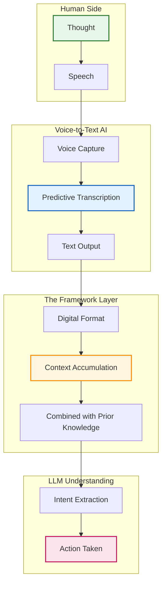

Something fundamental has shifted in how I interact with technology. For the first time, machines can truly understand human language—not through brute force transcription, but because the AI is actually predicting what I'm going to say. The quality of voice-to-text has become astonishing.

This isn't just incremental improvement. Two breakthroughs converged:

1. **AI-powered transcription that predicts, not just transcribes.** The models don't brute-force audio into text—they understand context, anticipate words, and correct in real-time.

2. **LLMs that understand intent.** For the first time, the AI on the other end actually comprehends what I mean, not just what I say.

Together, these create something new: a voice-to-text-to-LLM pipeline where I can think out loud and have machines actually act on my intent.

The magic happens in the middle: AI doesn't just transcribe what I say—it predicts what I'm about to say based on context. And on the receiving end, the LLM doesn't just parse my words—it understands my intent.

## From Thought to Action: The Speed Revolution

I speak 3-4 times faster than I type. That's not a marginal gain—that's a fundamental acceleration from thought to action.

But speed isn't even the real story. It's the fluidity. When I speak, thoughts flow naturally. I can gesture while thinking, lean back, grab coffee, point things out during screen shares. The constraint of sitting with fingers on keyboard, translating thoughts into typed characters—that friction disappears.

As I wrote in [AI as an Extension of Myself](/blog/technology-complexity-race), AI has become an extension of my thinking. Voice input takes that further—it removes the bottleneck between my brain and the machine entirely. I think, I speak, it happens.

## My Evolution: SuperWhisper to Wispr Flow

At the beginning of the year, I actually considered building a product like this myself. I had the vision—voice-to-text that truly understands context, seamless integration across apps, mobile-first design. But I quickly realized how complex it is. The predictive models, the latency requirements, the cross-platform challenges—this isn't a weekend project.

So when I discovered [SuperWhisper](https://superwhisper.com/) and then [Wispr Flow](https://wisprflow.ai/), I was genuinely relieved. These products completely address my need. The implementation is exactly how I imagined such a product should work: fluid, invisible, just there when I need it.

I started with SuperWhisper and built a [comprehensive analytics toolkit](https://github.com/crarau/superwhisper-analysis) to track my voice productivity. That data revealed something striking: I was speaking 4,200 words daily in just 40 minutes, saving 20 hours of typing every month.

But I switched to Wispr Flow for one reason: their mobile app. Voice input on desktop is powerful; voice input everywhere is transformational.

My Wispr Flow stats tell the story:

- **31 weeks** consecutive usage streak
- **778,501 words** dictated (equivalent to 7 complete books)
- **119 words per minute** speaking speed (top 3% of all Flow users)
- **101 different apps** used with voice input

No wonder Wispr Flow raised $80 million. They've built something that fundamentally changes the human-computer interface.

## The Loom Parallel: Why Text Won

This reminds me of another company I used heavily: [Loom](https://loom.com). Before the LLM era, I created over 8,000-9,000 Looms—video, audio, screen recording combined. It was the fastest way to communicate complex ideas.

But now? My Loom usage has dropped dramatically. Most of my interactions are full text.

Why? Because text is easier to consume than video. People can skim, search, reference. Even though a Loom communicates significantly more nuance—tone, emotion, visual context—text has won for asynchronous communication.

Voice-to-text tools like Wispr Flow capture the best of both worlds: I get the speed and fluidity of speaking, but the output is text that others can easily consume. The machine handles the translation.

## The Bigger Picture: Voice Changes Everything

On the surface, voice-to-text that's 3x faster than typing doesn't sound groundbreaking. It's just speed.

But the repercussions run deeper. The way Wispr Flow and similar tools have implemented this—the predictive models, the seamless integration across applications, the mobile-first approach—creates something qualitatively different.

As I explored in [AI Reads My Specs](/blog/ai-reads-my-specs), AI has become an extension of myself for development work. Voice extends that further. I'm no longer translating thoughts to finger movements to characters on screen. I speak, and the machine understands—not just the words, but increasingly the intent.

This connects back to my earlier thinking on [technology complexity outpacing human understanding](/blog/technology-complexity-race). AI handles the details while I comprehend the system. Voice accelerates that dynamic. My thoughts flow into the machine at the speed of speech, processed by AI that predicts and understands, generating output that would have taken me hours to type.

## Looking Forward: Voice as the New Interface

I'm at an inflection point where voice input transitions from "interesting capability" to "default interaction method."

The data proves it. When people consistently save 20+ hours monthly by speaking instead of typing, when that time savings comes with improved expression and reduced physical strain, when mobile apps mean voice is available everywhere—the choice becomes obvious.

I'm not just documenting productivity gains. I'm witnessing a fundamental shift in human-computer interaction. The keyboard is still there, but increasingly it's a fallback, not the primary interface.

**The acceleration is remarkable. What once required me to adapt to my tools now has my tools adapting to me.**

But here's what I want to be clear about: it's not that the machine "just understands" me automatically. That's not how this works. What's happening is a combination of layers working together:

- Voice-to-text AI that predicts and captures my speech
- A framework that converts thoughts into digital format
- Context that accumulates and combines with prior knowledge
- An LLM on the other end that interprets intent

Each layer is fuzzy on its own. The transcription isn't perfect. The LLM doesn't truly "understand" in a human sense. But combined—with all the frameworks in place—something emerges that feels like understanding.

For the first time, my thoughts flow into digital format and get interpreted meaningfully on the other side. It's not magic. It's not automatic. It's a carefully constructed pipeline where AI, frameworks, and context combine to bridge the gap between human thought and machine action.

And that combination—not any single piece—is what changes everything. 